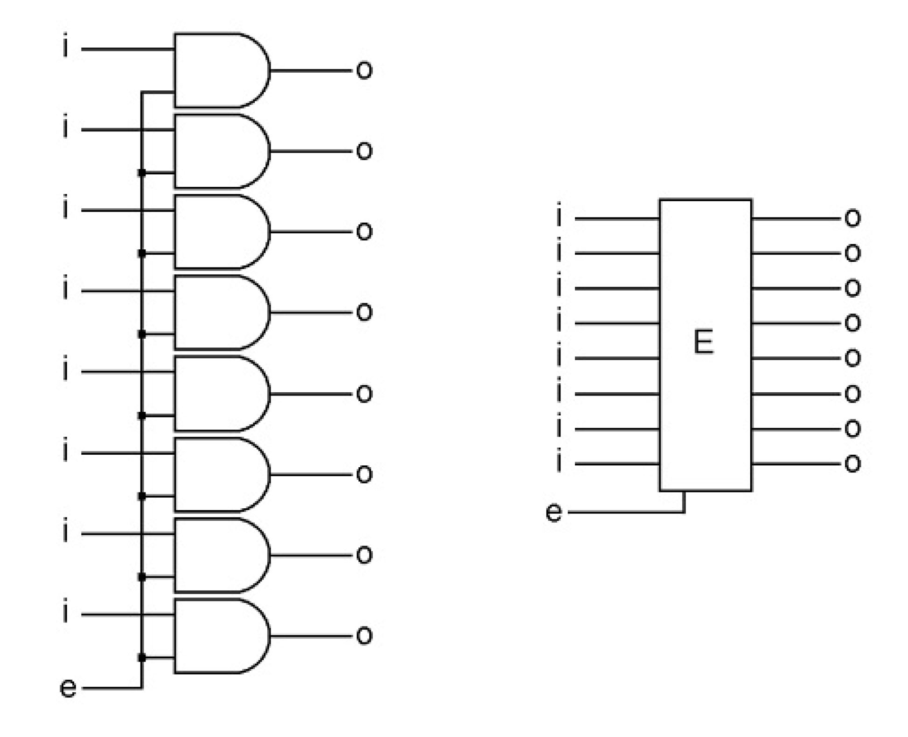

- 컴퓨터의 각 파트는 매우 간단한 기능만을 할 수 있다 

  작은 부분들이 모여서 컴퓨터라는 유용한 기계가 된다

- 컴퓨터로 게임을 하고 그림을 그리고 결제를 하는 등 수많은 일을 할 수 있지만 

  실제로 컴퓨터가 할 수 있는 것은 아주아주 간단한 일 뿐이다. 

  또한 한 번에 하나의 간단한 일만 할 수 있다. 

  다만 굉장히 빠른 속도로 일을 처리할 뿐이다

- 1940년대 처음 발명된 이래로 컴퓨터는 매우 빨라지고 매우 작아지고 매우 싸졌지만

  컴퓨터가 할 수 있는 일 자체는 그리 달라지지 않았다

  여전히 간단한 몇 가지 일을 할 수 있을 뿐이다

  다만 훨씬 빨라지고 싸지고 안정적인 방식으로 말이다

- 오직 비트(bit)만이 컴퓨터 안에 있다

- 비트는 두 가지의 상태만을 가진다

  비트는 크기와 위치를 가진 물리적인 오브젝트로 값을 가지고 있다

  해당 값은 두 가지 상태 중 하나를 말한다(상태가 변할 수는 있음)

  이 상태값은 전기가 통하고 있느냐 아니냐를 나타낸다

- 게이트(NAND gate = Negative AND gate)

  

  아웃풋 앞의 작은 동그라미는 반대로 뒤집으라는 것

  a, b가 on일 때만 c가 off

  가능한 경우의 수?

  x x o, x o o, o x o, o o x

- bit는 on이나 off 둘 중 하나의 상태를 나타낸다

- NOT gate

  

  삼각형은 들어온 인풋을 뒤집어서 내놓는다

  a, b는 항상 같다

  a, b가 on이면 c는 off

  a, b가 off이면 c는 on

  |  a   |  b   |  x   |  c   |
  | :--: | :--: | :--: | :--: |
  |  x   |  x   |  o   |  x   |
  |  x   |  o   |  o   |  x   |
  |  o   |  x   |  o   |  x   |
  |  o   |  o   |  x   |  o   |

  인풋과 아웃풋이 반대라서  NOT 게이트

- AND gate(combination gate)

  for the output to be on, one input AND the other input must both be on

  

  

  D는 AND function을 하라는 것( 두 인풋이 on일 때만 아웃풋 on)

  기본 게이트랑은 c가 반대

  x x x, x o x, o x x, o o o

- NAND 게이트가 제일 쉽게 만들 수 있고 싸고 믿을 만하다

  NAND 게이트가 기본이 되어 NOT이나 AND 게이트 등을 만든다

  AND 게이트가 이해하기 쉽고 컴퓨터에서 많이 쓴다

- NAND가 `기억`하는 방법

  즉, 메모리를 만드는 방법

  

  선이 교차할 때 점이 있어야 연결된 것(on/off 동일)

  인풋 2, 아웃풋 1, 와이어 3

  `i` 기억하고픈 인풋

  `o` 기억하고픈 아웃풋

  `s` set memory

  |  i   |  s   |  a   |  b   |  c   |  o   |
  | :--: | :--: | :--: | :--: | :--: | :--: |
  |  x   |  o   |  o   |  x   |  o   |  x   |
  |  o   |  o   |  x   |  o   |  x   |  o   |
  |  o   | `x`  | `o`  | `o`  |  x   |  o   |
  |  x   | `x`  | `o`  | `o`  |  o   |  x   |

  1-a: i + s

  2-b: s + a

  3-o: a + c

  4-c: b + o

  a가 x이면 a가 들어가는 b, o 값이  O가 된다

  

  s가 on이면 i와 o가 같다

  s가 off이면 i랑 무관하게(i는 변해도 된다) a는 o가 된다(s, a, b = x, o, o까지!)

  s가 off일 때 i, o는 s가 off되기 직전의 값을 그대로 간직한다

  

  all that computer memory is, is a way of preserving the way a bit was set at some point in time

  

  

  위의 네 개의 NAND 게이트 조합을 이렇게 나타낸다

  `i` is the input bit that you want to save

  `s` is the input that allows `i` into the memory bit when `s` is on
  	and locks it in place or sets it when `s` goes off

  `o` is the output of the current or saved data

  `M` stands for memory

  

  s가 on이면 i로 o의 on/off 조절

  s가 off이면 off 되기 직전 상태 유지됨

  

  on과 off 둘 중 한 상태만 가질 수 있는 비트로 뭘 할 수 있을까?

  상태가 어떤 뜻을 나타내게 하면 된다

  한 비트가 on이면 빨간불이 켜진다, 빨간불은 정지하라는 신호가

  한 비트가 on이면 식당 주문에서 해당 옵션 추가를 뜻한다

  A code is something that tells you what something else means

  

  신호등과 식당 주문에 쓰인 것은 비트 하나로 

  목적에 따라 다른 특별한 비트가 쓰이는 것이 아니다

  비트는 그저 전기가 on인지 off인지만을 나타낸다

  그에 따른 의미가 부여되는 것 뿐이다

  

- 비트는 Y/N 문제에 특화되어 있지만

  세상에는 그렇게 나뉘지 않는 문제들이 있다

  그런 문제 해결을 위해  M비트 8개를 쌓아 하나의 유닛을 만든다

  

  s는 하나!

  Byte = 8 bit

  

  byte의 상태는 0000 0000처럼 표시한다

  앞의 숫자 네 개가 상단의 네 비트의 상태, 뒤의 숫자 네 개가 하단의 네 비트의 상태

  

  byte 내부의 비트의 순서는 당연히 의미가 있다

  따라서 비트 하나는 두 가지 상태를 나타내고

  두 개는 2 * 2, 4개의 상태 ...

  바이트는 2의 8승, 256개의 상태를 나타낼 수 있다

  

- character

  character는 문자, 숫자, 기타 심볼 중 하나를 가리킨다

  Hello Joe를 컴퓨터에 입력하면 9 바이트를 쓴 것이다

  빈 칸 역시 하나의 바이트를 차지한다

  > ASCII(American Standard Code for Information Interchange)
  >
  > 바이트가 가리키는 character 정의

  문자는 코드에 의해 대표된다

  바이트 안에 있는 것은 그저 코드일 뿐이다

- 바이트의 아웃풋과 연결되는 추가 파트를 이용해서 컴퓨터 내부의 바이트를 기억할 수 있다

  이 추가 파트는 8개의 AND 게이트로 이루어져 있고 `Enabler`라고 부른다

  

  8개의 AND 게이트에 동일하게 연결되는 두 번째 인풋인 e

  e가 off이면 어떤 것이 enabler에 오든 통과할 수 없다

  반대편의 AND 게이트들이 모두 off이기 때문에 모든 아웃풋도 off다

  e가 on이면 인풋은 변하지 않고 enabler를 통과하여 아웃풋이 된다

  

  e가 on이면 게이트가 열린 것,

  off이면 게이트가 닫힌 것이라고 볼 수 있다

- byte와 enabler의 조합으로 여덟개의 비트를 저장할 수 있다

  It captures them all at the same time, and it can either keep them to itself, or let them out for use somewhere else.

  이 조합은 `Register`라고 부른다

  

  register는 정보를 기록하는 장소를 뜻한다

  이 경우에는 8개의 인풋 비트의 상태를 기록한다

  register는 값들의 세트 하나만을 가질 수 잇어 그 용도가 제한적이다

  새로운 상태를 register에 저장할 때마다 이전의 비트들 상태는 사라진다

  

  컴퓨터에서 8개의 선을 한 그룹으로 처리하는 것은 굉장히 흔한 일로 이를 `bus`라고 부른다

  -40페이지!!

