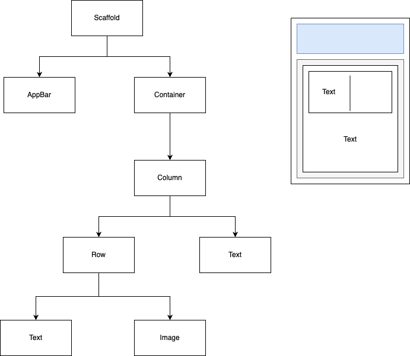

# Flutter

https://www.udemy.com/course/flutter-bootcamp-with-dart/

## introduction

flutter is kind of UI toolkit for developers 

to design beautiful interfaces 

for all sort of screen sizes and devices more easily


they offer bunch of pre-build widgets

you could deploy the app to all of devices

one codebase to rule them all

that code is Dart


flutter is open source(tou could see original code)


you could customize build in widgets


everthing inside of flutter app is 'widget'

so you could draw a widgettree

```dart
Scaffold(
	appBar: AppBar(),
  body: Container(
  	child: Column(
    	children: [
        Row(
        	Text(),
          Image(),
        ),
        Text(),
      ]
    )
  )
)
```




there are functionality widgets, too

like network image: picture from the internet via url


## I am Rich

실제 있었던 어플.

아무 기능이 없지만 부자라면 사보라는 도발과 함께

앱 스토어 최대한도 가격으로 팔린 앱

- setting

  - company domain: use for package name

    if you don't have domain, just use your name

    sujeecho.com => package name will be com.sujeecho.iamrich

  - when you create a flutter app for the first time, there is counter app as demo

- ```dart
  import 
  
  void main() => runApp(
  	MaterialApp(
      home: Text('Hello World')
    )
  );
  ```

  - you could access material design by using MateralApp

  - default location is TOP-LEFT

    if you want to center it, Material app - center - text

    `home: Center(child: Text('Hello, again'))`

- to use reformat feature, add comma after closing bracket

- main.dart on the right side of selected device is the starting point(you could change for sure)

- you could use {} instead of =>

  `void main() {runApp()}`

- trailing comment after closing bracket is optional

  preferences/Editor/General/Appearance/show closing labels

- the main function is the starting point for all our Flutter apps

- ```dart
  MaterialApp(
  	home: Scaffold(
    	backgroundColor: Colors.blueGrey,
      appBar: AppBar(
      	title: Text('I Am Rich'),
        backgroundColor: Colors.blueGrey[900],
      ),
      body: Image(
      	image: NetworkImage("https://~~"),
        // AssetImage is image from local(project folder)
      )
    )	
  )
  ```

  - appBar is shared position of Scaffold widget

  - to center the image

    1. `body: Center (child: Image(image:))`

    2. just from orginal code, 

       - put a cursor over Image, 
       - press option(alt)
       - dropdown menu / center widget

       then! automatically change the code like 1

- if it's something that show up in the screen, it's widget

- Dart using single quote(`'`) as default

  

### assetImage

- root/Images/my-img.png

- ```yaml
  # puhspec.yaml (39line. 40-42 uncomment)
  
  flutter:
  	assets:
  		-images/my-img.png
  ```

  you will specify what assets you will use from app

  yaml is not markup language

  yaml relies heavily on the **indentation(two spaces)**

  after add assets, press `Pub get` button at top-right.

  now, you can access this image on the app

- ```dart
  // main.dart
  image: AssetImage('images/my-img.png')
  ```

  exactly what you wrote at yaml

- you could specify only folders in the assets

  ```yaml
  flutter:
  	assets:
  		-images/
  ```

  still you could access the image with `image: AssetImage('images/my-img.png')`


### app Icon

https://appicon.co: you could change your image to app icon images

- move images
  - android: root/android/app/src/main/res/ 여기 안의 폴더들을 바꾼다
  - iOS: root/ios/Runner/Assets 어쩌구를 바꾼다

- android app icon looks like rectangle inside of circle.

  you could cange it!

  1. root folder right click

     Flutter

     Open Android module

     new window

  2. app/res right click

     image asset

  3. Path: choose icon img

     resize it to fit the icon

     Next-Finish

  4. you could see from res/nipmap

     

### running on the iOS / iPAD

- requires: apple ID, iPhone/iPad, Xcode, USB Cable(good one. some cables are not suit for send data)

- steps

  1. check iOS version is compatible with XCode

     if iOS is 12.2(General-Software version), XCode 10.2.1 is compatible

     Maximum two version behind XCode is acceptable.

     seconde number has to be lower on the iOS

  2. homebrew

     ```shell
     brew install --HEAD usbmuxd
     brew llink usbmuxd
     # above two line is temporary, so it might be unnecessary
     brew install --HEAD libimobiledevice
     brew install ideviceinstaller ios-deploy cocoapods
     pod setup
     ```

  3. add Apple ID to XCode

     android studio - root/iOS - right click

     1. Flutter - Open iOS module in XCode

        OR

     2. reveal in finder - iOS/Runner.xcworkspace

     Runner/General/Signing/Team: Add account

     select the account(Team)

  4. Connect USB

     trust - trust your development device

     - if app does not automatically launch, Settings/general/device/management

       myID/Trust-Trush

       then run again

  5. Create unique bundle ID from Xcode

     Runner - targets - runner - general - identity - bundle identifier

     com.sujeecho.iAmRich

     if someon already launched by this name, 

     you need to replace it with something unique

  6. run on Android Studio

     before run it just check flutter doctor

     menu/Tools/Flutter/Flutter doctor

     if it all checked, you can run on a real device


## MiCard

git repo's https clone

android studio - check out project from version control - Git - Url(git repo's https clone) - Directory: where you will install the pjt - clone

check out from version control alert - NO

open an existing and studio pjt - open(directory where you set before)

when you open it, there will be an error

=> lib/main.dart header - Get dependencies


hor reload:  ⚡beside bottom console tab

command + s (just save) triggers hot reload too

```dart
void main() {
  runApp{
  	MyApp()
  }
}

class myApp extends StatelessWidget{
  @override
  Widget build(BuildContext context) {
    return Container();
  }
}
```

container가 shortcut으로 나오는데 

이 부분을 main(){이 부분의 코드}로 바꾼다

```dart
class myApp extends StatelessWidget{
  @override
  Widget build(BuildContext context) {
    return MaterialApp(
    	home: Scaffold(...)
    )
  }
}
```


Stateless Widget 적용 후 stop - start

⚡옆의 ⚡비슷한 버튼은 state reset도 한다

hor reload won't loose the state


widget catalog(flutter.io)

containers with no children try to be as big as possible

unless the incoming constraints are unbounded, 

in which case SafeArea they try to be as small as possible.


container - wrap with new widget


```dart
MaterialApp(
home: Scaffold(
	backgroundColor: ,
  body: SafeArea(
    child: Container(
    	height: 100.0, // 100px
      width: 100.0,
      color: Colors.white,
      child: Text('Hello'),
      margin: EdgeInsets.all(20.0),
    )
  )
))
```

SafeArea를 사용하면 컨텐츠가 상태바 하단부터 나오게 해 준다

margin value === padding value

- EdgeInsets.all(20.0)
- EdgeInsets.symmetric(vertical: 50.0, horizontal: 50.0)


### flutter inspector

상단 메뉴의 체크박스를 클릭하면 el margin/padding 등을 볼 수 있다


## container

컨테이너의 자식이 하나일 때(child)는 괜찮지만

자식이 여럿일 때(children)는 column/row

```dart
column(
	mainAxisSize: MainAxisSize.min, //컬럼이 칠드런들에 맞는 사이즈로..
  verticalDirection: VerticalDirection.up,
  mainAxisAlignment: MainAxisAlignment.end,
  crossAxisAlignmen: CrossAxisAlignment.end,
)
```

- VerticalDirection은 down이 기본값
  - down
    - 1
    - 2
    - 3
  - up
    - 3
    - 2
    - 1
- MainAxisAlignment는 start가 기본값
  - start, center, end, spaceEvenly, spaceBetween
  - start는 상단 end는 하단 배치
  - spaceEvenly는 맨 위랑 맨 아래에도 공간 있음
  - column이라 y축인 거고 row면 x축
- crossAxisAlignmen는 start가 기본값
  - start, center, end, spaceEvenly, spaceBetween
  - end는 자식들 중 가장 길이가 긴 얘를 기준으로 걔의 오른쪽과 맞춰준다
  - column이라 x축인 거고 row면 y축
  - 그냥 다같이 화면의 오른쪽으로 가게 하고 싶으면..
    - 새로운 자식 container를 생성해서
    - width: double.infinity, height: 10.0,
  - 자식들 각각의 width를 **double.infinity**로 설정하든지
    **CrossAxisAlignment.stretch**를 하면 width를 무시한다(자식들이 화면의 너비 전체를 차지한다)
    - 자식들 사이에 SizedBox(height: 20.0,)을 넣으면 갭을 줄 수 있다
    - column이라 height만 설정한 것
    - stretch라서 너비 전체를 먹어서 width 설정은 안 먹힌다
    - row면 width만 설정

## s6-challenge

```dart
{
  bakcgroundColor: Colors.teal,
  SafeArea(
  	child: Rows(
  		children: <widget>(
      	CrossAxisWidget.stretch,
        MainAxisWidget.spaceBetween,
        container,
        container,
      )
  	)
  )
  
}
```


### avatar

```dart
CircleAvatar(
	radius: 50.0,
  color: Colors.white,
  backgroundImage; AssetImage('images/my-pic.jpg'),
)
```

make new directory, images and set some images

Git alert - Yes when got the project from git

```yaml
pubspec.yaml

flutter:
	uses-material-design: true
	assets:
	  - images/
```


### text

```dart
Text(
	'text string',
  style: TextStyle(
  	fontSize: 40.0,
  )
)
```


## tips

- Do not code along

  just watch videon tutorial for about 10 minutes

  tried to understand the video

  and then replicate by yourself

- www.draw.io draw a widget tree

- www.keybr.com typing speed

- getting stuck is universal part of the programming, it's not about you

- Leaving comment is good practice

- https://appicon.co image to app icon images

- good practice to building habit is draw a line on the calendar

  you don't want to break up the line

- www.icons8.com/ouch free images

- www.vecteezy.com

- www.canva.com create your own image

- ctrl + J on widget: quick docs

- 

  