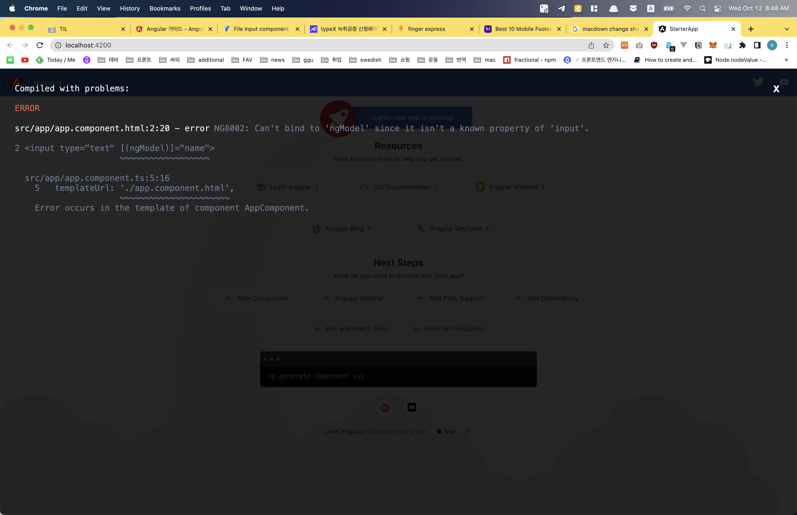

# Angular-the complete guide
[Angular - The Complete Guide (2022 Edition)](https://www.udemy.com/course/the-complete-guide-to-angular-2/)

[toc]


## getting started
- Angular?

	JS framework which allows you to build a API(single page application)
	
	SPA gives user reactive, past experience and make them feel like using mobile app
	
	
	
	- angular version
	
	  Angular JS = Angular 1: not safe. fundamental flaws
	
	
	​		| complete Re-Write. totally different from Angular 1
	
	​		Angular = Angular 2+...
	
	​		Angular 2(2016), 3 skipped..... 12.....
	
	​		there is new version every 6 months => compatible
	
	
	
- Angular CLI	

  make sure have node version < 18 (use LTS version)

  ~~~shell
  npm install -g @angular/cli
  ng new [pjt_name] --no-strict
  cd [pjt_name]
  ng serve
  ng gernerate component xyz
  ~~~
  if you enabled strict mode somehow, 

  go to `tsconfig.json` - `strict: false`

  if you don't want to have git, `ng new [pjt_name] --no-strict --skip-git`

  

- Editing the first app

  ~~~typescript
  // src/app/app.component.ts
  
  @Component({
  	selector: 'app-root', // index.html - <body> <app-root>
  	templateUrl: './app.component.html',
  	styleUrls: ['./app.component.css']
  })
  
  export class AppComponent {
  	title = "title of the app",
  	// it can be refered in the html like {{titleng}}
  	name = "tebah",
  }
  ~~~

  ~~~html
  <!-- src/app/app.component.html--> 
  
  <input type="text" [(ngModel)]="name">
  <p>{{name}}</p>
  <!-- input's word and the text inside P tag are synced
  	 name is the property inside of ts file
  -->
  ~~~
  then there will be error like below

  

  ~~~typescript
  // app.module.ts
  
  import {FormsModule} from `@angular/forms`;
  
  imports: [
  	...
  	FormsModule,
  	...
  ]
  ~~~

  

- Typescript?

  More features than vanila JS like Types, Classes, Interfaces...

  since ts can't be run in the browser, needs to be complied to js

  you don't NEED to study ts ahead to use angular

  

- Bootstrap for styling

  `npm install --save bootstrap@3`

  since I'd like to new features of bootstrap I just omitted @3 part

  ~~~json
  // angular.json(in root folder)
  "projects": {
      "starter-app": {
        ...
        "architect": {
          "build": {
            	...
              "styles": [
                "node_modules/bootstrap/dist/css/bootstrap.min.css",
                "src/styles.css" // this is for global styling. default setting
              ],
            ...
  ~~~


## the basics

- How an Angular App gets loaded and started
	
	the one served by the browser is `index.html`
		
	app-root is written like `<app-root>Loading...</app-root>` in index.html
	
	but there isn't Loading... on the browser.
	
	through the `selector` of component.ts @Component, the component can be referenced at index.html
	
	`selector: "app-root"`	=> `<app-root></app-root>` in index.html
	
- how is angular triggered?

  though we didn't import script file, ng server do that for us

  if you check the source at development tool, there are bunch of scripts at index.html

  those js files do bundling and other things for us.
  	

- Component

  component: reusable

  add components to app component

  (app component will be the wrapper of all other components)

  ```typescript
  // app/server/server.component.ts
  
  import {Component} from '@angular/core';
  
  @Component({
  	selector: 'app-server', // unique one!
  	templateUrl: './server.component.html'
  })
  
  export class ServerComponent {
  	
  }
  ```

  ```html
  // app/server/server.component.html
  
  <app-server></app-server>
  ```

  components can be used multiple times

  you could see by just adding `<app-server></app-server>` several times in the server.component.html

  it's good to make app component has only child components

  

  - app.module.ts

  	what it does?
  	
  	module: bundle of functionality of an app
  	
  	```typescript
  	import { NgModule } from '@angular/core';
  	import { FormsModule } from '@angular/forms';
  	import { HttpModule } from '@angular/http';
  	import { BrowserModule } from '@angular/platform-browser';
  	
  	import { AppComponent } from './app.component';
  	import { ServerComponent } from './server/server.component';
  	
  	@NgModule({
  	  declarations: [
  	    AppComponent,
  	    ServerComponent,
  	  ],
  	  imports: [
  	    FormsModule,
  	    HttpModule, // my project doesn't include this one, but max's does
  	    BrowserModule
  	  ],
  	  providers: [],
  	  bootstrap: [AppComponent]
  	})
  	export class AppModule { }

  	```
  	
  	new component needs to be registered in app.module.ts
  	
  	since app is the only component that is attached to index.html
  	
  	
  	
  - creating components with CLI

    :exclamation: make sure `ng serve` terminal is running

    open another terminal

    `ng generate component servers` == `ng g c servers`

    now you have new folder name servers inside app folder

    app / servers / [css, html, spec, ts]

    (spec.ts is for testing. you could remove it for now.

    to not create it from the first, `ng g c servers --skip-tests`)

    app.module.ts is updated automatically, too.

    not only app can have components in it.

    components also can have components

    

  - components templates

    ```typescript
    // servers.component.ts
    
    @Component({
      selector: 'app-servers',
    	template: `
    		<app-server></app-server>
    		<app-server></app-server>
    	`,
      styles: [`
    		h3 {
    			color: dodgeblue;
    		}
    	`]
    })
    ```

    templateUrl can be used like `template` above

    you can write in-page html if there are only a few lines

    by using back quote(`) you can insert multiple lined of html

    `styles` instead of styleUrls is also possible

    

  - selector

    you could have different style of selector

    1. 'app-servers'
    2. '[app-servers]'
    3. '.app-servers'
    4. '#app-servers'

    looks familiar?

    it's just like css selector!

    since it is css selector how you refer this is...

    1. `<app-servers>`

    2. `<div app-servers>`: using like attribute

    3. `<div class="app-servers">`

    4. `<div id="app-servers">`

       

  - assignment

    - two new components(one by manual, one by CLI)

    - display both of them

    - add something to their template

    - style it(bootstrap for one)

      

- DataBinding

  data binding is communication between TS(business logic) code and template(html)

  1. TS === output data ===> Template

     - string interpolation: {{data}}
     - property binding: [property] = "data"

  2. TS <=== react to events === Template

     ​		Event Binding: (event) = "expression"

  3. combination

     two-way-binding: [(ngModel)] = "data"

     

  - String interpolation

    ```typescript
    export class ServerComponent {
    	serverId = 10;
    }
    ```

    though it is not required, you could specify type

    ```typescript
    export class ServerComponent {
    	serverId: number = 10;
      serverStatus: string = 'offline';
      getServerStatus() { // this is how you write method
        return this.serverStatus;
      }
    }
    ```

    ```html
    <!-- server.component.html -->
    
    {{serverId}}
    {{'serverId'}}
    {{getServerStatus()}}
    ```

    string interpolation accept any expression which can be resolved to a string in the end.

    {{`this is string`}} is fine

    but no multi-line / block expression

    as long as function returns string, insertion of function is fine, too

    

  - Property binding

    ```typescript
    export class ServerComponent {
    	serverId: number = 10;
      serverStatus: string = 'offline';
      allow = false;
      getServerStatus() { // this is how you write method
        return this.serverStatus;
      }
      constructor() {
        setTimeout(() => {
          this.allow = true;
        }, 2000);
      }
    }
    ```

    ```html
    <!-- server.component.html -->
    
    <button [disabled] = "allow" >
      allow
    </button>
    <p [innerText] = "allow"></p>
    ```

    button's disabled property became boolean(because of []). 

    the value depending on the value of "allow"(which is defined at ts file like data of vue)

    since p tag's innerText is also binded to allow data, you could see allow's value 

    

    +) [angular life cycle](https://freestrokes.tistory.com/96)

     1. Constructor

     2. ngOnChanges

     3. ngOnInit

     4. ngDoCheck

         	1. ngASfterContentInit
              	2. ngAfterContentChecked
              	3. ngAfterViewInit
              	4. ngAfterViewChecked

     5. ngOnDestroy

        

  - Event Binding

    ```typescript
    export class ServerComponent {
    	serverId: number = 10;
      serverStatus: string = 'offline';
      serverStatusMsg = 'No server was created!';
      allow = false;
      getServerStatus() { // this is how you write method
        return this.serverStatus;
      }
      constructor() {
        setTimeout(() => {
          this.allow = true;
        }, 2000);
      }
      onCreateServer() {
        this.serverStatus = 'server has created!';
      }
    }
    ```

    ```html
    <!-- server.component.html -->
    
    <button 
    	[disabled] = "allow" 
      (click) = "onCreateServer()"
    >
      add server
    </button>
    <p [innerText] = "allow"></p>
    ```

    () means event binding

    google [Element_name] properties || [Element_name] events to figure out which events are there

    

    ```html
    <input (input) = "inputChanged($event)">
    ```

    input event of input element is triggered when user insert something

    when $event is used between `""` like above,` $event` means the data emitted with the event

    ```typescript
    export class ServerComponent {
    	serverName = '';
      inputChanged(event: any) {
        this.serverName = (<HTMLInputElement>event.target).value;
      }
    }
    ```

    

  - two-way binding

    `import {FormsModule} from '@angular/forms';` at app.module.ts

    ngModel is provided by FormsModule

    ngModel is used for two-way-binding

    two-way binding combines property and event

    `<input [(ngModel)] = "servetName">`
  
    
    
  - assignment
  
    1. add a input field wich updates a property "username" via two-way-binding
    2. output the usernameproperty vis string interpolation(in a paragraph below the input)
    3. add a button which may only be clicked if the username is NOT an empty string
    4. upon clicking the button, the username should be reset to an empty string
  
  
  
- Directives

  Directives are instructions in the DOM(like constructor())

  directives can have(not necessarily) template

   - ngIf

     ```html
     <p *ngIf = "booleanExpression">
       this paragraph is not exist until the value binded here is true
     </p>
     
     how about else condition?
     
     <p *ngIf = "booleanExpression; else falsyOnly;">
       this paragraph is not exist until the value binded here is true
     </p>
     <p #falsyOnly>
       you could see this phrase when the value of if condition is false
       # appended in front is for local reference
     </p>
     ```

     there is `ng-complete` tag. 

     used to mark places in the dom

     ```html
     <ng-template #falsyOnly>
     	<p #falsyOnly>
         you could see this phrase when the value of if condition is false
         # appended in front is for local reference
       </p>
     </ng-template>
     ```

     

   - ngStyle

     used for dynamic styling

     unlike structural directives, attribute directives don't add or remove element

     they only change the element they were placed on

     ```html
     <p [ngStyle] = "{'background-color': getColor()}">
     	[] shows it's bindied to the value
     <p [ngStyle] = "{backgroundColor: getColor()}">
       you don't need to add quote mark unless it includes -
     <p [ngStyle] = "{'background-color': i > 4 ? 'blue' : 'red'}">
       you can write conditional operator, too
     ```

     

   - ngClass

     dynamic class

     same as ngStyle

     ```html
     <p [ngClass] = "{online: serverStatus === 'online'}">
       since online class doesn't have dash init, you don't need to wrap it with quote.
       only if the condition is true(serverStatus strictly equals to online), online class will be added.
     </p>
     ```

     

   - ngFor

     ```html
     <p *ngFor = "let server of servers">
       
     <p *ngFor = "let server of servers; let i = index">
       if you need to access index, define any variable and then assign `index` to it
     ```

     

   - assignment

     1. add a btn 'Display Details'
     2. add a paragraph with any content of your choice
     3. toggle the displaying of that paragraph with the btn created in the step 1
     4. log all btn clicks in an array and output that array below the secret paragraph(with tiemstamp or increasing number)
     5. starting of the 5th log item, give all future log items a blue background(ngStyle) and white color(ngClass)

  
### pjt

1. Planning the App

   layout the structure

   - feature: shopping list, recipe book

   - component: 

     root > header, shoppinglist, recipes

     shopping list > shopping edit

     recipes > recipe list, recipe detail

     recipe list > recipe item

     > you can use cli command for nested folder structure
     >
     > `ng g c recipes/recipe-list --skip-tests`

   - model: ingredient, recipe

   

2. recipe model

   ```typescript
   // recipes/recipe.model.ts
   export class Recipe {
     public name: string;
     public description: string;
     public imagePath: string;
     constructor(name: string, desc: stirng, imagePath: string) {
       this.name = name;
       this.description = desc;
       this.imagePath = imagePath;
     }
   }
   ```

   ```typescript
   // recipe-list.component.ts
   import {Recipe} from '../recipe.model';
   export... {
   	recipes: Recipe[] = [
       new Recipe('A test', 'test desc', 'https://~');
     ]
   }
   ```

   when you use ngFor for imagePath

   - src = "{{recipe.imagePath}}"

   - [src] = "recipe.imagePath"

     

3. ingredient model

   there is shorcut

   ```typescript
   // app/shared/ingredient.model.ts
   // ingredient will be used in multiple components.
   // make a shared folder right below app
   export class Ingredient {
     constructor(public name: string, public amount: number) {}
   }
   ```

   this is just same as declare public name and amout, then assign the value from constructor.

   ```typescript
   // shopping-list.component.ts
   ingredients: Ingredients[] = [
     new Ingredient('Apple', 5),
     new Ingredient('Tomatoe', 10),
   ]
   ```

   

4. bootstrap

   `<span class="caret"></span>` => :small_red_triangle_down:

   

## debugging

when error message is not enough to solve the issues,

use `Browser Sourcemaps`

- devtool / sources / main.bundle.js

  if you click the line you think the problem exists, it will show you the ts file of that code

- devtool / sources / webpack /. /src/

  you can access to ts file(our src folder) directly

- do debugging in here

  

## components&databinding

- ```typescript
  element: {type: string, name: string, content: string};
  
  // it is not a type definition. it's just normal assignment
  serverElements = [{type: string, name: string, content: string}];
  ```

- property of component is only accessible from that component.

  if you want to allow parent component to access, use decorator!

  ```typescript
  import {Component, Input} from '@angular/core';
  export class {
    @Input() element: {type: string, name: string, content: string};
    // now element property of server-element component is accessible from parent component(== as long as the component is importing server-element component)
  }
  ```

  you could set alias

  `@Input('svrElement') element: {type: string, name: string, content: string};`

  `srvElement` is the name you could access to element property from outside of the component

  `element` is only for the current component

  

- emit the event to the parent component

  ```html
  <!-- app.html -->
  <app-cockpit (serverCreated)="onServerAdded($event)"></app-cockpit>
  ```

  `serverCreated` event is not the built-in event but the custom event

  

  ```typescript
  // app.ts
  serverElements = [{type: string, name: string, content: string}];
  onServerAdded(serverData: {serverName: string, serverContent: string}) {
    this.serverElements.push({
      type: 'server',
      name: serverData.serverName,
      content: serverData.serverContent
    });
  }
  ```

  serverData is the $event emitted from template

  

  ```typescript
  // cockpit.ts
  import {Component, EventEmitter} from '@angular/core';
  
  serverCreated = new EventEmitter<{serverName: string, serverContent: string}>();
  onAddServer() {
    this.serverCreated.emit({
      serverName: this.newServerName,
      serverContent: this.newServerContent,
    })
  }
  ```

  to make serverCreated be heard from outside...

  ```typescript
  import {Component, EventEmitter, Output} from '@angular/core';
  
  @Output() serverCreated = new EventEmitter<{serverName: string, serverContent: string}>();
  ```

  you could assign an alias like Input

  :exclamation:However, using output, input is not the best practice especially for complex application

  

- view encapsulation

  by adding custom attribute to element by component, angular make css file applied within that component

  `<p _ngcontent-ejo-1>` like this one

  if you want to modify it,

  ```typescript
  import {Component, ViewEncapsulation} from '@angular/core';
  
  @Component({
    encapsulation: ViewEncapsulation.Emulated;
  })
  ```

  there are three options for ViewEncapsulation

  - Emulated

    default

  - None

    no attribute is added (for this component)

    if you write css file of this component, it will be affect globally

  - ShadowDom

    same as emulated only when the browser support it

    just think there are only emulated and none

  

- local references in templates

  you can use it on ANY HTML Elements

  if you add `#customRef` to the input element,

  you can refer this input within that template(html!)

  `<button (click)="onAddServer(customRef)">`

  if you pass reference itself like above,

  type is `HTMLInputElement`

  `onAddServer(nameInput: HTMLInputElement) {};`

  

- @ViewChild()

  ```typescript
  import {Component, ViewChild, ElementRef} from '@angular/core';
  @ViewChild('customRef', {static: true}) customRef: ElementRef;
  ```

  customRef is local reference you set in html

  `{static: true}` is needs to be added as a second argument of @ViewChild() and @ContentChild() since Angular 8

  it you plan on accessing the selected element inside of ngOnInit() `true`, not inside ngOnInit() => `false`

  but after Angular 9, false is not need to be added

  

  important thing is do not access DOM with this

  DO NOT `this.customRef.nativeElement.value = 'New';`

  

- everything you place between the opening and closing tag of your own component is LOST by default

  `<app-server>You Can't SEE me</app-server>`

  but, there is a way to display it

  write `<ng-content></ng-content>` inside app-server.html

  then Angular will project it.

  

- Life Cycle

  

  :heavy_plus_sign: https://angular.kr/guide/lifecycle-hooks

  each life cycle hooking method name comes from life cycle hook interface name prefixed with` ng`

  ex) OnInit interface => ngOnInit() method

  1. ngOnChanges

     when angular sets/resets data-bound input properties

     recieve SimpleChanges object of current and previous property values

     happens frequently

  2. ngOnInit

     디렉티브, 컴포넌트에 바인딩된 입력 프로퍼티 값이 처음 할당된 후

     ngOnChanges가 처음 실행된 후 한 번

     ngOnChanges가 실행되지 않더라도 ngOnInit은 실행된다

     한 번만 실행되니까 초기화는 여기서

     Constructor에는 데이터를 외부에서 받아오고 컴포넌트 초기화하는 등의 로직 쓰지 말기! 이런 건 ngOnInit

     입력 프로퍼티 값을 할당한 후에(constructor) 컴포넌트 초기화가 가능하다

     constructor는 지역 변수 할당만 하게 만드는 게 좋다

     디렉티브에 바인딩되는 입력 프로퍼티 값은 constructor 실행 후 할당된다

     ```typescript
     constructor(private logger: LoggerService)
     
     ngOnInit() {
       this.logger.log(`#${this.id} onInit`);
     }
     ```

     if you add new instance, 

     constructor and ngOnInit will be triggered

     

     ```typescript
     import {Component, OnInit, OnChanges, simpleChanges} from '@angular/core';
     
     export class CLASSNAME implements OnInit, OnChanges {
       ngOnChanges(changes: simpleChanges) {
     		console.log(changes);
       }
     }
     ```

     it's good to use implements

     it shows what this component is using more clearly

     

     Before ngOnInit, After constructor

     changes object { 

     ​	element: simpleChange {

     ​		currentValue, 

     ​		firstChange: true, 

     ​		previousValue: undefined

     ​	}

     }

     element on the second line is the binded property

     `element = { content: '-', name: '-', typescriptpe: '-'}`

     simpleChange is types

     currentValue is the value of element

     and since this is the first one, previous Value is undefined

     

  3. ngDoCheck

  4. ngAfterContentInit

  5. ngAfterContentChecked

  6. ngAfterViewInit

  7. ngAfterViewChecked

  8. ngOnDestroy

     

- @ContentChild()

  ```typescript
  // app.html
  <app-server-element>
    <p #contentParagraph>
  
  // server_element.component.ts
  @ContentChild('contentParagraph') paragraph: ElementRef;
  ```

  @ContentChild is not accessible before ngAfterContentInit.

  

- Assignment

  1. create three new components: game control, odd, and even
  2. game control have button to start/stop the game
  3. when starting the game, an event(holding a incrementing number) should get emitted each second(ref = setInterval())
  4. the event should be listenable from outside of the component
  5. when stopping the game, no more events should get emitted(clearInterval(ref))
  6. a new odd component should get created for every odd number emitted. and same for event
  7. output odd-numger, even-number
  8. style the output text differently

### pjt

- adding navigation with event binding & ngIf

  ```html
  <!-- header.html -->
  Nav > ul > li > <a (click)="onSelect('recipe')"></a>
  Nav > ul > li > <a (click)="onSelect('shopping-list')"></a>
  ```

  ```typescript
  @Output() featureSelected = new EventEmitter<string>();
  
  onSelect(feature: string) {
    this.featureSelected.emit(feature);
  }
  ```

  ```html
  <!-- app.html -->
  <app-header (featureSelected)="onNavigate($event)">
  	<app-recipes *ngIf="loadedFeature === 'recipe'"></app-recipes>
    <app-shopping-list *ngIf="loadedFeature !== 'recipe'"></app-shopping-list>
  </app-header>
  ```

  

  you could also send $event and other data

  ```html
  <a (click)="btnClicked($event, data)"></a>
  <a (click)="btnClicked(data, $event)"></a>
  ```

  $event's order is not important. 

  just use this specific name `$event`

  

  ```typescript
  // app.ts
  loadedFeature = 'recipe';
  
  onNavigate(feature: string) {
    this.loadedFeature = feature;
  }
  ```

  

- passing Recipe data with property binding

  ```html
  <!-- recipe-list.html -->
  <app-recipe-item
  	*ngFor="let recipeEl of recipes"
    [recipe] = "recipeEl"
  ></app-recipe-item>
  ```

  ```typescript
  // recipe-item.ts
  @Input() recipe: Recipe; // this one is app-list-item.html's [recipe]
  ```

  `@Input()` allows us to bind this component property from outside

  

- passing data with Event and property bindings

  ```html
  <!-- recipe-item.html -->
  <a (click)="onSelected()"></a>
  ```

  ```typescript
  // recipe-item.ts
  @Output() recipeSelected = new EventEmitter<void>();
  
  onSelected() {
    this.recipeSelected.emit();
  }
  ```

  

  ```html
  <!-- recipe-list.html -->
  <app-recipe-item
  	*ngFor="let recipeEl of recipes"
    [recipe] = "recipeEl"
    (recipeSelected) = "onRecipeSelected(recipeEl)"
  ></app-recipe-item>
  ```

  ```typescript
  // recipe-list.ts
  @Output() recipeWasSelected = new EventEmitter<Recipe>();
  
  onRecipeSelected(recipe: Recipe) {
    this.recipeWasSelected.emit(recipe);
  }
  
  ```

  

  ```html
  <!-- recipes.html -->
  <app-recipe-list
  	(recipeWasSelected) = "selectedRecipe = $event"
  >
  	<app-recipe-detail
    	*ngIf="selectedRecipe; else infoText"
    >
    </app-recipe-detail>
    <ng-template #infoText>
    	<p>
        Please select a recipe
      </p>
    </ng-template>
  </app-recipe-list>
  
  ```

  ```typescript
  // recipe.ts
  selectedRecipe: Recipe;
  ```

  `(recipeWasSelected) = "selectedRecipe = $event"`

  you could assign as inline style! as long as it's simple one

  

  ```typescript
  // recipe-detai.ts
  @Input() recipe: Recipe;
  ```

  ```html
  <!-- recipes.html -->
  
  <app-recipe-detail 
  	*ngIf="selectedRecipe; else infoText"
    [recipe]="SelectedRecipe">
  </app-recipe-detail>
  
  
  <!-- recipe-detail.html -->
  
  {{ recipe.name }}
  
  ```


- add ingredients to the shopping list

  ```html
  <!-- shopping-edit.html -->
  
  <input id="name" #nameInput>
  <input id="amount" #amountInput>
  <button (click)="onAddItem()">
    Add
  </button>
  ```

  ```typescript
  // shopping-edit.ts
  
  @ViewChild('nameInput') nameInputRef: elementRef;
  // if angular8, second argument of ViewChild needs to be {static: false}
  @ViewChild('amountInput') amountInputRef: elementRef;
  @Output() ingredientAdded = new EventEmitter<Ingredient>();
  // Ingredient is imported. Ingredient = {name: string, amount: string}, so you could replace Ingredient with that object. but not recommended of course.
  
  onAddItem() {
    const ingName = this.nameInputRef.nativeElement.value;
    const ingAmount = this.amountInputRef.nativeElement.value;
    const newIngredient = new Ingredient(ingName, ingAmount);
    this.ingredientAdded.emit(newIngredient);
  }
  ```

  ```html
  <!-- shopping-list.html -->
  <app-shopping-edit (ingredientAdded)="onIngredientAdded($evnet)"></app-shopping-edit>
  ```

  ```typescript
  // shopping-list.ts
  onIngredientAdded(ingredient: Ingredient) {
    this.ingredients.push(ingredient);
  }
  ```

  

## directives

| attribute directive                                          | structural directive                                         |
| ------------------------------------------------------------ | ------------------------------------------------------------ |
| just like normal HTML attribute<br />possibly with data binding or event binding | look like a normal HTML attribute<br />but have a leading *(for desguising) |
| only affect/change the element they are added to             | affect a whole area in the DOM(elements get added/removed)   |

you could have **only one** structural directive on one element

you could use variable that defined within that element

```html
<li
    *ngFor="let odd of oddNumbers"
    [ngClass]="{oddClass: odd % 2 !== 0}"
    [ngStyle]="{backgroundColor: add % 2 !== 0 ? 'yellow' : 'transparent'}"
></li>
```

odd in ngClass and ngStyle comes form ngFor


- create own attribute directive

  BasicHighlightDirective is the directive that chagne background of element

  ```typescript
  // app/basic-highlight/basic-highlight.directive.ts
  import {Directive} from '@angular/core';
  
  @Directive ({
    selector: `[appBasicHighLight]` 
    // camel case notation for directive selector
    // directive's selector is just like component's selector
  })
  export class BasicHighlightDirective implements OnInit {
  	constructor(private elementRef: ElementRef){}
    
    ngOnInit() {
      this.elementRef.nativeElement.style.backgroundColor = 'green';
      // this statement could be written in constructor but it's better to be in onInit()
    }
  }
  ```

  

  then infore it

  ```typescript
  // app.module.ts
  import
  	declarations: [
      AppComponent,
      BasicHighlightDirective
    ]
  ```

  now you can set BasicHighlightDirective within any component(without import)

  `<p appBasicComponentligt>Style me </p>`

  it's look like attribute because you've set the name like that

  

- renderer to build a better attribute directive

  access to the elements directly from the ts file is not recommended style(the one used at basic highlight)

  ```typescript
  // better-highlight / better-highlight.directive.ts
  import {Directive, OnInit, ElementRef, Renderer2} from '@angular/core';
  
  @Directive({ selector: '[appBetterHighlight]'})
  export class BetterHighlightDirective implements OnInit {
    constructor(private elRef: ElementRef, private renderer: Renderer2) {}
    
    ngOnInit() {
      this.renderer.setStyle(this.elRef.nativeElement, 'background-color', 'blue', false, false) // 4th optional argument is flag
    }
  }
  ```

  :exclamation: Renderer2

  ```html
  <p appBetterDirective>
    Blue
  </p>
  ```

- Host Listener

  ```typescript
  // betterHighlight
  import {HostListener} from '@angular/core';
  
  // HostListener's argument is string of event name : 'mouseenter'
  @HostListener('mouseenter') mouseover(eventData: Event) { 
    this.render.setStyle(this.elRef.nativeElement, 'background-color', 'blue', false, false);
  }
  
  @HostListener('mouseleave') mouseleave(eventData: Event) {
    this.render.setStyle(this.elRef.nativeElement, 'background-color', 'transparent', false, false);
  }
  ```

- HostBinding

  render is find but hostbinding is better

  ```typescript
  // betterHighlight
  import {HostBinding} from '@angular/core';
  
  // camel case!! backgroundColor
  @HostBinding('style.backgroundColor') backgroundColor: string = 'transparent',
    // set default value to prevent error
  constructor
  ngOnInit
  @HostListener('mouseenter') mouseover(eventData: Event) {
    this.backgroundColor='blue';
    // now you don't need to specify this.render.setStyle~~
  }
  ```

- binding to directive properties

  custom property binding

  ```typescript
  @input() defaultColor: string = 'transparent';
  @input() highlightColor: string = 'blue';
  @HostBinding('style.backgroundColor') = this.defaultColor;
  @HostListener('mouseenter') mouseover(eventData: Event) {
    this.backgroundColor = this.highlightColor;
  }
  ```

  ```html
  <p 
     appBetterHighlight
     [defaultColor] = "'yellow'"
     [highlightColor] = "'red'"
     >
    not transparent / blue
    but yellow / red
  </p>
  ```

  `[defaultColor] = "'yellow'"` == `defaultColor="yellow"`

  you should set default color from `ngOnInit()`

  ngOnInit() {

  ​	this.backgroundColor = this.defaultColor;

  }

- `<ng-template>` is  not rendered element. but when angular needed, it can be rendered

  ```html
  <ng-template [ngIf]="!onlyOdd"></ng-template>
  ==
  <div *ngIf = "!onlyOdd"></div>
  ```

  ```typescript
  @Directive({selector: '[appUnless]'})
  export class UnlessDirective {
  	@Input() set appUnless(condition: boolean) {
      // set makes it triggered whenever property changes(change outside of this directive). with set, this Input() is working like method. it is property, just setter of a property
      if (!condition) {
        // viewContainerReference?
        this.vcRef.createEmbeddedView(this.templateRef);
      } else {
        this.vcRef.clear(); // remove everything form this view
      }
    }
  }
  ```

  use this unless directive like ngif

  ```typescript
  constructor(private templateRef: TemplateRef<any>,
              private vcRef: ViewContainerRef
             )
  ```

  ```html
  <div *appUnless = "onlyOdd">
    since it's unless not if, no need to use !onlyOdd.
    ng-template is not needed, it will be cleared.
  </div> 
  ```

- ngSwitch

  built-in structural directive

  ```html
  <div [ngSwitch]="value">
    <p *ngSwitchCase="5">Value = 5</p>
    <p *ngSwitchCase="10">Value = 10</p>
    <p *ngSwitchCase="15">Value = 15</p>
    <p *ngSwitchDefault>Value is unset</p>
  </div>
  ```

### pjt

- dropdown directive

  ```ts
  // shared / dropdown.directive.ts
  // add this directive in app.module
  @Directive({selector: '[appDropdown]'})
  export class DropdownDirective {
    @HostBinding('class.open') isOpen = false;
    @HostListener('click') toggleOpen() {
      thisisOpen = !this.isOpen;
    }
    
  }
  
  ```

  with this directive, when button.dropdown-toggle in recipe-detail is clicked,

  add open class to the btn-group div(parent of button) and remove the class when it is clicked second time

  ```html
  // recipe-detail.component.html
  <div class="btn-group" appDropdown>
    <button>
    </button>
  </div>
  ```

  ```html
  // header.html
  <ul class="nav navbar-right">
    <li class="dropdown" appDropdown></li>
  </ul>
  ```

- close the dropdown from anywhere

  when user clickes anywhere outside of the dropdown, the dropdown will be closed

  ```typescript
  @HostListener('document.click', ['$event']) toggleOpen(event: Event) {
    this.isOpen = this.elRef.nativeElement.contains(event.target) ? !this.isOpen : false;
  }
  constructor(private elRef: elementRef) {}
  ```

  

## using services & dependency injection

- service
  - reuse code & store data
  - centralization

- takes a logging service

  ```typescript
  // app/logging.service.ts
  
  export class LoggingService {
    
  }
  ```

  service doesn't need a decorator(can use)

### pjt
## changing pages with routing
### pjt
## understanding observables
### pjt
## handling forms in angular apps
### pjt
## using pipes to transform output
## making http requests
### pjt
## authentication & route protection in Angular
## dynamic components
## angular modules & optimizing angular apps
## deploying an Angular app
## standalone componemnts
## working with NgRx in our project
## Angular universal
## Angular animations
## adding offline capabilities with service workers
## a basic introduction to unit testing in Angular apps
## Angular as a Platform & closer look at the CLI
## Angular changes & new features
## Typescript introduction