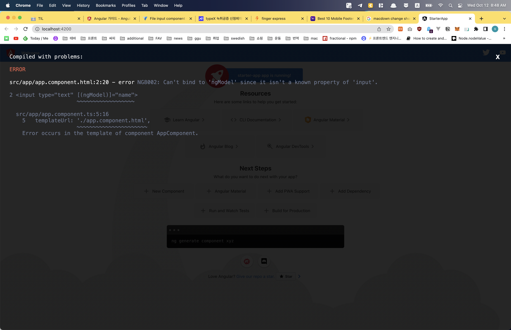

# Angular
[Angular - The Complete Guide (2022 Edition)](https://www.udemy.com/course/the-complete-guide-to-angular-2/)


## getting started
- Angular?

	JS framework which allows you to build a API(single page application)
	
	SPA gives user reactive, past experience and make them feel like using mobile app
	
	
	
	- angular version
	
	  Angular JS = Angular 1: not safe. fundamental flaws
	
	
	​		| complete Re-Write. totally different from Angular 1
	
	​		Angular = Angular 2+...
	
	​		Angular 2(2016), 3 skipped..... 12.....
	
	​		there is new version every 6 months => compatible
	
	
	
- Angular CLI	

  make sure have node version < 18 (use LTS version)

  ~~~shell
  npm install -g @angular/cli
  ng new [pjt_name] --no-strict
  cd [pjt_name]
  ng serve
  ng gernerate component xyz
  ~~~
  if you enabled strict mode somehow, 

  go to `tsconfig.json` - `strict: false`

  if you don't want to have git, `ng new [pjt_name] --no-strict --skip-git`

  

- Editing the first app

  ~~~typescript
  // src/app/app.component.ts
  
  @Component({
  	selector: 'app-root', // index.html - <body> <app-root>
  	templateUrl: './app.component.html',
  	styleUrls: ['./app.component.css']
  })
  
  export class AppComponent {
  	title = "title of the app",
  	// it can be refered in the html like {{titleng}}
  	name = "tebah",
  }
  ~~~

  ~~~html
  <!-- src/app/app.component.html--> 
  
  <input type="text" [(ngModel)]="name">
  <p>{{name}}</p>
  <!-- input's word and the text inside P tag are synced
  	 name is the property inside of ts file
  -->
  ~~~
  then there will be error like below

  

  ~~~typescript
  // app.module.ts
  
  import {FormsModule} from `@angular/forms`;
  
  imports: [
  	...
  	FormsModule,
  	...
  ]
  ~~~

  

- Typescript?

  More features than vanila JS like Types, Classes, Interfaces...

  since ts can't be run in the browser, needs to be complied to js

  you don't NEED to study ts ahead to use angular

  

- Bootstrap for styling

  `npm install --save bootstrap@3`

  since I'd like to new features of bootstrap I just omitted @3 part

  ~~~json
  // angular.json(in root folder)
  "projects": {
      "starter-app": {
        ...
        "architect": {
          "build": {
            	...
              "styles": [
                "node_modules/bootstrap/dist/css/bootstrap.min.css",
                "src/styles.css" // this is for global styling. default setting
              ],
            ...
  ~~~


## the basics

- How an Angular App gets loaded and started
	

the one served by the browser is `index.html`
	
app-root is written like `<app-root>Loading...</app-root>` in index.html
	
	but there isn't Loading... on the browser.
	
	through the `selector` of component.ts @Component, the component can be referenced at index.html
	
	`selector: "app-root"`	=> `<app-root></app-root>` in index.html


​	
​	
	- how is angular triggered?
	
		though we didn't import script file, ng server do that for us
		
		if you check the source at development tool, there are bunch of scripts at index.html
		
		those js files do bundling and other things for us.


​		
​	
- Component

  component: reusable

  add components to app component

  (app component will be the wrapper of all other components)

  ```typescript
  // app/server/server.component.ts
  
  import {Component} from '@angular/core';
  
  @Component({
  	selector: 'app-server', // unique one!
  	templateUrl: './server.component.html'
  })
  
  export class ServerComponent {
  	
  }
  ```

  ```html
  // app/server/server.component.html
  
  <app-server></app-server>
  ```

  components can be used multiple times

  you could see by just adding `<app-server></app-server>` several times in the server.component.html

  

  - app.module.ts

  	what it does?
  	
  	module: bundle of functionality of an app
  	
  	```typescript
  	import { NgModule } from '@angular/core';
  	import { FormsModule } from '@angular/forms';
  	import { HttpModule } from '@angular/http';
  	import { BrowserModule } from '@angular/platform-browser';
  	
  	import { AppComponent } from './app.component';
  	import { ServerComponent } from './server/server.component';
  	
  	@NgModule({
  	  declarations: [
  	    AppComponent,
  	    ServerComponent,
  	  ],
  	  imports: [
  	    FormsModule,
  	    HttpModule, // my project doesn't include this one, but max's does
  	    BrowserModule
  	  ],
  	  providers: [],
  	  bootstrap: [AppComponent]
  	})
  	export class AppModule { }

  	```
  	
  	new component needs to be registered in app.module.ts
  	
  	since app is the only component that is attached to index.html
  	
  	
  	
  - creating components with CLI

    :exclamation: make sure `ng serve` terminal is running

    open another terminal

    `ng generate component servers` == `ng g c servers`

    now you have new folder name servers inside app folder

    app / servers / [css, html, spec, ts]

    (spec.ts is for testing. you could remove it for now.

    to not create it from the first, `ng g c servers --skip-tests`)

    app.module.ts is updated automatically, too.

    not only app can have components in it.

    components also can have components

    

  - components templates

    ```typescript
    // servers.component.ts
    
    @Component({
      selector: 'app-servers',
    	template: `
    		<app-server></app-server>
    		<app-server></app-server>
    	`,
      styles: [`
    		h3 {
    			color: dodgeblue;
    		}
    	`]
    })
    ```

    templateUrl can be used like `template` above

    you can write in-page html if there are only a few lines

    by using back quote(`) you can insert multiple lined of html

    `styles` instead of styleUrls is also possible

    

  - selector

    you could have different style of selector

    1. 'app-servers'
    2. '[app-servers]'
    3. '.app-servers'
    4. '#app-servers'

    looks familiar?

    it's just like css selector!

    since it is css selector how you refer this is...

    1. `<app-servers>`

    2. `<div app-servers>`: using like attribute

    3. `<div class="app-servers">`

    4. `<div id="app-servers">`

       

  - assignment

    - two new components(one by manual, one by CLI)

    - display both of them

    - add something to their template

    - style it(bootstrap for one)

      

- DataBinding

  data binding is communication between TS(business logic) code and template(html)

  1. TS === output data ===> Template

     - string interpolation: {{data}}
     - property binding: [property] = "data"

  2. TS <=== react to events === Template

     ​		Event Binding: (event) = "expression"

  3. combination

     two-way-binding: [(ngModel)] = "data"

     

  - String interpolation

    ```typescript
    export class ServerComponent {
    	serverId = 10;
    }
    ```

    though it is not required, you could specify type

    ```typescript
    export class ServerComponent {
    	serverId: number = 10;
      serverStatus: string = 'offline';
      getServerStatus() { // this is how you write method
        return this.serverStatus;
      }
    }
    ```

    ```html
    <!-- server.component.html -->
    
    {{serverId}}
    {{'serverId'}}
    {{getServerStatus()}}
    ```

    string interpolation accept any expression which can be resolved to a string in the end.

    {{`this is string`}} is fine

    but no multi-line / block expression

    as long as function returns string, insertion of function is fine, too

    

  - Property binding

    ```typescript
    export class ServerComponent {
    	serverId: number = 10;
      serverStatus: string = 'offline';
      allow = false;
      getServerStatus() { // this is how you write method
        return this.serverStatus;
      }
      constructor() {
        setTimeout(() => {
          this.allow = true;
        }, 2000);
      }
    }
    ```

    ```html
    <!-- server.component.html -->
    
    <button [disabled] = "allow" >
      allow
    </button>
    <p [innerText] = "allow"></p>
    ```

    button's disabled property became boolean(because of []). 

    the value depending on the value of "allow"(which is defined at ts file like data of vue)

    since p tag's innerText is also binded to allow data, you could see allow's value 

    

    +) [angular life cycle](https://freestrokes.tistory.com/96)

     1. Constructor

     2. ngOnChanges

     3. ngOnInit

     4. ngDoCheck

         	1. ngASfterContentInit
              	2. ngAfterContentChecked
              	3. ngAfterViewInit
              	4. ngAfterViewChecked

     5. ngOnDestroy

        

  - Event Binding

    ```typescript
    export class ServerComponent {
    	serverId: number = 10;
      serverStatus: string = 'offline';
      serverStatusMsg = 'No server was created!';
      allow = false;
      getServerStatus() { // this is how you write method
        return this.serverStatus;
      }
      constructor() {
        setTimeout(() => {
          this.allow = true;
        }, 2000);
      }
      onCreateServer() {
        this.serverStatus = 'server has created!';
      }
    }
    ```

    ```html
    <!-- server.component.html -->
    
    <button 
    	[disabled] = "allow" 
      (click) = "onCreateServer()"
    >
      add server
    </button>
    <p [innerText] = "allow"></p>
    ```

    () means event binding

    google [Element_name] properties || [Element_name] events to figure out which events are there

    

    ```html
    <input (input) = "inputChanged($event)">
    ```

    input event of input element is triggered when user insert something

    when $event is used between `""` like above,` $event` means the data emitted with the event

    ```typescript
    export class ServerComponent {
    	serverName = '';
      inputChanged(event: any) {
        this.serverName = (<HTMLInputElement>event.target).value;
      }
    }
    ```

    

  - two-way binding

    `import {FormsModule} from '@angular/forms';` at app.module.ts

    ngModel is provided by FormsModule

    ngModel is used for two-way-binding

    two-way binding combines property and event

    `<input [(ngModel)] = "servetName">`
  
    
    
  - assignment
  
    1. add a input field wich updates a property "username" via two-way-binding
    2. output the usernameproperty vis string interpolation(in a paragraph below the input)
    3. add a button which may only be clicked if the username is NOT an empty string
    4. upon clicking the button, the username should be reset to an empty string
  
  
  
- Directives

  Directives are instructions in the DOM(like constructor())

  directives can have(not necessarily) template

   - ngIf

     ```html
     <p *ngIf = "booleanExpression">
       this paragraph is not exist until the value binded here is true
     </p>
     
     how about else condition?
     
     <p *ngIf = "booleanExpression; else falsyOnly;">
       this paragraph is not exist until the value binded here is true
     </p>
     <p #falsyOnly>
       you could see this phrase when the value of if condition is false
       # appended in front is for local reference
     </p>
     ```

     there is `ng-complete` tag. 

     used to mark places in the dom

     ```html
     <ng-template #falsyOnly>
     	<p #falsyOnly>
         you could see this phrase when the value of if condition is false
         # appended in front is for local reference
       </p>
     </ng-template>
     ```

     

   - ngStyle

     used for dynamic styling

     unlike structural directives, attribute directives don't add or remove element

     they only change the element they were placed on

     ```html
     <p [ngStyle] = "{'background-color': getColor()}">
     	[] shows it's bindied to the value
     <p [ngStyle] = "{backgroundColor: getColor()}">
       you don't need to add quote mark unless it includes -
     <p [ngStyle] = "{'background-color': i > 4 ? 'blue' : 'red'}">
       you can write conditional operator, too
     ```

     

   - ngClass

     dynamic class

     same as ngStyle

     ```html
     <p [ngClass] = "{online: serverStatus === 'online'}">
       since online class doesn't have dash init, you don't need to wrap it with quote.
       only if the condition is true(serverStatus strictly equals to online), online class will be added.
     </p>
     ```

     

   - ngFor

     ```html
     <p *ngFor = "let server of servers">
       
     <p *ngFor = "let server of servers; let i = index">
       if you need to access index, define any variable and then assign `index` to it
     ```

     

   - assignment

     1. add a btn 'Display Details'
     2. add a paragraph with any content of your choice
     3. toggle the displaying of that paragraph with the btn created in the step 1
     4. log all btn clicks in an array and output that array below the secret paragraph(with tiemstamp or increasing number)
     5. starting of the 5th log item, give all future log items a blue background(ngStyle) and white color(ngClass)

  
### pjt

1. Planning the App

   layout the structure

   - feature: shopping list, recipe book

   - component: 

     root > header, shoppinglist, recipes

     shopping list > shopping edit

     recipes > recipe list, recipe detail

     recipe list > recipe item

     > you can use cli command for nested folder structure
     >
     > `ng g c recipes/recipe-list --skip-tests`

   - model: ingredient, recipe

   

2. recipe model

   ```typescript
   // recipes/recipe.model.ts
   export class Recipe {
     public name: string;
     public description: string;
     public imagePath: string;
     constructor(name: string, desc: stirng, imagePath: string) {
       this.name = name;
       this.description = desc;
       this.imagePath = imagePath;
     }
   }
   ```

   ```typescript
   // recipe-list.component.ts
   import {Recipe} from '../recipe.model';
   export... {
   	recipes: Recipe[] = [
       new Recipe('A test', 'test desc', 'https://~');
     ]
   }
   ```

   when you use ngFor for imagePath

   - src = "{{recipe.imagePath}}"

   - [src] = "recipe.imagePath"

     

3. ingredient model

   there is shorcut

   ```typescript
   // app/shared/ingredient.model.ts
   // ingredient will be used in multiple components.
   // make a shared folder right below app
   export class Ingredient {
     constructor(public name: string, public amount: number) {}
   }
   ```

   this is just same as declare public name and amout, then assign the value from constructor.

   ```typescript
   // shopping-list.component.ts
   ingredients: Ingredients[] = [
     new Ingredient('Apple', 5),
     new Ingredient('Tomatoe', 10),
   ]
   ```

   

4. bootstrap

   `<span class="caret"></span>` => :small_red_triangle_down:

## debugging

when error message is not enough to solve the issues,

use `Browser Sourcemaps`

- devtool / sources / main.bundle.js

  if you click the line you think the problem exists, it will show you the ts file of that code

- devtool / sources / webpack /. /src/

  you can access to ts file(our src folder) directly

- do debugging in here

## components&databinding
### pjt
## directives
## using services & dependency injection
### pjt
## changing pages with routing
### pjt
## understanding observables
### pjt
## handling forms in angular apps
### pjt
## using pipes to transform output
## making http requests
### pjt
## authentication & route protection in Angular
## dynamic components
## angular modules & optimizing angular apps
## deploying an Angular app
## standalone componemnts
## working with NgRx in our project
## Angular universal
## Angular animations
## adding offline capabilities with service workers
## a basic introduction to unit testing in Angular apps
## Angular as a Platform & closer look at the CLI
## Angular changes & new features
## Typescript introduction