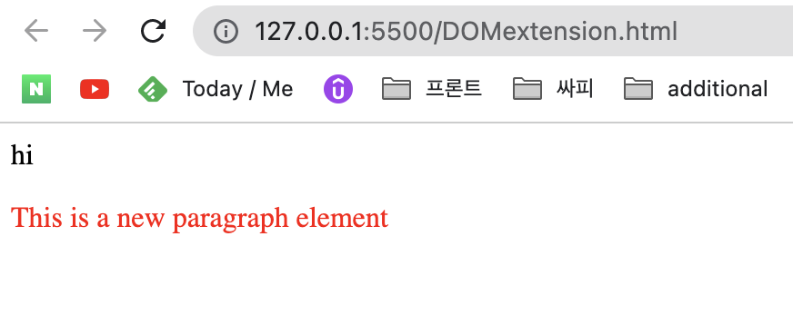

# DOM

source: [Udemy course DOM 2022](https://www.udemy.com/course/build-interactive-websites-1/) 

## Introduction

DOM: Document Object Model

- almost every single interaction on your page

- DOM is **not** a programming language

- the Browser gives us access to the DOM

  different browser will have its own way of creating the DOM

- everything in the browser can be represented as am object


DOM **Hierarchy**

- the DOM will map out HTML into a hierarchical structure

- window: each tab has its own window instance

  >  window has many properties(closed, frames, location, document)

- all the document object represents our entire webpage

  if you want to access any element in an HTML page, you always have to start with accessing the document object

  `[window.]document`

- console.log(): a function that prints an array.object or message to the console, most times as a string

  console.dir(): a function that takes an object as its input, and prints it out as a JSON-like tree

- document = html = head = title

  ​							   = body = h1, p, form, form

  html에 form이 두 개 있어서

  `document.forms`하면 HTMLCollection(2) [form, form]

- JS uses the DOM API to tell the browser what to display on page


BOM

- the console is part of the window object

- window object is supplied by the BOM(Browser Object Model)

- BOM allows JS to talk to the browser

  about things other than the content of the page

  ex) history, navigator, screen, location...

- window: entire browser

  - document: your website

  - navigator: info about the browser

    location: current URL

    screen: info about user's screen

    history: info about user's history

- there is no standard for the BOM

- the whole HTML document is a property of the window object

  if it's object of the window, you don't have to write `window.`

  ex) document(not window.document), console...

- the DOM looks at our document object within our hierarchical structure

- every website consists of an HTML document, DOM

  this model(DOM) allows JS(and other languages) to access elements and text of the web page

  the page content is stored in the DOM

  JS is just one of different languages that is given access to all of this content

- DOM was designed to be independent of any programming language(we mostly use JS)


XML: eXtensible Markup Language


What is NOT the DOM

- DOM is not your HTML

  you could figure it out in errors and JS

  **Errors**: the DOM is an interface for valid HTML documents. if html file has an error itself, (like 'hello' only in html file without tags) DOM will add certain elements to make it a valid representation.

  **JS**: DOM is modified by JS like creation of new element

- DOM is not what you see in the browser

  ```html
  <p style="display: none;">
    I'm still in the DOM
  </p>
  ```

  the browser will not display this paragraph,

  but it still stays in the DOM.

  DOM is not the same as the render tree(what you see in the browser)

- DOM is not whats in DevTools

  example of this would be CSS pseudo-elements(::before, ::after...).

  CSS pseudo-elements are part of the CSSOM

  so, it is in the tree but not part of the DOM

  there is subtle difference. because element inspector of DevTools try to be close to the DOM in the browser. sometimes it includes info that is not in the DOM

  DOM does not have **style** of elements.

  DevTools display only **after** and **before**(among CSS pseudo-elements)


Pseudo Elements

- A CSS pseudo-element is a keyword added to a selector that lets you style a specific part of an elements.
- `selector::pseudo-element {}`
- ::first-letter, ::first-line, ::before, ::after
- since this is not the part of the DOM, JS couldnt's access this pseudo elements.

What is the DOM

- the DOM is built from our source HTML file

- the DOM is always built from valid hTML

- the DOM looks at our document object within our hierarchical structure

- Every website has a DOM

  this model(DOM) allows JS(and other languages) to access elements and text

- the DOM is alive

  we can change it with JS at any time

- the true DOM does not include any CSS properties

  though there is no way to see the TRUE DOM

- the DOM is an interface to web pages

  it's an API to the page, allowing programs and languages to read and manipulate the page's content, structure, and styles.

  

## JavaScript vs DOM

what is the DOM API

- the browser creates the DOM to render the page

- the browser gives JS access the DOM

- there are the DOM and JS engine inside the browser

  DOM does not live inside the JS engine

  the DOM API gives JS ways(methods) to access the DOM

  JS engine lives in the browser independently of the DOM


```html
<button onclick="newWindow()">Curious?</button>
```

```jsx
function newWindow() {
	let url = 'https://dictionary.com/browse/shivoo?s=t';
	// open url on new window(not tab), features size is 500x800
	let newWindow = window.open(url, "", "width=500, height=800"); 
  // close this new window after 5 seconds
	setTimeout(() => {
		newWindow.close();
	}, 5000);
}
```

`[window.open](http://window.open)` gets three arguments.

1. url 
2. target
3. features

```jsx
setTimeout(() => {
		newWindow.close();
	}, 5000);
```

`setTimeout`, `close()`, `,5000` 셋 다 JS 아님. DOM API다

`() -> {}` , `newWindow`, `.으로 타고 들어가는 거`, `;` 얘네는 JS

어쨌든 DOM이랑 js 둘 다 함께 해야 함

The browser provides us with a DOM API

The DOM API gives us many functions like setTimeout, to access the DOM

These functions are not JS

JS is a programming language that browsers can execute

We use JS to work with the DOM API

The DOM was not designed for JS… this can sometimes make things awkward

The DOM and JavaScript are completely different. One way to think about it is that the DOM API gives us the bricks, and JavaScript is the concrete (or glue) that holds them all together.

<u>let</u> button <u>=</u> document<u>.</u>getElementById<u>('</u>test<u>');</u>

button<u>.</u>addEventListener<u>('</u>click<u>', () =></u> alert('hi<u>'));</u>

underlined text is JavaScript. plane text is the DOM API.


## Accessing the DOM

DOM: the browser's visual representation of your page

To access the DOM, use document object

`typeof(document)` => object

though each browser has their own DOM, they follow the same standards.

- ways to access elements on our page(access the DOM)

  sometimes we want more control than only accessing the document

  - `document.getElementById()` => element object
  - `document.getElementsByClassName()` => HTML Collection
  - `document.getElementsByTagName()` => HTML Collection
  - `document.querySelector()` => element object
  - `document.querySelectorAll()` => node list

  these methods comes from Document object

the DOM is often referred to as DOM Tree. 

this tree consists of millions of objects called Nodes.

pretty much everything is node.

document node - html node - head node - title node...

document node - html node - body node - h1 node...

- `<h1 id = "heading"> Hope </h1>` 

  whole line above is element.

  h1 is tag

  id is attribute

  heading is attribute value

  Hope is text

### getElementById

traditional way of accessing DOM

it returns an Element node

```js
let header = document.getElementById('header');
header.nodeType; // 1(it means Element Node)
header.nodeName; // Div(header is Div Element)
```

Id has to be **unique**

you can only access **one** element

### getElementsByClassName

it takes only one argument - the class name

returns a live HTMLCollection(it's **not** an array)

```js
let classElements = document.getElementsByClassName('header');
for(i=0; i<classElements.length; ++i) {
  classElements[i].style.backgroundColor = 'rgb(122, 173, 254)';
}
```

forEach function can only be used on Arrays, Maps, and Sets.

HTMLCollection.forEach() throws an error

length property is provided by the DOM API not JS.

### getElementsByTagName

this method searches through all nodes, finding those with a specified tag name(=> heavy performance)

it returns a live HTMLCollection

`let tagElements = document.getElementsByTagName('p');`

### querySelector

kinda newer way to access the DOM

like jQuery's CSS selector

In 2013, we were given the Selector API(querySelector, querySelectorAll)

querySelector returns single Item(Element Object)

querySelectorAll returns all elements(Node List)

`#test`: id = "test"

`#test.demo`: id = "test" & class = "demo"

`.text`: class = "test"

`a:hover`: when mouse over a link

`*`: all elements

```js
let queryElement = document.querySelector("#query");
let queryAllElement = document.querySelectorAll(".query-all");
// forEach can be applied for node list
queryAllElement.forEach(el => { 
  el.style.backgroundColor = "red";
});
```


## Nodes

Node: every item in the DOM tree

every html document is made up of a tree of HTML nodes. ex) `<p>` `<head>`

each node can have html attributes

each node can have content including other nodes & text

semantic tag: nodes which have a specific meaning / purpose


```html
<head>
  <title>This is title</title>
</head>
```

- `HTML`(HTMLElementNode)
  - `HEAD`(Head Element Node)
    - `#text`(new line, space..)
    - `TITLE`(Title Element Node)
      - `#text`
    - `#text`(new line)


any new line or space are valid characters

=> they are part of the DOM

but there are two exceptions

- spaces & new lines **above** the `<head>` are ignored
- spaces & new lines **below** the `</body>` are removed and placed inside the `<body>`


### different types of Node

- 1: **Element Node** - inside of tag
- 3: **Text node** - not inside of a tag. actual text
- 4: CDATA section Node - character data that is not parsed by the parser
- 7: Processing Instruction Node - used with XML to embed application-specific instructions
- 8: **Comment Node** - `<!-- -->`
- 9: **Document Node** - root document node
- 10: Document Type Node - `<!DOCTYPE html>` declaration
- 11: Document Fragment Node - a lightweight document object. sometimes you may want to extract a portion of the documents tree and create a new fragment

Every node has a nodeType, nodeName and nodeValue property


family dynamics: parents, siblings, children

이 관계는 누가 중심이냐에 따라 다르다

```html
<body>
  <div>
    <h1>This is H1</h1>
    <h2>This is H2</h2>
  </div>
</body>
```

body - div relationship is parent - child

but in div - h1 relationship div becomes parent


$0: 현재 노드

- devtool에 $0을 쓰면 현재 node(element 탭에서 클릭한..?)
- $0.nodeType => comment node면 8을 리턴
- $0.nodeName => `#comment`
- $0.nodeValue => comment content


### nodename

you can view the name of an element or tag you're dealing with.

just console log the nodeName(it returns a CAPITAL string)

ex) `<p>` => P  `<div>` => DIV

nodeName is read-only property of DOM nodes

but you can't get information like attributes

$0.tagName is kinda similar but if's only for the element node


### NodeList vs. HTMLCollection

both are collections of DOM nodes

Nodelist can contain any node type

NodeList items can only be accessed by their index number

NodeList items are typically static

NodeList is a collection of nodes. it's like an array but it is not an array.(not support array methods)

HTMLCollection only contains Element Node

HTMLCollection can be accessed by their name, id, or index number

HTMLCollections are live


### Live vs. Static Lists

you could modify HTMLCollections which is live: like appendChild()

live node lists update as the DOM updates

if you try to modify the Node List items, it won't work

Node List item is just a **reference** to the original list item

```html
<li>item1</li>
<li>item2</li>
```

- `.getElementsByTagName('li')` => HTMLCollection

  `LiHTMLCollection[0].parentNode.appendChild(document.createElement('li'));`

  parentNode here is `<ul>`. parentNode property only works on nodes. it's read-only property which returns the name of the parent node. HTMLCollection is not Node. it's just Collection of nodes. that's why you specified like [0] above, and then accessed parentNode.

  as a result of this line, `<li>` element is created and LiHTMLCollection is added also.

- `LiNodeList = document.querySelectorAll('li');`

  `LiNodeList[0].parentNode.appendChild(document.createElement('li'));`

  `<li>` will be added to the document, but LiNodeList is not nodified

  if you want to get modified list, you need to declaire it again


## Traversing the DOM

sometimes you'll want to move through the DOM without specifying each and every element beforehand.

=> traverse the DOM with parent, child, and sibling properties


how do we move up & down the DOM?

how family structures of DOM tree work?

=> parentNode, parentElement


descendants: nodes beyond one level of nesting

sibling: any node in the same level.(don't have to be of the same type)


traversing the DOM: getting one element from a neighboring element in the DOM. traversing uses relationship between nodes

accessing the DOM: starting with `document.`. using DOM access mehod.(it's better way than traversing the DOM)

document.documentElement => htmlElement


though there are several ways of getting around the DOM, sometimes we don't know what we're looking for

=> all of our elements in the DOM have at least one combination of parents, children and siblings


to move up and down the DOM tree, there are a few methods we can use.

firstChild, lastChild, previousSibling, nextSibling, children, parentNode


### parentNode

body - main - wrapper - h2

`let h2 = document.getElementById('h2');`

`h2.parentNode.parentNode.parentNode;` // body

you can chain the mehtods. like parentNode.parentNode...


### siblings

elements that share the same parent in the same tree level

siblings do not have to be of the same type

nodes higher than a sibling are ancestors

nodes lower than a sibling are descendants

body - main - h1, div

h1 sees div as nextSibling

div sees h1 as previousSibling

`div.previousSibling` = #text 

because there is a spaces or new line between `</h1>` and `<div>`.

previousSibling takes not only ElementNode but all Nodes

if you want to find element only,

uses `div.previousElementSibling`


### children

- firstChild, lastChild

  only child like main in body - main, main becomes firstChild and lastChild

  if there is no child, both first and lastChild returns null.

- children

  collection of child elements(HTMLCollection)

  though it looks like an array, it's not a true array

  but we can iterate through the coolection

  it has length propery

  body - main - h1, div

  main = body.children[0]

  if there is no child, children returns empty HTMLCollection not null

  `<h1>Hi</h1>` 

  chidren of h1 returns empty HTMLCollection

  first/lastChild of h1 return 'Hi'

  first/lastChild return ANY type of node

  children returns only Element Node

  firstElementChild returns only Element Node


- an HTML element may have many levels of other elements nested under it (if it directly nested below => children). all of these elements are called descendants of our starting element.

- childNodes vs. children

  childNodes returns a NodeList(all node children)

  children returns a HTMLCollection

  children is a property of an Element

  children are all Element

  - child element number?

    children.length;

    childElementCount;

  - all the nodes number?

    childNodes.length;


## Creating, Removing and Cloning DOM Elements

- static website: Elements are added to the page by directly writing code in html file

  dynamic website: Elements are added with JS

  

- createElement: DOM API

  adds an HTML Element to the DOM

  the most common way of creating am element

  it's in the Document object

  

  call createElement on document object

  `document.createElement(<html tag name>);`

  

  ```js
  let newPara = document.createElement('p');
  console.log(newPara); // <p></p>
  
  let html = document.documentElement;
  console.log(html);
  ```

  when you log html variable, 

  you can see there is no `<p></p>` in the html

  it means element is not added to the document

  by just call createElement on document

  

  the newPara variable held a reference to newly created `<p>` element(which is not in the DOM)

  in order for this element to ba a part of the DOM,

  we need somewhere to put it

  1. find a parent
  2. attach it to the parent: `appendChild()`

  

  add a text to newly created p element by using the `textContent` property

  `newPara.textContent = "I'm kinda NEW";`

  innerHTML can be used too

  but innerHTML exposes your site to possible cross-site scripting

  because inline JS can be added to an element

  textContent is safer as it strips out the HTML tag

  

- Document VS. document

  - `console.dir(document)`

  - `_proto_` of document is the HTMLDocument

  - `window.document.constructor` => HTMLDocument

    document object is constructed from the HTMLDocument constructor

  - `window.document.nodeType` => 9(DOCUMENT_NODE)

  - the HTMLDocument constructor function creates the document

  - the document is a DOCUMENT_NODE object which ingerits from the Document node

  - the Document node is not the root of the page

    first Element node in the Document is the root, 

    and that is the html element

  - HTML element is the root of our HTML document

    when this HTML file is looked in our browser,

    it becomes the document object

  - Document is the ultimate node from which our document inherits from

  

- appendChild

  attached element to a parent

  it always adds the element to become the **last** child of the parent

  if body - h1 - script.appendChild('p'),

  p would be added after the `<script>` 

  

  there are multiple methods of adding elements

  - appendChild()

  - insertBefore()

  - replaceChild()

    

- insertBefore

  two arguments

  1. first: element you wnat to insert
  2. second: a reference to the siblings you want to **precede**

  

  `bodyElement.insertBefore(newElement, scriptElement);`

  newElement is inserted before scriptElement 

  

  there is NO insertAfter but you can trick the browser 

  by combining `insertBefore()` with `node.nextSibling`

  body - h1("I am title") - script

  ```js
  let h1Element = document.querySelector('h1');
  let bodyElement = document.querySelector('body');
  let h1NextElement = h1Element.nextElmentSibling;
  bodyElement.insertBefore(newElement, h1NextElmeent);
  ```

  it's convenient when you don't know the next Element.

  

- remove elements

  remove nodes from the DOM

  `parentNode.removeChild()`

  

  this method will not travel up and down the DOM to find the elemnt

  we have to call removeChild from the parent of the child we want to remove

  

  what do we do if we don't have direct access to an elements parent?

  `newElement.parentNode.removeChild(newElement);`

  

  `remove()` is kinda new method(from 2011) that not all browser support it

  just use removeChild to be safe

  `newElement.remove();`

  remove children, grand children...too

  

- clone

  creating identical replicas

  cloneNode() on the element we wish to clone

  

  we also need to provide a true or false argument

  `node.cloneNode(true);` clone all the children too

  `node.cloneNode(false);` clone the element only

  

  ```js
  let bodyElement = document.querySelector('body');
  let paraElement = document.querySelector('.message');
  
  function cloning() {
    // passing 'true' to clone text, too
  	let clonedText = paraElement.cloneNode(true);
    bodyElement.appendChild(clonedText);
  }
  
  // execute cloning every one seconde
  setInterval(cloning, 1000);
  ```

  setInterval is a built in DOM function from the window object

  

  cloning a node copies all of the node's attributes and values,

  including inline event listeners(not be addEventListener)

  it copy and paste elements as a block

  it's a deep copy(copies all the descendants and any nodes contained within the items and the descendants)


## Introduction to Events

you need to know about event to create dynamic pages

- What is an event?

  an event is an action a user(or browser) has taken

  ex) clicks a button, hovers an element...

  events take place in the browser

  we can use events through javascript

  > web events are not part of the core javascript language. they are given to us by the DOM API built into the browser

  > when the event fires, javascript can comes in. after js executes, then the DOM API can continue to do its business and update the page if required.
  >
  > though event and js are very closely related, they are different!

  event listener and event handler are two most important things.

- event listener

  listens out for the event

  DOM API gives us a way to listen to events happening in the DOM

  you can add event listeners to any DOM object(not necessarily a HTML element)

  this "listener" is a function that is subscribed to the event, meaning that when the event is actually fired, it will be notified. this listener will then call the event handler to execute.(not keep watching the element)

  - inline event listeners
  - inline properties
  - event listeners

- event handler

  each event(click, keypress..) needs an event handler

  if you want to react to a certain event and do something when a specific action takes place write a js function that deals with the event. this function is the handler of the event.

  an event handler is a block of code 

  when the event happens(fires) execute this event handler

### Inline Event LIsteners

`<button onclick=boom()>Click me</button>`

when the button is clicked, boom function is fired

onclick is provided by a DOM API.

boom is js function

`function boom() {alert('BOOM!');}`

- why attribute vales are not wrapped by quotation mark?

  like `<button onclick="boom()">Click me </button>`

  when we write an inline event listener within HTML, it is an attribute of that HTML element

  like class or type.

  then... why some attribute values needed to be wrapped by quotation mark?

  actually `<button type=button>`, `<button class=awesome>` these code is valid html, too.

  **an attribute value can be used without quotes under certain conditions.**

  - if attribute value does not contain spaces

    `<button class="beautiful funky">` if quotes are omitted in this case, 

    button will have two attributes, class(beautiful) and funky(funky=""). but funky is not a valid HTML

  - if attribute value does not contain

    ```js
    ""
    ''
    ``
    =
    <
    >
    ```

  - other than two condition, we have to wrap attribut values in single or double quotation marks.

  if it confuses you, just wrap your attribute values in quotes all the time.(good practice)

- inline event listener is not recommended way but you should know about it to deal with it.

  this is unmanageable, inefficient, and not search engine friendly way.

  javascript code in html file makes engine hard to parse

  (inline CSS on an HTML element is also not good)

- test

  ```html
  <!DOCTYPE html>
  <html lang="en">
  <head>
      <meta charset="UTF-8">
      <meta name="viewport" content="width=device-width, initial-scale=1.0">
      <meta http-equiv="X-UA-Compatible" content="ie=edge">
      <title>Changing Element Colors</title>
      <style>
          h1, p {
              text-align: center;
          }
          button {
              display: block;
              margin: 2em 0;
              margin-left: auto;
              margin-right: auto;
          }
      </style>
  </head>
  <body>
      <h1 id="title">This is a really fun Website</h1>
      <p id="first-paragraph">Wally The Warthog is a great pet</p>
      <p id="second-paragraph">Wally eats a lot of grass</p>
      <div class="wrapper">
          <button onclick="allBlue()">How about making everything blue?</button>
          <button onclick="allRed()">How about making everything red?</button>
      </div>
      <!-- task: think about how to add an inline event listener here and make this dynamic - so when a user clicks the button, all text on your page turns blue (and red); -->
      <script>
          let title = document.getElementById('title');
          let para1 = document.getElementById('first-paragraph');
          let para2 = document.getElementById('second-paragraph');
          let arr = [title, para1, para2]
          function allBlue() {
              for (var i=0; i<arr.length; ++i) {
                  arr[i].style.color="blue";
              }
          }
          function allRed() {
              for (var i=0; i<arr.length; ++i) {
                  arr[i].style.color="red";
              }
          }
      </script>
  </body>
  </html>
  ```

  

### Inline Properties

`<button id="btn">Click me</button>`

```js
let btn = document.getElementById('btn');
btn.onclick = () => {
  alert("BOOM");
}
```

very similar to the inline event listener

both approaches attach an event listener as a property on HTML element

but, it sets property by using javascript

it starts from accessing the button.

- test

  ```js
  // (1) add an inline property to the anchor tag by using JavaScript; 
  // and (2)  effect the CSS of the <div> element with ID of content.
  
  let ancBtn = document.getElementById("show-more");
  let contents = document.getElementById("content");
  ancBtn.onclick = () => {
    if (ancBtn.innerText == "Show More") { // expand
      ancBtn.innerText = "Collapse";
      contents.style.maxHeight = "100%";
    } else { // shrink
      contents.style.maxHeight = "148px";
      ancBtn.innerText = "Show More";
    }
  }
  ```

  using class of elements(`if (contents.className = 'open')`) would be more elegant way

### addEventListener()      

`<button id="btn">Click me</button>`

```js
let btn = document.getElementById('btn');
btn.addEventListener('click', boom);
function boom() {
  alert("BOOM");
}
```

this is the latest standard and recommended way of attaching event listeners.

it attaches a method to a DOM element, rather than attaching an attribute.

this event listener will **listen** or watch for an event being fired on the element.

when the event fires, it automatically gives us access to the **event** object.

(usually name this object `e`, but call it whatever you like)

addEventListener() is not js but DOM API

> People confuse what's Javascript and what's DOM API. 
>
> Because Web APIs are mostly used with JS, but you don't strictly have to always use JS.

`element.addEventListener(event, callback)`

- event is the action we're watching out for(onclick, hover)
- callback is event handler
- target(the element that fired the event) will automatically be given to us in the callback function


### callback functions

callback function is a function to be called after something else has happened

the first argument to the addEventListener is the event

the second argument is the event handler, which is a callback function

this callback function is automatically executed when the event fires

data about the event is given to us automatically through this callback

: target, where the event occurred, type of event...

```js
let h1 = document.querySelector(".title");
h1.addEventListener("click", (data) => {
  console.log(data)
})
// data in this case is MouseEvent object(it has all the information we want to know)
```

a callback function is just a function which is

- accessible by another function; and
- invoked after the first function completes
- it is passed as an argument to anothier function
- it is executed inside of the function it was passed into


why do we need callbacks?

- to run code in response to somthing happening

- to stop a process from blocking out other code

  > client-side JS runs in the browser. but this JS process is a single threaded event loop. it means that if we try to execute long-running operations within a single-threaded event loop, these processes will be blocked. this is bad because this will stop other JS code executing and we'll have to wait for the operation to complete.
  >
  > in order to prevent blocking on long-running operations, callbacks are typically used.


- how do we set colors

  - keyword: case insensitive `red`

  - HSL system: hue, saturation and lightness. extra alpha `hsl(9, 100%, 14%)`

  - RGB system: red, green and blue. hexadecimal(`#ff0000`) or functional notations(`rgb(255, 0, 0)`).

  - make event handler which changes the color of element randomly

    ```js
    let circle = document.getElementById("circle");
    function randomGenerator() {
      let randomColor = Math.floor(Math.random() * 16777216).toString(16); // hex
      circle.style.backgroundColor = '#'+randomColor;
    }
    circle.addEventListener("click", randomGenerator);
    ```

    there is 6 digit in rgb, each digit can have 16 options(0, 1, 2, 3, 4, 5, 6, 7, 8, 9, A, B, C, D, E, F)

    so, `16^6` = `256*256*256` = `16777216`

    this number includes 0.

    `Math.random() * 16777216` = random number between 0 and 16777215.999

    `Math.floor()` will round down to nearest whole number.

    `Math` object is a JS object, available to us automatically in every borwser

    `toString()` method converts an object( or number) to a stirng. 

    - every object has a toString() method. 
    - this function accepts a single optional parameter base. 
      the base specifies how the integer should be represented in string.

## Different types of events

programming languages have slightly different kind of event model.

node.js is a JS that enables developers to write JS in the backend.

(it's method on() is similar to the addEventListener())


### common events

each event is unique and is an object with its own properties and methods

All events inherit from the Event object

1. mouse: click, dbclick, mousedown...
2. keyboard: keydown, keypress, keyCode...
3. form: focus, submit, blur, change...
4. touch: touchstart, touchmove(touchable divice only. tablet PC, smart phone...)
5. window: scroll, resize, load, hashchange..


```javascript
document.addEventListener('keydown', (e) => {
  console.log(e.key);
})
```


document.forms returns HTMLCollection of forms

```javascript
let output = document.getElementById('output');
form.addEventListener('submit', (e) => {
  e.preventDefault();
  output.textContent = `Fired at ${e.timeStamp}`;
})
```

`preventDefault()`: if you hadn't specify the url of `form`, the page will be refreshed when the submit button is clicked. to prevent such thing, add `preventDefault` to submit event handler.

- form-submit event
  1. button is clicked
  2. input with type submit is clicked


### input event

```javascript
let nameText = document.querySelector('input[type="text"]');
nameText.value; // what's inserted into the input
```

- input: something has inserted
- focus: when input is focused
- copy: when things in input is copied.
- paste


## Event Challenges

1. when the image is clicked, dynamically display text beneath it.

2. as mouse moves over the image, you can draw on the image and text is added below

   clientY gives us the vertical distance (in pixels) from the top left of the content area(the viewpoint). it start at 0px 0px in the upper left corner and is as wide/tall as your browser window is open(minus scroll bars, frame, title bar, etc).

3. move the mustache with mouse

## Object and node hierarchy

```javascript
// JS object
let dog = 'woof';
dog.__proto__; // String{...}

// DOM object
let p = document.createElement('p');
p.__proto__; // HTMLParagraph Element{...}
```


### Native VS Host Objects

every node in the DOM inherits methods / properties from its parent node

 = every object in the JS inherits methods / properties from its parent object


pretty much everything in the JS is object, 

pretty much everything in the DOM is node

every object / node contains a private property which holds a link to its prototype.


a node is a generic term for any type of object in the DOM

in the JS an object is a complex data type.

there are two object types

1. Native

   predefined objects(=> always abailable)

   set out in the ECMAScript specification(Object, Function, String...)

   a native object means you have access to JavaScript objects automatically.

2. Host

   provides by a specific environment in order to serve a specific purpose

   not defined by ECMAScript

   Not all environments have the same host objects

   

window object(root object. given to us by the browser) is host object.

window object enables DOM(host), BOM(host), and JS(native) access

DOM is governed by the W3C. 
document, event, console, node...

BOM is all about the view and other stuff not the content of the page. BOM is not governed!
screen, history, navigator, frames...

JS: Object, Number, Date, String...


### Inheritance

the full set of properties and methods of a node comes as the result of inheritance

some nodes have a value from its parent.


To create, remove, modify elements, we have to access the document

like `document.createElement('p');`

then.. where does this method come from??

`console.dir(document);`

createElement is in the Document(document => HTMLDocument => Document)

document object inherits createElement method from `Document` object.

`document.__proto__.__proto__;`


```javascript
let p = document.createElement('p');
let obj = {}; // == obj = new Object();
```

p is DOM Object

obj is JS Object

- object hierarchy

  prototype of **DOM Object p** is HTMLParagraphElement.

  prototype of HTMLParagraphElement is HTMLElement.

  prototype of HTMLElement is Element.

  prototype of Element is Node.

  prototype of Node is EventTarget.

  prototype of EventTarget is **Object**.(which is JS Object)

  Nearly all objects in JS are descendants of the `Object`

  A typical object inherits properties / methods from Object.prototype.

  +) Object that the p inherits from is kinda limited JS object. it only inherits a few methods and properties from the Object prototype.

  - EventTarget is the **root** object

    it serves a s a base for all other nodes

    it allows all nodes to utilise events

    it gives us access to the addEventListener()]

    a lot of othet objects inherit from the EventTarget.

    (XMLHttpRequest, audioContext, audioNode...)

  - Node

    the Node object allows us to traverse the DOM

    it gives us `getters`: parentNode, childNodes, nextSibling...

    many nodes inherit from it

  - Element

    Element object helps us to traverse only element items

    it gives us access to nextElementSibling, children, querySelector..

    it serrves as a base for the HTMLElement

  - HTMLElement

    This interface is available to any HTML element

    specifies operations and queries that can be made on any HTML element.

  - HTMLParagraphElement

    HTMLElement's more specific concrete version.(it's Paragraph in this case)

    paragraph element

    each tag has its own unique object it inherits from(if it was the anchor tag, it would've been HTMLAnchorElement)

    each object provides specific properties and methods


- DOM extension

  DOM extension is the process of adding custom methods/properties to DOM objects

  DOM objects are host objects that inherit from the Element, Event, Document or other DOM interfaces

  you can add methods/properties either to the DOM objects directly or to the prototype of it.

  the most popular extended objects are DOM elements like p or div tags.(elements that inherit from the Element interface)

  there are popular libraries and packages: Prototype, Mootools

  - add our own custom method on `Element` host object

    **Do not add a mehtod like `Element.red`. You should use it like `Element.prototype.red`. If you write like Element.red, red won't attach to the Element's constructor.**

    ```javascript
    Element.prototype.red = function() {
      this.style.color = 'red';
    }
    let p = document.createElement('p');
    document.write('hi');
    p.textContent = 'This is a new paragraph element';
    document.body.appendChild(p);
    p.red();
    ```

    

    first assign the red function to the Element prototype.

    then, create paragraph element, and then invoke the red function directly on it.

    we could make it like `HTMLParagraphElement.prototype.red`. then red function is only available within paragraph element.

    just like that, creating a property on Element.prototype will not make it available on all nodes but only those of type Element.

  - but, it's not a good practice.

    1. Right Prototype

       you need to choose right prototype carefully. weather it's Element or Paragraph...

    2. No Rules

       since DOM objects are host objects, exposure of these DOM objects prototype is not guaranteed. DOM specification doesn't make it mandatory. host objects are difficult to work with. 

       `document.createElement('p').offsetParent` will return an error in IE. Because the DOM spec allows different browsers to implement host objects in different ways.

    3. Collisions

       is the property you're trying to add already part of the DOM?

       can you overwrite it?

       does it have knock-on effects?

       HTML5 brings new methods and properties all the time

    > attach to each object like `p.red` is also not the best idea. Every time you want to use the red property, you'll first need to extend the object. 
    >
    > another problem is when it comes to events. some events can fire dozens of times per second, so extending each p element you create is a very slow and inefficient process.

  - alternative?

    object wrappers: what jQuery has done

    (Object.create() then refer to a custom prototype we've created)

    this just means that you can create a new object that references the original, but provides additional functionality through the new, wrapper object.

## Capturing and Bubbling

### Event Bubbling

event bubbling: the flow of each event through the DOM


How events get fired?

an event is not an isolated disturbance.

```
#one
	#two
		#three-a
			button#button1
    #three-b
    	button#button2
    	
window
document
html
body
#one
#two
#three-a
#button1
```

when #button1 is clicked,

a click event will be fired.

where that click event will be fired?

it does not originate at #button1.

**All events originate at ROOT(window object)**

click event starts from window object

`#button` is a target

our event notifies every element till reaches target

when it reaches target element,

the event then returns **back to the root**


by those coming from and returning to root object,

any event handlers will get called.

the steps event take from root to target is called `event capturing phase`

and the steps event take from target to root(returning back to root)

is called `event bubbling phase`


every element has the benefit of being notified twice when an event is fired


event capturing and bubbling are related to the **order** 

in which event handlers are called

when one element is nested inside a second element,

and both elements have registered a listener for the same event.


events are actions or occurences that happen in your browser.


which phase do we listen to an event on?

`element.addEventListener('click', clickHandler, true)`

addEventListener gets three argument.

if the third argument is true,

it listens to the capturing phase.

default value is false(bubbling)


`for ... of` is a loop iterating over objects

querySelectorAll() returns a static NodeList

it will return a collection of document's elements

that match the specified group of selectors.


mostly capturing or bubbling doesn't matter

but sometimes you'll need to distinguish.

- nested menus
- third party library
- overrides(built in browser methods..)


### stopPropagation

sometimes we want to kill our event.

stop it from reaching the root

stoppropagation prevents our event from running through our DOM


event capturing and bubbling are two ways of event propagation in the DOM API.

`#one - #two - #three-a - #button1`

both #button1 and #three-a have click event handler.

(`#button1`, click, handler1

`#button2`, click, handler2 with e.stopPropagation())

if we click button1, handler1 couldn't be executed

(whether in capturing phase or bubbling phase)

only the handler2 is executed once, <u>then all stops.</u>


stopPropagation() method stops the move of the event upwards or downwards

it will still execute all handlers on the current element

if you want to stop the execution of handlers on the current element,

use `event.stopimmediatePropagation()`


not all events will bubble up through the DOM

for instance, a focus event does not bubble.

there are other events that also don't bubble.

events fired on the window object(load and resize events)

or other non-DOM objects like XHRs

## Event Delegation and Challenges

### Box Challenges

there are nine gray boxes,

if you click one of the box, background color of that box is changed.

if you click another box, the first one's background color get back to the gray

and the one you clicked becomes red.

```html
<tr>
	<th colspan="3"> all three of the td below will get equal space
  </th>
</tr>
<tr>
	<td></td>
  <td></td>
	<td></td>
</tr>
```

```javascript
let selectedElement = null;

function changeColor(e) {
  let target = e.target;
  highlight(target);
}

function highlight(node) {
  if (selectedElement != null) {
    selectedElement.classList.remove('highlight');
  }
  selectedElement = node;
  selectedElement.classList.add('highlight');
}
```

but if you click the something else than td,

no box has a color.

so make the event triggered only when td is clicked.


classList API(Application Programming Interface) returns a live DOMTokenList

API is just a set of instructions which is given for the benefit of other developers.

APIs give developers a common, standard method for writing code that builds upon each other.

classList API gives us an easy way to grab all the classes of an element.

this property is useful to add, remove and toggle CSS classes of en element.

it was introduced by the HTML5 spec


DOMTokenList

it returns a special kind of a list that gives us all the methods(add(), remove(), contains(), toggle(), toString(), item(), value, length...)


```javascript
function changeColor(e) {
  let target = e.target;
  if (target.tagName != 'TD') {
    return; 
    // undefined will be returned if no value is specified
  } else {
    highlight(target);
  }
}
```

`element.tagName` is a read-only property.(given to us by the DOM)

it returns the tag name of the element on which it is called

**for HTML the returned value is in CAPITAL.**


### quote challenge

you could delete element by click x button

```javascript
function remove(e) {
  let target = e.target;
  if (target.className != 'remove') {
    return;
  } else {
    target.parentElement.remove();
  }
}
```


### list challenge

```html
<ul>
  <li> First
  	<ul>
      <li> Second
      	<ul>
          <li> Third </li>
        </ul>
      </li>
      <li> Second
      	<ul>
          <li> Third </li>
        </ul>
      </li>
    </ul>
  </li>
</ul>
```

if you click First, menu below that First will collapse,

click again that First? you can see them again.

if you click Second, menu below that Second will collapse....

```javascript
let ul = the top ul element

ul.addEventListener('click', showOrHide);

function showOrHide(e) {
  let target = e.target;
  if (target.tagName == "LI") {
    let ulShowOrHide = target.querySelector('ul');
    if (ulShowOrHide) { // if there are submenu
      ulShowOrHide.classList.toggle('hide');
    }
  }
}
```

`.hide {display: none;}`


## Website Project - A Shopping List

- insert/delete item (submit / click)
- search item(key up)
- hide list(checkbox change)


### Removing Item

```javascript
// old way

buttons.forEach((button) => {
  button.addEventListener('click', (e) => {
    const LI = e.target.parentElement;
    LI.parentElement.removeChild(LI);
  })
})
```

```javascript
// new way - event bubbling

function remove(e) {
  let target = e.target;
  if (target.className == 'delete') {
    let li = target.parentElement;
    li.remove();
  }
}

UL.addEventListener('click', remove);
```


### Forms

```javascript
// get second form of the doc
document.forms[1];
// get the form with id 'add-item'
document.forms['add-item'];
```


when form gets **submit** event, page will be refreshed.

to prevent browser's default behavior of the form, just use  `preventDefault()`.

a lot of elements(links, input boxes, forms, checkbox...) has their own default behavior.

if you use preventDefault on link element, it will not direct you to link.


### Add Items

```javascript
formAdd.addEventListener('submit', (e) => {
  e.preventDefault();
  // grab user's input
  let text = formAdd.querySelector('input[type="text"]').value;
  // make a new list item
  // li - span - text input
  //    - span - delete button
  let li = document.createElement('li');
  let groceryName = document.createElement('span');
  let deleteButton = document.createElement('span');
  li.appendChild(groceryName);
  li.appendChild(deleteButton);
	// add the list item to the DOM
  let ul = document.getElementsByTagName('ul')[0];
  ul.appendChild(li);
  // add text
  groceryName.textContent = text;
  deleteButton.textContent = 'delete';
  groceryName.classList.add('name');
  deleteButton.classList.add('delete');
})
```


### Hide Items

change events only available on input, select, text area

for checkbox, a change event is fired every time the checked state changes.

although similar to the oninput event,

(occurs immediately after the value of an element has changed)

the change event is different


```javascript
checkbox.addEl('change', (e) => {
  let groceryList = 'grab the list on the DOM';
  if (checkbox.checked) {
    groceryList.style.display = 'none';
  } else {
    groceryList.style.display = 'black';
  }
})
```


### Search Items

keyup event handling

case insensitive searching


- access input inside the form

  1. give the input ID

  2. document.forms will return HTMLCollection of forms

     form['search-item'].querySelector('input');

  declare `const SEARCH`

  ```javascript
  SEARCH.addEventListener('keyup', (e) => {
    let text = e.target.valut.toLowerCase();
  })
  ```

  - toLowerCase()

    converts text tinto lower case

    JS function of String object(`console.dir(String)`)

    no argument

    it does not alter the original string

    it generates a new modified string

- convert HTMLCollection to an array

  HTMLCollection is a result of an getElementsByTagName

  why do we need to convert to an array? 

  ​	to use array's method like forEach

  `let groceriesArray = Array.from(groceries);`

  - Array.from(arg1, arg2, arg3)

    creats an array from

    - array-like object: objects which have a length property and indexed elements
    - iterable object: map, set...

    JS function of Array object

    introduced as part of ES6

    `Array.from('woof')` => ['w', 'o', 'o', 'f']

    arg1: array like object or iterable object

    arg2: map

    arg3: this

    arg2 and arg3 are optional

    ```javascript
    let arr = ['dog', 'cat'];
    function handler(animal) {
      return `A ${animal} is so cute!!`;
    }
    console.log(Array.from(arr, handler));
    // ['A dog is so cute!!', 'A cat is so cute!!']
    ```

- access item lists

  ```
  div#grocery-list
  	h2.title
  	ul
  		li
  			span.item
  			span.delete
  ```

  span.item has a name of items: this is the target of search

  ```javascript
  let groceryList = document.querySelector('#grocery-list ul');
  let groceries = groceryList.getElementsByTagName('li');
  let groceriesArray = Array.from(groceries);
  groceryArray.forEach((grocery) => {
    let groceryName = grocery.firstElementChild.textContent;
    let groceryNameLower = groceryName.toLowerCase();
    if(groceryNameLower.indexOf(text) == -1) {
      grocery.style.display = 'none';
    } else {
      grocery.style.display = 'block';
    }
  })
  ```

  use indexOf to see if the text can be found within groceryName.

  if nothing is found, -1 will be returned

  - indexOf()

    tells you if a given item can be found in an `array` or `string`

    from 2009

    `indexOf(search Item, starting Point)`

    if starting point is omitted, default value is 0

    if no item is found, return value is -1

    if item is found, return value is an index of the item.

    ```javascript
    [1, 2, 3, 4].indexOf(2) // 1
    [1, 2, 3, 4].indexOf(5) // -1
    [1, 2, 3, 4].indexOf('2') // -1
    [1, 2, 3, 4].indexOf(2, 2) // -1
    [1, 2, 3, 4].indexOf(2, 1) // 1
    ```

    - strict equality(===). case sensitive for sure
    - though we limited the searching area by giving second argument, return index is from entire array.

    ```javascript
    let sentence = "hello world!";
    sentece.indexOf('world'); // 6
    ```

    if there is multiple target word in the string,

    first one's first index would be returned.

    if I want to get the second one's index,

    `sentence.indexOf('world', sentence.indexOf('world') + 1);`

    it will search for the 'world' from index 7

    - -1 is not equal to false

      `if('red fox'.indexOf('Red') == false)` phrase will not be executed!

      `if('red fox'.indexOf('Red') == -1)` phrase will 

  

  if search item is exist, change the display to block. otherwise display is none.

- final code

  ```javascript
  let groceryList = document.querySelector('#grocery-list ul');
  
  const SEARCH = document.forms['search-item'].querySelector('input');
  SEARCH.addEventListener('keyup', (event) => {
      let text = event.target.value.toLowerCase();
      let groceries = groceryList.getElementsByTagName('li');
      let groceryArray = Array.from(groceries);
      groceryArray.forEach((grocery) => {
          let groceryName = grocery.firstElementChild.textContent;
          groceryNameLower = groceryName.toLowerCase();
          if(groceryNameLower.indexOf(text) == -1) {
              grocery.style.display = 'none';
          } else {
              grocery.style.display = 'block';
          }
      })
  })
  ```

  

### clear the input text

when user clicks add button, clear the input text

```javascript
submit handler {
  // after get the text from input value
  formAdd.querySelector('input').value = null;
}
```


### tabs at the bottom

```
div#tab-wrapper
	ul.heading
		li <= tab1 <li data-clicked="#joke" class='active'>
		li <= tab2 <li data-clicked="#facts">
	div#joke.panel
		p
		p
	div#facts.panel
		p
		p
```

```css
#tab-wrapper .panel {
  display: none;
}
#tab-wrapper .panel.active {
  display: block;
}
#tab-wtapper .selected {
  background-color: salmon;
}
```

- data attribute

  HTML5 introduced it

  it allows us to store some extra information in our html element with no particular meaning

  syntax: include an attribute with a name that starts with `data-`

  JS is needed to read the value of data attribute

  `element.dataset.[your data name]`

```javascript
let selectedPanel = null;
let panels = document.querySelectorAll('.panel'); // NodeList
// use event bubbling
let headings = document.querySelector('.heading');
headings.addEventListened('click', (e) => {
  let target = e.target;
  let dataAttr = target.dataset.clicked;
  if (target.tagName == "LI") {
    // remove the currently selected element
    if (selectedPanel != null) {
      selectedPanel.classList.toggle('selected');
    };
    selectedPanel = target;
    selectedPanel.classList.toggle('selected');
    let targetPanel = document.querySelector(dataAttr);
		panels.forEach((panel) => {
      if (panel == targetPanel) {
        panel.classList.add('active');
      } else {
        panel.classList.remove('active');
      }
    })
  }
})
```

dataAttr is the value of data-selected.

what we gave to data-selected is an id like '#joke'


## Tips

1. console - sources - New Snippet

2. offsetParent

   `MyElement.offsetParent`

   the offsetParent is a DOM method that returns a reference to the element which is the closest(nearest in the hierarchy) positioned ancestor element.
   
3. document.querySelectorAll('*');

4. border: 1px solid rgb(211, 211, 211, 0.877);

   simple rgb can include alpha.

5. width: 90%; max-width: 250px;

   write both `width` and `max-width`

6. nodeList.forEach((item) => {item.textContent = 'text'});

7. ```
   #add-item
   	input
   	button
   ```

   ```css
   #add-item {
     width: 400px;
     margin: 0 auto;
   }
   #add-item input {
     width: 300px;
     display: block;
     float: left;
   }
   ```

   the button will attach to right side of the input

8. is it mandatory thing to make a form when gets an input from user?

9. `getElementsByTagName('div');` the lowercase is fine in this method.

   BUT! `element.tagName` returns in all CAPITAL.
   
10. Quokka! jsdom-quokka-plugin
   you could see the expected result of running immediately in output tab