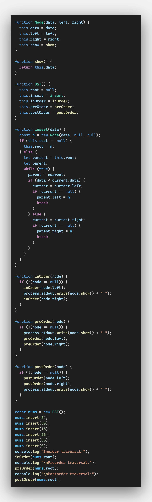
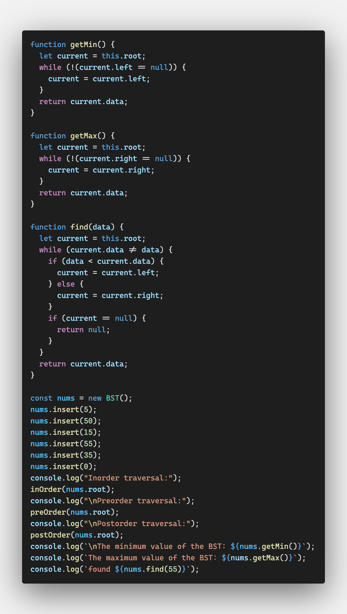
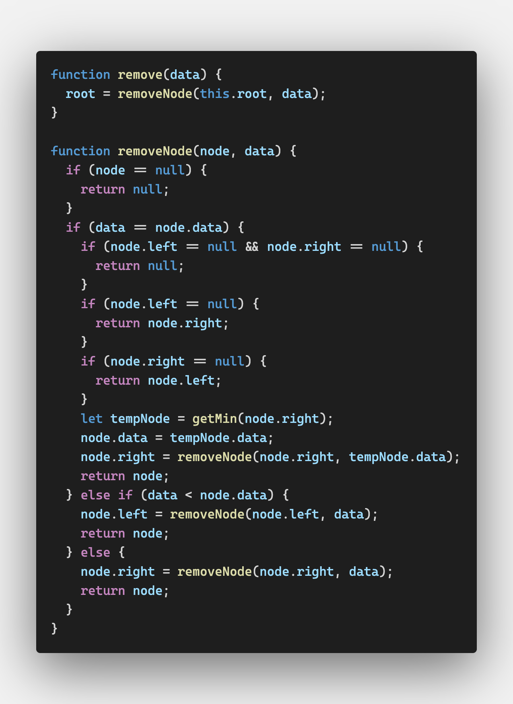
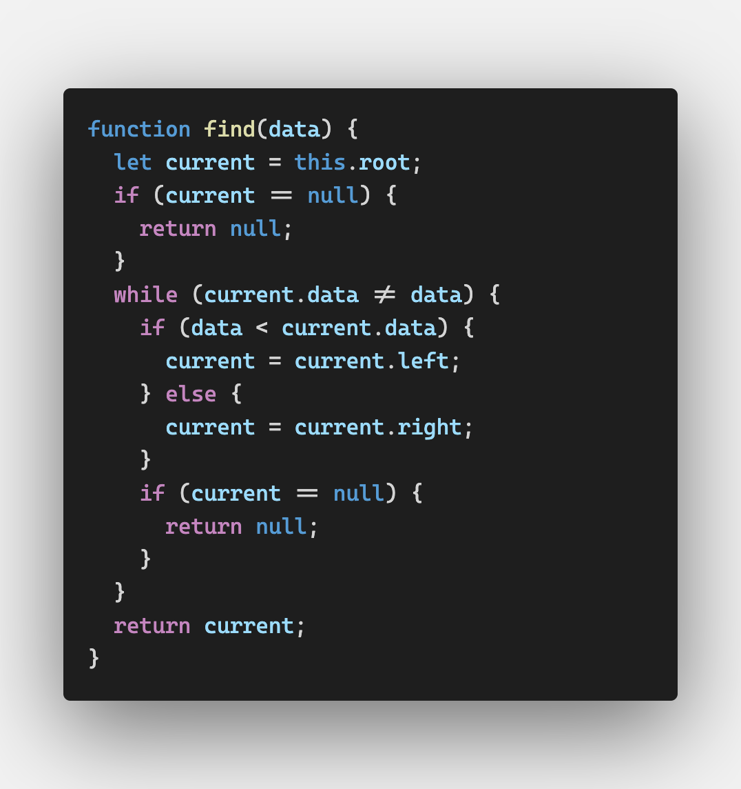
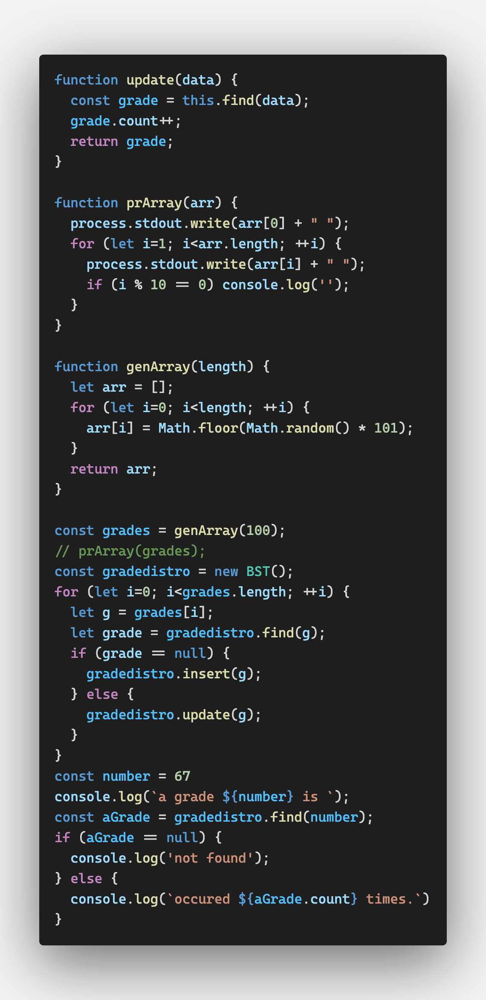

# Binary Trees and Binary Search Trees

트리 자료구조는 비선형으로(nonlinear) 계층 구조를 가진 데이터를 저장한다

그 중에서도 이진 트리가 흔히 쓰이는데 

연결 리스트보다 검색이 빠르고

어레이보다 데이터 삽입 및 삭제가 빠르기 때문이다


## 정의

트리는 노드와 노드를 잇는 간선(edge)으로 이루어진다

트리의 가장 위에 있는 노드를 루트 노드라고 한다

노드 A의 아래에 다른 노드 B와 C가 연결되어 있다면

노드 A는 노드 B와 C의 부모 노드가 되고, 노드 B와 C는 노드 A의 자식 노드가 되다

노드는 0개 이상의 자식 노드를 가질 수 있고,

자식 노드가 없는 노드를 leaf 노드라고 한다

이진 트리는 자식 노드의 개수가 두 개를 넘을 수 없다


간선을 따라가다 보면 직접적으로 연결되지 않은 노드로도 이동할 수 있는데

이 때, 한 노드에서 다른 노드까지를 이어준 간선들을 통틀어 path라고 한다


특정 순서에 따라 트리의 모든 노드를 방문하는 것을 트리 순회라고 한다(tree traversal)


트리는 레벨별로 나눌 수도 있는데,

루트 노드의 레벨은 0이고

루트 노드의 자식은 1, 그들의 자식은 2 이런 식으로 하나씩 높아진다

레벨 1 이상인 노드들은 루트의 서브트리라고 부를 수 있다

트리의 깊이(depth)는 해당 트리의 최대 레벨을 말한다


노드가 지니는 값을 key 값이라고 한다


## 이진 트리와 이진 탐색 트리

이진 트리의 노드는 자식 노드를 두 개까지밖에 가질 수 없기 때문에 효율적인 프로그램을 짤 때 유용한 자료구조다

이진 탐색 트리는 부모 노드의 키 값보다 적은 키 값을 가진 자식 노드는 왼쪽에

더 큰 키 값을 가진 자식 노드는 오른쪽에 저장한다

(=> 효율적인 탐색 가능)


### BST Implementation

이진 탐색 트리 역시 노드들로 이루어져있으므로

노드 오브젝트를 만드는 것이 첫 번째 순서다


노드 오브젝트를 만들었으면 BST 클래스를 만드는데,

BST 클래스는 하나의 데이터 멤버를 가진다

BST의 루트 노드가 될 노드 오브젝트로 

생성자에서 null로 정의해둔다(empty node)


`insert`는 트리에 새로운 노드를 추가하는 함수로 조금 복잡하다.

1. 데이터를 넘겨줄 노드 오브젝트를 만든다
2. BST에 루트 노드가 있는지 확인한다
   1. 없으면 1번에서 만든 노드가 루트 노드가 되고 여기서 리턴을 해 준다
   2. 있다면 반복문으로 BST를 순회하면서 적절한 위치를 찾아야 한다
      루트 노드를 현재 노드로 지정한다
      만약 삽입될 노드의 데이터가 현재 노드보다 작다면 왼쪽 자식 노드를 현재 노드로 지정한다. 왼쪽 자식 노드가 null이라면 거기에 노드를 삽입하고 반복문을 빠져나온다. null이 아니라면 다음 반복자로 넘어가서 계속한다
      만약 삽입될 노드의 데이터가 현재 노드보다 크다면 오른쪽 자식 노드를 현재 노드로 지정한다. 오른쪽 자식 노드가 null이라면 거기에 노드를 삽인하고 반복문을 빠져나온다. null이 아니라면 다음 반복자로 넘어가서 계속한다


`traversal`: BST를 순회할 순서를 결정한다

1. inorder: 노드의 키 값을 기준으로 오름차순 정렬하여 BST의 모든 노드를 방문한다

   재귀를 이용해 구현하는 것이 제일 효율적이다

   오름차순으로 정렬하려면 매 서브트리마다 왼쪽 노드와 오른쪽 노드를 모두 방문해야 하기 때문이다.

2. preorder: 루트 노드를 처음 방문한 뒤 왼쪽 서브 트리를 방문한 뒤 오른쪽 서브 트리를 방문한다

3. postorder: 왼쪽 서브트리의 모든 자식 노드부터 루트 노드까지 방문한 뒤 오른쪽 서브 트리의 자식 노드부터 루트 노드까지 방문한다





## BST 검색

### 최대값, 최소값

작은 값은 왼쪽 노드에 저장되므로 

최소값을 찾으려면 왼쪽의 마지막 노드를 방문하고

최대값을 찾으려면 오른쪽의 마지막 노드를 방문하면 된다


### 특정 값 찾기

찾고자 하는 특정 값과 현재 노드의 값을 비교하는 과정이 필요하다

비교 결과에 따라 해당 노드를 반환할 것인지, 왼쪽이나 오른쪽으로 갈 것인지를 결정한다





## 노드 삭제하기

노드 삭제는 BST에서 가장 까다로운 작업이라고 할 수 있다

만약 자식 노드가 없는 노드를 삭제하고자 하면 좀 더 간단하게 끝낼 수 있다

노드를 삭제할 때도 재귀를 쓴다


먼저 현재 노드가 삭제하고자 하는 데이터를 가지고 있는지 확인한다

그렇다면 현재 노드를 삭제하고

아니라면 삭제하고자 하는 데이터와 현재 노드의 데이터를 비교해서

왼쪽이나 오른쪽 자식 노드로 이동한다

그리고 거기서 현재 노드의 데이터 확인 후 비교를 반복한다


삭제해야 할 노드를 발견했다면

해당 노드가 자식 노드를 가지고 있는지를 봐야한다

자식이 없는 리프 노드라면 부모 노드를 가리키고 있는 링크를 null로 바꾸면 끝난다

자식이 하나 있다면, 삭제될 노드를 가리키고 있는 자식 노드의 링크를  스스로를 가리키게 바꾼다

자식이 둘 있다면, 삭제될 노드의 왼쪽 서브트리의 최대값을 찾거나 오른쪽 서브트리의 최소값을 찾아야 한다.




이를 구현하기 위해 getMin의 코드도 살짝 수정했다

```javascript
function getMin(data = null) {
  let current = data || this.root;
  ...
```


## Counting Occurrences

BST를 이용해서 데이터 셋 안에서 특정 데이터가 몇 번 나오는지 알아볼 수도 있다

시험 점수를 저장하는 BST가 있다

새로운 점수를 저장할 때 기존에 저장된 것과 같은 점수라면 발생횟수를 하나 올리고

기존에 저장된 동일한 점수가 없다면 새로 삽입하는 프로그램을 만들어보자


이 프로그램을 만들기 위해서는 노드 오브젝트를 살짝 수정해야 한다

```javascript
function Node(data, left, right) {
  this.data = data;
  this.count = 1;
  this.left = left;
  this.right = right;
  this.show = show;
}
```


find도 수정했다







## Exercises

1. 노드의 개수를 세는 함수를 추가하라
2. 간선의 개수를 세는 함수를 추가하라
3. max() 함수를 추가하여 최대값을 찾아라
4. min() 함수를 추가하여 최소값을 찾아라
5. 텍스트 파일의 단어들이 몇 번씩 나오는지 세는 프로그램을 만들어라