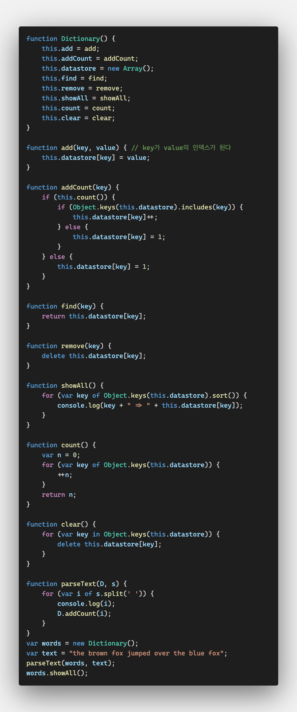

# Dictionaries

딕셔너리는 데이터를 **키-값** 형식(key-value pair)으로 저장한다

검색하기 위해 키를 사용하고 검색의 결과로 값이 반환된다

JS의 오브젝트 클래스는 딕셔너리처럼 동작하도록 설계되었다


## The Dictionary Class

여기서 딕셔너리 클래스는 Object 클래스가 아니라 Array 클래스를 활용한다

딕셔너리의 키들을 정렬하는 기능이 필요한데 JS는 오브젝트의 속성을 정렬할 수 없기 때문이다

하지만 JS의 모든 것은 오브젝트라는 것을 잊지 말자

어레이도 오브젝트다


remove()에서 사용하는 `delete`는 JS 내장 함수로 오브젝트 클래스에 있다

keys()는 오브젝트와 함께 호출되면 해당 오브젝트에 저장된 모든 키를 리턴한다


## 보조 함수

1. count()

   ```js
   function count() {
       var n = 0;
       for (var key of Object.keys(this.datastore)) {
           ++n;
       }
       return n;
   }
   ```

   length를 쓰지 않는 이유는 문자 키와 함께 쓸 수 없기 때문이다

2. clear()

   ```js
   function clear() {
       for (var key in Object.keys(this.datastore)) {
           delete this.datastore[key];
       }
   }
   ```

   

## 정렬

딕셔너리의 주용도는 키를 통해서 값을 찾는 것이다

아이템들이 저장된 순서는 중요하지 않지만 많은 사람들이 딕셔너리를 정렬된 순서로 보기를 원한다

array가 정렬되는 것처럼 문자 키를 가진 딕셔너리를 정렬할 수는 없다

그러나 `showAll()` 함수를 수정해서 정렬된 순서로 출력할 수는 있다

for 반복문 헤더의 반복 오브젝트를 `Object.keys(this.datastore).sort()`로 바꾼다


## Exercises

1. .text에서 이름과 전화번호를 입력받아서 딕셔너리에 저장하는 프로그램을 만들어라. 하나의 전화번호 표시하는 기능, 모든 전화번호를 표시하는 기능, 새로운 전화번호를 입력하는 기능, 전화번호를 삭제하는 기능, 모든 전화번호를 삭제하는 기능을 포함하는 프로그램이어야 한다.

   

2. 딕셔너리 클래스를 이용해서 텍스트의 단어 출현횟수를 세는 프로그램을 만들어라. 단 한 번 나온 단어도 세야 한다. 

3. 2번 프로그램을 수정하여 정렬된 순서로 단어를 출력하게 만들어라

   