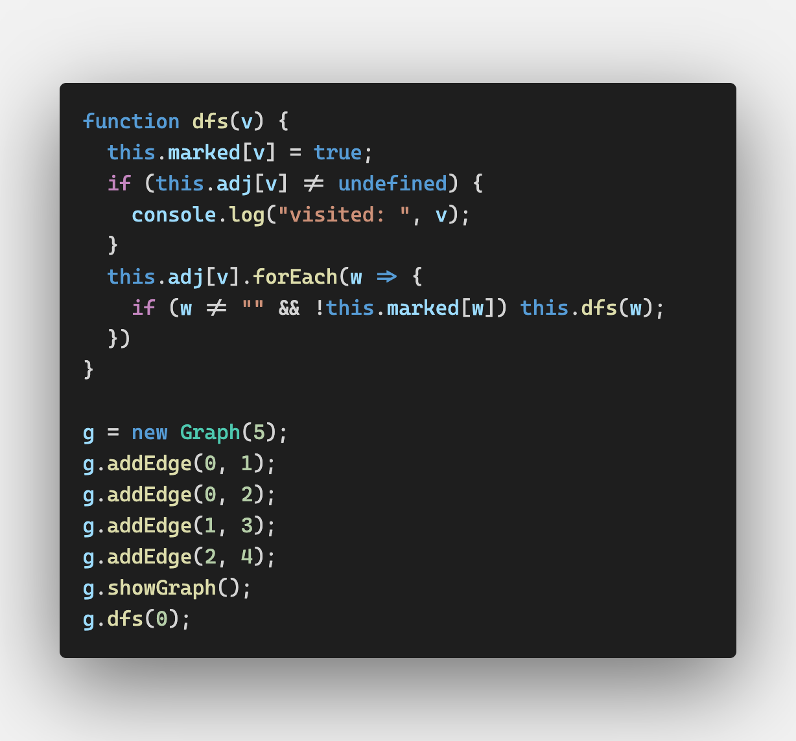
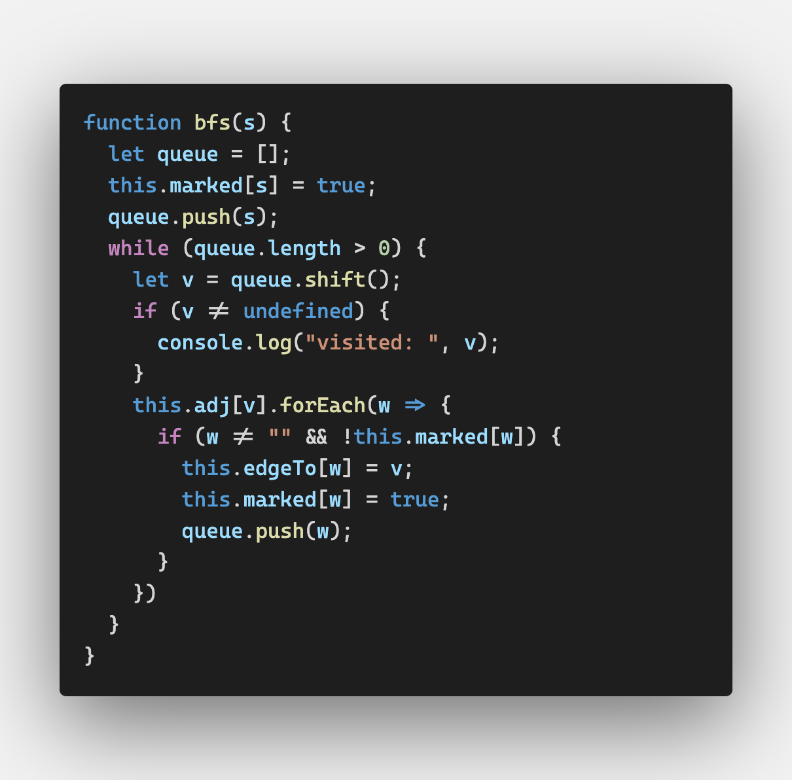
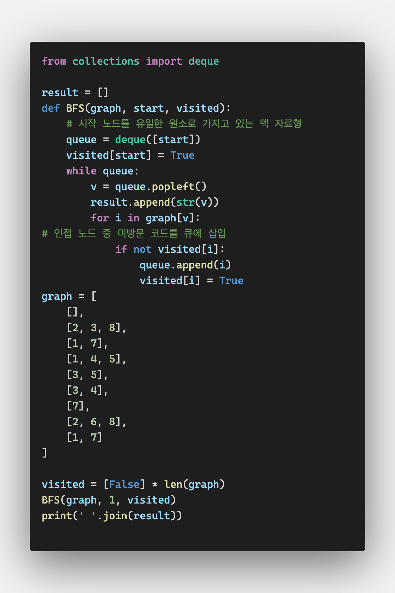
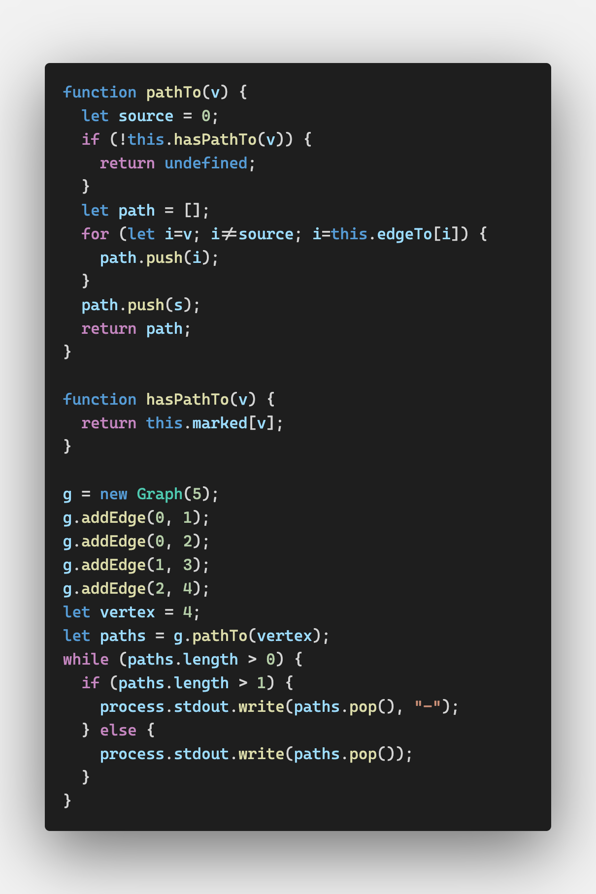

# Graphs and Graph Algorithms

## Graph Definitions

그래프는 정점들과 간선들로 이루어진다(a set of vertices and a set of edges)

두 정점을 잇는 선이 간선이다
(정점 v1과 v2를 잇는 간선을 (v1, v2)라고 한다)

정점은 무게/비용/값 등으로 나타낼 수 있는 수치를 가질 수 있다

정점들이 정렬된 그래프를 방향 그래프라고 한다(directed graph, digraph)

방향 그래프에서 한 정점은 다른 정점을 가리키는 간선을 가진다


보통의 그래프는 정렬되지 않은 그래프(unordered graph)다


패스(path)는 일련의 정점들을 가리키는 말로 패스 내의 정점들은 간선으로 연결되어 있다

패스의 길이는 첫 정점부터 마지막 정점까지를 잊는 간선의 수로 결정된다

스스로를 가리키는 정점으로 이루어진 패스를 루프(loop)라고 한다. 루프의 길이는 0이다


싸이클(cycle)은 처음과 마지막 정점이 같은 패스로 하나 이상의 간선을 가지고 있어야 한다

simple cycle은 반복되는 간선이나 정점이 없는 싸이클으로 방향그래프인지 무방향그래프인지는 무관하다

처음이자 마지막 정점 외 다른 정점을 반복하는 패스를 general cycle이라고 한다


정점 ㄱ에서 정점 ㄴ을 가리키는 간선이 있고, 정점 ㄴ에서 정점 ㄱ을 가리키는 간선이 있다면

즉, 두 정점이 서로를 가리키는 간선을 가지고 있다면

두 정점은 strongly connected되어 있다고 한다

방향 그래프에서 모든 정점이 강하게 연결되어있다면 이 방향 그래프가 strongly connected되어있다고 말할 수 있다


## Real-World Ststems Modeled by Graphs

그래프는 실제 생활에도 자주 쓰이는 모델이다

교통 현황이 그 예시다

정점은 교차로를 나타내고 간선은 도로를 나타낸다

간선의 가중치는 속도제한이나 차선을 나타낸다

최단 경로나 교통체증이 없는 경로를 선택하기 위해 이 시스템을 사용할 수 있다


## The Graph Class

그래프는 트리같아 보이지만 규모가 커질 수 있기 때문에 트리처럼 오브젝트 기반의 클래스를 만들면 비효율적이다

### Representing Vertices

우선 정점을 저장할 Vertex 클래스를 만들어야 한다

연결리스트나 이진 검색 트리의 노드 클래스같은 역할을 한다

Vertex는 두 개의 데이터 멤버가 필요한데,

정점을 나타내는 label과

boolean 값으로 이 정점에 방문을 했는지 여부를 나타내는 wasVisited가 그것이다


정점 목록을 array에 저장하여 Graph 클래스가 위치에 따라 참조할 수 있게 한다


### Representing Edges

그래프 관련 중요한 정보는 그래프의 구조를 묘사하는 간선에 저장된다고 볼 수 있다

이진 트리는 경직된 구조를 가지고 있어(자식 노드를 둘 밖에 가질 수 없다든지?)

유연성이 필요한 그래프를 나타내는 데 좋지 않다(한 정점에 0개 혹은 여러 개의 간선이 연결될 수 있다)


그래프의 간선을 표현하는 방법1: **인접 목록**(adjacency list)

한 그래프당 하나의 리스트를 가진다

그 리스트 안에서 정점마다 리스트를 가지게 된다

만약 정점 0~3로 이루어진 그래프라면

`[[], [], [], []]` 이렇게 각각 정점을 나타내는 네 리스트가 그래프를 나타내는 리스트에 저장된다

각 정점을 나타내는 리스트에는 해당 정점과 인접한 정점들이 저장된다

정점 2가 정점 0, 1, 3에 인접하다면

`[[2], [2], [0, 1, 3], [2]]` 이렇게 나타낸다


그래프의 간선을 표현하는 방법2: **인접 행렬**(adjacency matrix)


## Searching a Graph

### Depth-Frist Search

DFS, 깊이 우선 검색은 패스를 따라 첫 번째 정점에서 마지막 정점에 방문한 뒤

다시 돌아나와 다음 패스의 마지막 정점에 방문하는 것을 남은 패스가 없을 때까지 반복한다


아직 방문하지 않은 정점에 방문한 뒤 방문했다고 표시한다

맨 처음 정점의 인접 목록에 속한 정점 중 방문하지 않은 정점이 없을 때까지 재귀한다

방문한 정점을 담을 array가 Graph 클래스에 추가되어야 한다

```javascript
this.dfs = dfs;
this.marked = [];
for (let i=0; i<this.vertices; ++i) {
  this.marked[i] = false;
}
```



정점에 방문하면 방문했다고 표시한다


### Breadth-First Search

BFS, 넓이 우선 탐색은 첫번째 정점을 방문한 뒤 해당 정점에서 가까운 모든 정점을 방문한다

마치 한 층 한 층 검색을 하는 것과 같다


BFS 알고리즘은 리스트가 아니라 큐(queue)를 사용한다


 Graph에는 `this.edgeTo = [];`를 추가한다



파이썬을 이용한 BFS



## Finding the Shortest Path

그래프를 이용한 정점간 최단 경로 찾기는 자주 사용하는 작업이다


### BFS leads to Shortest Paths

BFS를 수행하면 자동으로 최단 경로를 찾는다


### Determining Paths

BFS를 변형하여 최단 경로를 찾는다

pathTo()는 특정 정점들과 간선을 공유하는 모든 정점들을 저장하는 stack이다




## Topological Sorting

