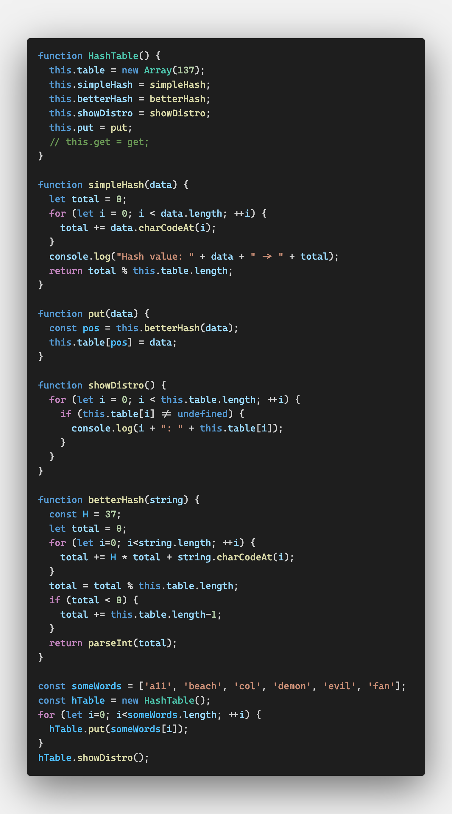
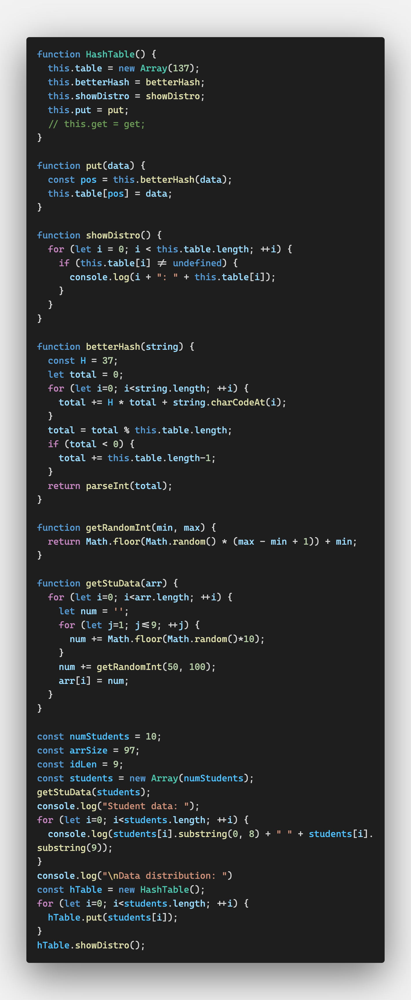
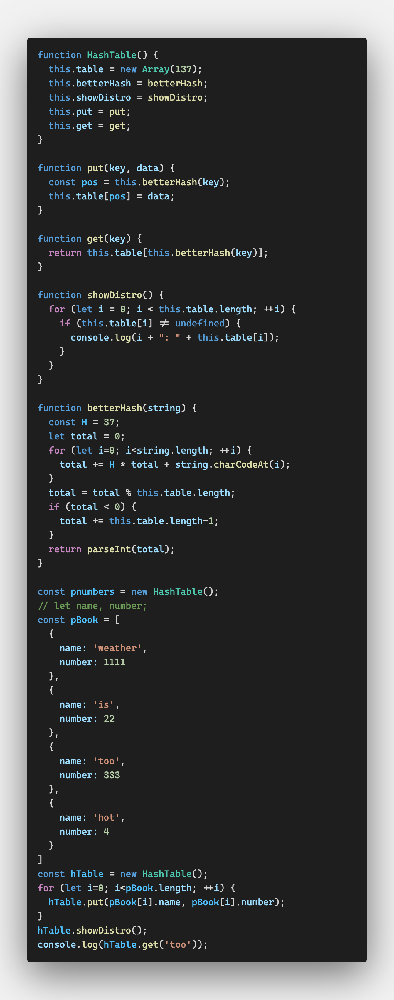

# 해싱

해싱은 매우 빠르게 데이터를 삽입하고 꺼내 오는 저장 방식이다

해싱은 **해시 테이블**이라는 자료 구조를 이용한다

해시 테이블은 삽입, 삭제, retrieval은 빠르지만

최솟값, 최댓값 같은 검색 작업의 효율이 좋지 않다


## 해싱 알아보기

해시 테이블은 array를 기반으로 한다

0부터 정해진 길이만큼의 요소를 가진다(이 정해진 크기는 필요할 때 늘릴 수 있다)

각 요소는 `key`라고 불리는 관련 데이터 요소를 기반으로 저장된다

마치 딕셔너리같은 느낌이다


key는 해시 함수를 이용해서 0부터 해시 테이블의 크기 사이의 숫자에 매핑된다

해시 함수가 각 키를 array 요소에 저장해야 맞겠지만

현실적으로 가능한 키는 무한한 반면 array 요소의 최대숫자는 유한하므로(이론적으로는),

해시 함수의 목표는 array의 요소들 사이에 가능한한 공평하게 key를 부여하는 것이다

아무리 효율적인 해시 함수여도 두 개의 키가 같은 값에 부여될 수 있다

이 현상을 충돌(collision)이라고 한다

충돌에 대비한 전략을 준비하는 것 역시 필요하다


해시 함수를 만들 때 고려해야 할 마지막 요소는 해시 테이블을 위해 만들 array의 사이즈다

하나의 제약 조건은 **소수**여야 한다는 것이다


## 해시 테이블 클래스

클래스는 

- 해시 값을 계산할 함수, 
- 해시 테이블에 데이터를 입력할 함수, 
- 해시 테이블의 데이터를 찾아올 함수, 
- 해시 테이블의 데이터 분포를 보여줄 함수를

기본적으로 포함한다.


필요한 해시 함수는 키의 데이터 타입에 따라 다르다

키가 정수라면 그냥 해당 정수를  어레이의 크기로 나눈 나머지를 반환하면 된다

하지만 항상 이 방식이 맞지는 않다

만약 모든 키의 마지막 자릿수가 0이고 어레이 크기가 10이라면 말이다

이런 이유가 어레이 크기가 소수여야 하는 이유 중 하나이기도 하다


만약 키가 무작위로 선정된 정수라면 해시 함수는 키를 분배하는 데 더 공평해야 한다

이런 유형의 해싱은 모듈식 해싱(modular hashing)이라고 알려져 있다


대부분의 애플리케이션에서 키는 스트링이다

스트링 키에 작업할 해시 함수는 더 복잡하다

```js
function HashTable() {
  this.table = new Array(137);
  this.simpleHash = simpleHash;
  this.showDistro = showDistro;
  this.put = put;
  // this.get = get;
}

function simpleHash(data) {
  let total = 0;
  for (let i = 0; i < data.length; ++i) {
    total += data.charCodeAt(i);
  }
  return total % this.table.length;
}

function put(data) {
  const pos = this.simpleHash(data);
  this.table[pos] = data;
}

function showDistro() {
  for (let i = 0; i < this.table.length; ++i) {
    if (this.table[i] != undefined) {
      console.log(i + ": " + this.table[i]);
    }
  }
}

const someWords = ['a11', 'beach', 'col', 'demon', 'evil', 'fan'];
const hTable = new HashTable();
for (let i=0; i<someWords.length; ++i) {
  hTable.put(someWords[i]);
}
hTable.showDistro();
```

`simpleHash`는 키를 구성하는 문자의 아스키 코드 값을 더하는 것이다

해시 값은 총합을 어레이 크기로 나눈 수가 된다

`put`은 어레이 인덱스 값을 simpleHash로부터 받아 데이터를 해당 위치에 저장하낟=]

`showDistro`는 해시 함수를 이용해서 어레이의 어디에 실제로 이름이 저장되어 있는지 보여준다

그러나 결과를 보면 알 수 있듯이 데이터가 잘 분배되어 있지는 않다.

이는 생각보다 심각한 문제인데

어레이의 모든 요소가 출력되지 않을 수도 있기 때문이다

해시가 같은 여러 개의 값이 수 충돌이 생길 수도 있다


### 개선된 해시 함수

충돌 상황을 피하려면 해시 테이블을 만들기 위해 사용하는 어레이의 크기가 소수여야 한다

나머지 연산으로 키를 계산하기 때문이다

어레이의 크기는 100 이상이어야 테이블의 키가 고르게 분포할 수 있다

100 이상의 소수 중 가장 작은 숫자는 137이다

100에 가까운 소수더라도 100보다 작으면 충돌 가능성이 있다

적절한 크기를 가진 해시 테이블이 있다면

그 다음은 좀 더 나은 해시 값을 연산하는 것이다

호너(Horner)의 메서드가 바로 그 방법이다

새로운 해시 함수는 마찬가지로 각 글자의 아스키 코드 값을 더하지만

결과 값을 prime constant와 곱하는 단계가 더해진다

이 소수는 클 필요가 없다



put에서도 simpleHash가 아니라 betterHash를 쓰게 바꿔준다


### 정수 키 해싱

문자 키가 아니라 정수 키는 어떻게 다뤄야 할까?

랜덤으로 9자리 숫자를 만들어 학생식별숫자로 지정하고 학생의 성적을 값으로 저장해보자



```js
for (let i=0; i<students.length; ++i) {
  hTable.put(students[i]);
}
```

이 코드에서는 단순히 put을 쓰면 아직 충돌을 처리한 함수가 아니기 때문에 모든 데이터가 어레이에 저장되지 않을 수도 있다

프로그램을 여러 번 돌려보면 어떤 때는 모두 저장되고 어떤 때는 아닌 것을 확인할 수 있다

그러므로 이전에 만든 put 함수와 betterHash함수를 적용한다

betterHash는 스트링 키와 인티저 키 모두 적용 가능하다


### 해시 테이블 데이터 store & retrieve

해시 함수를 해시 테이블에 적용하기 위해서 put이 key와 data 모두를 받도록 바꿔본다

```js
function put(key, data) {
  const pos = this.betterHash(key);
  this.table[pos] = data;
}
```

put은 키를 해시하고 해시 함수가 연산한 테이블의 위치에 데이터를 저장한다

데이터를 가져오는 get 역시 지금 정의해보겠다

get 역시 키를 해시할 줄 알아야 어디에 데이터가 저장되어 있는지 알 수 있다

```js
function get(key) {
  return this.table[this.betterHash(key)];
}
```



## 충돌 대비하기

충돌은 해시 함수가 두 개 이상의 값에 같은 키를 배당할 때 발생한다

해시 알고리즘의 두 번째는 충돌의 해결이다

모든 키가 해시 테이블에 저장될 수 있게 하는 것이다

그 방법으로는 두 가지가 있는데 separate chaining과 linear probing이다


### separate chaining

충돌이 발생해도 만들어진 인덱스에 키를 저장할 수 있다 

다만 해당 어레이의 요소에 하나 이상의 데이터를 저장하는 것이 불가능할 뿐이다


separate chaining은 해시 테이블의 각 어레이 요소가 다른 자료 구조를 저장하는 기술이다

다른 어레이를 저장한다면 한 해시 값에 여러 키가 저장될 수 있다

이 기술을 사용해서 같은 해시 값을 가진 두 키가 만들어진다면 각 키가 두 번째 어레이의 각기 다른 위치에 저장되게 만들어본다


해쉬 처리된 키를 저장하는 어레이를 만든 후에

해쉬 테이블 어레이의 각 요소에 빈 어레이를 할당하는 함수를 호출하면 된다

이러면 2차원 어레이가 만들어진다

```js
function buildChains() {
  for (let i=0; i<this.table.length; ++i) {
    this.table[i] = new Array();
  }
}
```


### linear probing

linear probing은 open-addressing 해싱이라고 불리는 대표적인 해싱 기술을 사용한다

충돌이 있으면 해시 테이블의 다음 요소가 비어 있는지 확인하고

비어 있다면 키를 다음 요소에 두고

비어 있지 않다면 비어 있는 요소가 나올 때까지 다음 요소를 찾는다

해시 테이블의 비게 되는 많은 요소들을 사용할 수 있게 된다


데이터를 저장하기 위한 어레이가 큰 편일 때

separate chaining보다 linear probing을 사용한다

만약 어레이의 사이즈가 저장될 데이터의 절반 정도라면 separate chaining을,

두 배 정도라면 linear probing을 쓰는 것이 좋다


linear brobing은 어떤 식으로 동작하는 걸까?

우선 put과 get을 손 봐야한다

2차원 어레이를 만들 수 있게 HashTable 클래스 역시 수정을 한다

table 어레이와 values 어레이는 병렬으로 동작해서

키가 tables 어레이에 저장될 때

값을 해당하는 위치의  values 어레이에 저장한다


## Exercises

1. linear probing을 사용하여 단어의 정의를 저장하는 간단한 사전을 만들어라. 단어와 정의가 쓰여 있는 텍스트 파일을 읽고 해시 테이블에 저장하는 기능과 사용자가 새로운 단어를 추가하는 기능 두 가지가 구현되어야 한다
2. 1번을 separate chaining을 이용해 구현하라
3. 텍스트 파일을 읽고 해당 파일의 단어들이 몇 번 나왔는지 저장하는 프로그램을 해싱을 이용해 구현하라

## 추가

📌 아무리 생각해도 책 내용으로는 해싱을 잘 이해 못 하겠고, collision부터 코드들도 이상한 것 같고(내가 모르는 건지) 그래서 다른 자료를 찾아보기로 했다

https://jarednielsen.com/data-structure-hash-table-javascript/

https://jarednielsen.com/data-structure-hash-table-separate-chaining/

https://jarednielsen.com/data-structure-hash-table-linear-probing/

- 해시 테이블의 장점

  다른 자료구조와 달리 반복을 통해 값을 찾지 않는다

  그래서 주어진 키를 통해 값을 찾고 삽입하고 삭제하는 일이 빠르다

- 해싱: 해시 테이블에 저장된 값을 찾기 위한 키를 만드는 작업

- 해시 테이블 클래스

  ```js
  class HashTable {
      constructor() {
          this.table = [];
      }
  
      modularHash(key) {
          let sum = 0;
  
          for (let i = 0; i < key.length; ++i) {
              sum += key.charCodeAt(i);
          }
  
          let hash = sum % 71; 
  
          return hash;
      }
  
      put(key, value) {
          let hash = this.modularHash(key);
          return this.table[hash] = value;
      }
    
      get(key) {
          return this.table[this.modularHash(key)];
      }
  
      remove(key) {
          return delete this.table[this.modularHash(key)];
      }
  }
  
  const hashTable = new HashTable();
  ```

  

- separate chaining

  ```js
  put(key, value) {
    let hash = this.modularHash(key);
  
    if (this.table[hash] === undefined) {
      this.table[hash] = [];
    }
  
    return this.table[hash].push([key, value]);
  }
  
  get(key) {
    let hash = this.modularHash(key);
  
    for (let i = 0; i < this.table[hash].length; i++) {
      if (this.table[hash][i][0] === key) {
        return this.table[hash][i][1];
      }
    }
  
    return undefined;
  }
  ```

  put에서 새로운 테이블을 만들 때 key-value pair를 넘긴다

  키가 해시된 값으로 해당 인덱스의 어레이까지 찾아오면

  해시되기 이전의 키 값으로 찾기 위해서다

- linear probing

  ```js
  put(key, value) {
    let hash = this.modularHash(key);
  
    if (this.table[hash] === undefined) {
      return this.table[hash] = [key, value];
    } else {
      while (this.table[hash] !== undefined) {
        hash++;
      }
    }
  
    return this.table[hash] = [key, value];
  }
  get(key) {
    let hash = this.modularHash(key);
  
    while (this.table[hash] !== undefined) {
      if (this.table[hash][0] === key) {
        return this.table[hash][1];
      }
      hash++;
    }
  
    return undefined;
  }
  ```

  key-value pair를 저장하고 있다!