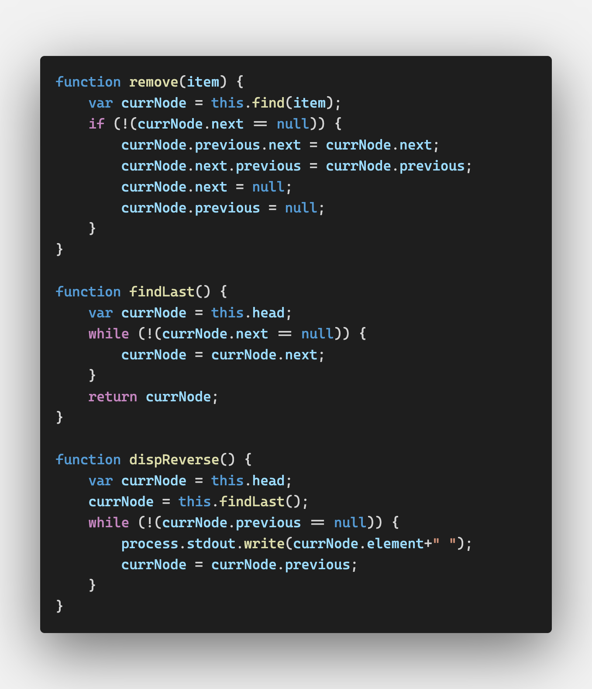
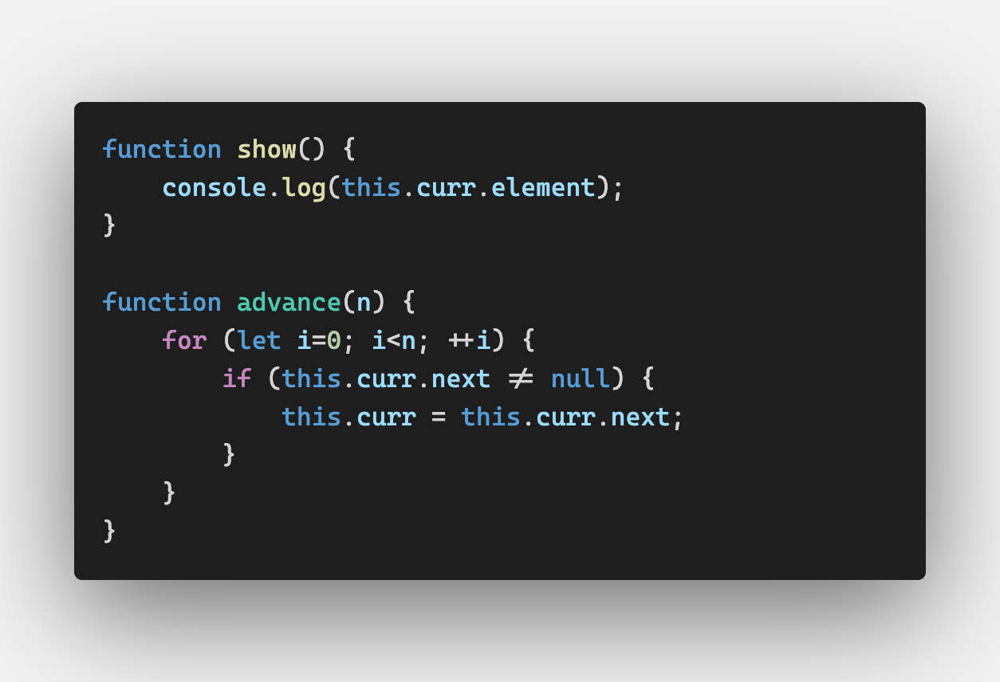
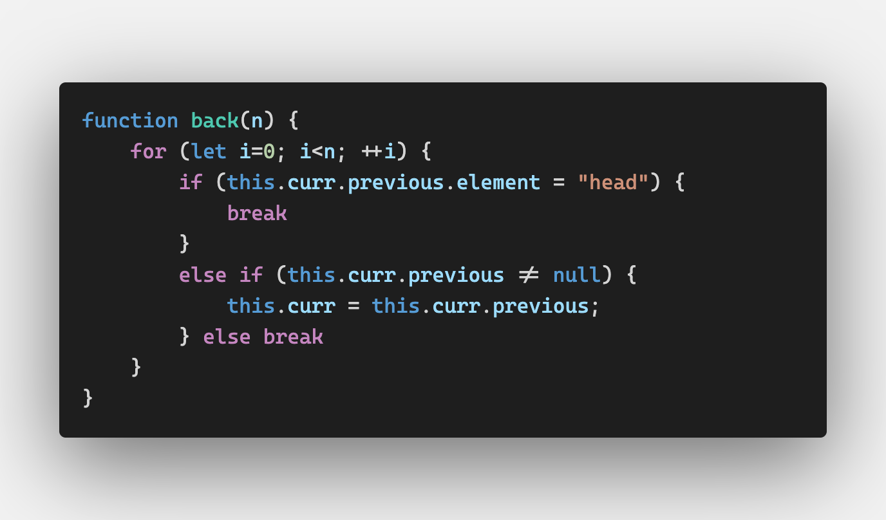
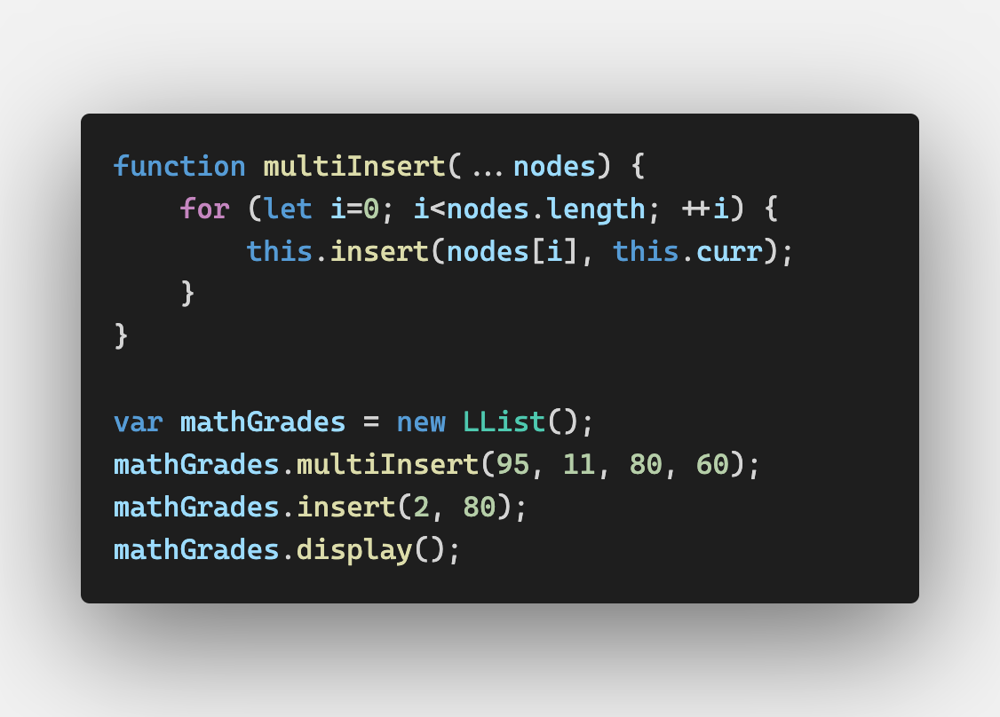
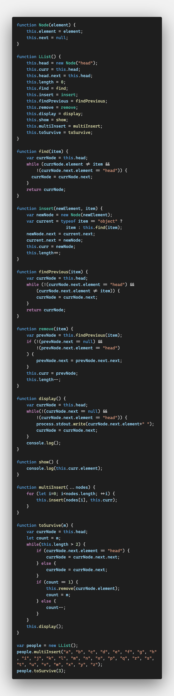

# Linked Lists

대개 array를 이용해 리스트를 구현하지만

연결 리스트가 array보다 선호되는 경우가 있다


## Array의 단점

- 많은 언어에서 array의 길이가 고정되어 있어 다 찼을 때 새로운 데이터를 삽입하기 힘듦
- 데이터 삽입 및 제거 작업이 어려움

두 가지 단점은 JS에서는 큰 단점이 되지 않는다(`split()`)


그러나 JS array의 문제점은 array가 오브젝트로 실행되어 

array가 내장되어 있는 C++이나 자바에 비해 덜 효율적이라는 것이다

array를 활용한 작업이 너무 느리다고 생각되면 연결 리스트를 사용하자


**1차원 array가 쓰이는 곳**이라면 거의 대부분 연결 리스트를 사용할 수 있다

다만, **랜덤한 요소에 접근할 때는 array가 더 낫다**


## Linked Lists Defined

연결 리스트는 **노드**라고 불리는 오브젝트들의 집합니다

각 노드는 오브젝트 참조를 통해 다음의 노드와 연결되어 있다

이 참조를 **간선(link, edge)**이라고 한다


array 요소들이 위치에 의해 참조되는 것에 반해

연결 리스트의 요소들은 다른 요소들과의 관계에 의해 참조된다

한국 => 중국 => 일본 => Null

이 때, 중국이 한국 뒤에 있다고(중국 follows 한국) 표현하지 두번째에 있다고 하지 않는다


연결 리스트를 조회하려면 첫 노드부터 마지막 노드까지 링크를 따라가야 한다

헤더 노드는 연결 리스트의 입구를 표시하는데 사용되는 노드로(없어도 됨) 조회시 무시된다

헤더 => 한국 => 중국 => 일본 => Null


연결 리스트의 **마지막은 Null 노드를 가리킴**으로써 표현된다


연결 리스트에 새로운 노드를 삽입하는 것은 매우 쉬운 작업이다

삽입할 노드 이전에 있는 노드의(previous node) 간선을 새로 삽입할 노드를 가리키게 수정하고

새로운 노드의 간선은 이전 노드가 원래 가리키고 있던 노드를 가리키게 한다


노드를 삭제하는 것도 쉽다

삭제할 노드의 이전 노드의 간선은 삭제할 노드가 가리키던 곳을 가리키게 수정한다

삭제할 노드의 간선을 Null을 가리키게 수정하여 연결 리스트에서 없앤다


##  An Object-Based Linked List Design

Node 클래스로 연결 리스트에 노드를 더하고

LinkedList 클래스로 노드 삽입, 제거, 리스트 표시 및 다른 기능들을 수행하게 만든다


- The node class

  ```js
  function Node(element) {
    this.element = element; // 노드의 데이터
    this.next = null; // 간선
  }
  ```

  

- The linked list class

  ```js
  function LList() {
    this.head = new Node("head");
    this.find = find;
    this.insert = insert;
    this.remove = remove;
    this.display = display;
  }
  ```

  헤드 노드는 간선을 null으로 해서 시작한 뒤

  연결리스트에 첫번째 노드가 삽입되면 해당 노드를 가리킨다

  (그래서 LList에서 새로운 노드를 만들기만 하고 next 속성을 바꾸지 않았다)

  

- 새로운 노드 삽입

  일단 삽입할 노드의 앞이나 뒤 노드를 특정해야 한다

  - 기존 노드의 뒤에 노드를 삽입하는 경우

    1. find()로 특정 데이터를 찾아서 해당 노드 반환

       ```js
       function find(item) {
         // 새로운 노드를 생성해 헤드 노드로 만든다
         var currNode = this.head;
         // 찾고 있는 데이터가 아니면 다음 노드로 넘어간다
         while (currNode.element != item) {
           currNode = currNode.next;
         }
         // 만약 찾지 못하면 null을 반환한다
         return currNode;
       }
       ```

    2. 새로운 노드의 next 속성을 찾은 노드의 next로 설정

    3. 기존 노드의 next 속성을 새로운 노드로 설정

       ```js
       function insert(newElement, item) {
         var newNode = new Node(newElement);
         var current = this.find(item);
         newNode.next = current.next;
         current.next = newNode;
       }
       ```

  - 연결 리스트 보여주기

    ```js
    function display() {
      var currNode = this.head;
      while(!(currNode.next == null)) {
        process.stdout.write(currNode.next.element);
        currNode = currNode.next;
      }
    }
    ```

    데이터가 있는 노드만 표시하기 위해(헤드 노드를 제외하기 위해)

    `currNode.next.element`를 프린트한다

    📌`process.stdout.write`: 개행문자 없이 프린트

    

- 노드 제거하기

  1. 제거할 노드의 앞에 있는 노드를 찾는다

  2. 앞의 노드의 next 속성을 제거할 노드의 뒤에 있는 노드를 가리키게 수정한다

     ```js
     function findPrevious(item) {
       var currNode = this.head;
       while(!(currNode.next == null) &&
            (currNode.next.element != item)) {
         currNode = currNode.next;
       }
       return currNode;
     }
     ```

  3. 노드 삭제

     ```js
     function remove(item) {
       var prevNode = this.findPrevious(item);
       if (!(prevNode.next == null)) {
         prevNode.next = prevNode.next.next;
       }
     }
     ```

     `prevNode.next = prevNode.next.next;`를 통해

     삭제할 노드의 앞에 있는 노드가 삭제할 노드의 뒤에 있는 노드를 가리키게 만든다


## Doubly Linked Lists

이중 연결 리스트

연결 리스트의 첫 노드부터 끝 노드까지 움직이는 것은 쉽지만

반대 방향은 쉽지 않다

이를 쉽게 하려면 Node 클래스에 이전 노드 링크를 저장하는 속성을 만들면 된다

이전 노드를 저장하면 노드를 삭제할 때 좀 더 효율적이다

(이전 노드를 찾을 필요가 없으므로)


```js
function Node(element) {
  // ...
  this.previous = null;
}

function LList() {
	// ...
  this.findLast = findLast;
  this.dispReverse = dispReverse;
}

function insert(newElement, item) {
  // ...
	newNode.previous = current;
}
```



remove()

- 삭제하고자 하는 노드를 찾아서 
- 삭제 노드 next를 삭제 노드 이전 노드의 next에 할당하고
- 삭제 노드의 previous 속성을 다음 노드의 previous에 할당한다


## Circularly Linked Lists

원형 연결 리스트

연결 리스트를 끝에서 처음으로 하는 검색도 가능하게 하고 싶은데

이중 연결 리스트를 만들어서 무겁게 하고 싶지는 않을 때 좋다


일반 연결 리스트와 흡사하지만 

원형 연결 리스트의 헤드 노드의  next 속성은 스스로를 가리키고 있다

이 next 속성은 새로운 노드가 삽입될 때마다 상속되면서

원형 연결 리스트의 마지막 노드는 항상 헤드를 가리키게 된다

```js
function LList() {
    this.head = new Node("head");
    this.head.next = this.head;
		// ...
}
```


원형 연결 리스트에서 똑같이 동작하기 위해서는 함수들을 조금씩 바꿔줘야 한다

1. display()

   마지막 노드에서 다시 첫 노드로 돌아가기 때문에 

   무한 반복을 막기 위해서 while 조건문을 다음과 같이 바꿔준다

   ```js
   while(
     !(currNode.next == null) && 
     !(currNode.next.element == "head")
   ) { ... }
   ```

2. find()

   ```js
   while (
     currNode.element != item &&
     !(currNode.next.element == "head")
   ) { ... }
   ```

3. findPrevious()

   ```js
   while (
     !(currNode.next.element == "head") &&
     (currNode.next.element != item)
   ) { ... }
   ```

4. remove()

   기존의 remove()를 고치지 않으면 존재하지 않는 데이터를 지우려고 했을 때,

   findPrevious()가 마지막 노드를 반환하고(3번에서 수정한 결과!)

   그러면 remove()가 `prevNode.next = prevNode.next.next;`로 만들어서

   마지막 노드의 다음 노드(head)의 다음 노드, 즉 첫 번째 노드를 가리키게 되어

   이 상태에서 display()를 하면 무한 반복되게 된다 

   ```js
   if (
     !(prevNode.next == null) && 
     !(prevNode.next.element == "head")
   ) { ... }
   ```


## 다른 기능들

연결 리스트를 잘 활용하기 위해서는 다른 기능들도 필요할 것이다

예를 들면

1. advance(n)

   연결 리스트에서 n개 앞의 노드로 이동

2. back(n)

   이중 연결 리스트에서 n개 뒤의 노드로 이동

3. show()

   현재 노드 표시


## Exercises

1. advance(n) 함수를 만들어보자

   3번 show() 함수와 함께 만들겠다

   이 때, 현재 노드는 삽입시 삽입된 노드, 삭제시 삭제 이전 노드라고 가정하겠다

   

   LList 클래스에 `this.curr`을 만들어 처음에는 this.head를 할당했다

   insert와 remove 함수의 마지막에 this.curr을 할당하는 작업도 추가했다

   

2. back(n) 함수를 만들어보자

   

   

3. show() 함수를 만들어보자

   

4. 시험 점수 세트를 입력받는 연결 리스트 프로그램 만들기

   문제가 원하는 바가 여러 개의 데이터를 입력받는 프로그램이라고 가정했다

   

   insert의 코드도 약간 수정했다

   `var current = typeof item == "object" ? item : this.find(item);`

   multiInsert에서 this.curr.element를 보내주면 수정을 하지 않아도 되지만 

   find를 쓰지 않도록 하기 위해서 코드를 수정했다

   `mathGrades.display()`의 결과는 `95 11 80 2 60`이었다

   

5. 4번을 이중 연결 리스트를 이용해 만들어보자

   4번과 똑같이 수정하면 된다

   

6. n명의 사람들이 원형으로 둘러서 있을 때, m번째 사람이 계속 죽는다고 하자(3이면 3, 6, 9, ...) 마지막 두 사람이 되려면 몇 번째에 위치해야 하는지 구하는 프로그램을 만들어라 원형 연결 리스트를 이용해야 한다

   인덱스를 추가해서 위치를 말해야하나 싶었는데 어차피 삭제되니까 그냥 해당 엘리먼트를 반환하는 프로그램을 짰다

   

   이 파일을 실행하면 g와 q가 나온다