# Queues

리스트의 종류 중 하나인 큐는 마지막에 데이터가 삽입되고 앞에서 데이터가 제거된다

스택과는 달리 발생 순서대로 데이터를 저장할 때 쓴다

대기줄을 생각하면 이해하기 쉽다

선입선출(FIFO, first-in, first-out) 자료 구조


## Queue Operations

enque: 큐의 마지막에 새로운 엘리먼트 삽입

deque: 큐의 맨 앞에 있는 엘리먼트 제거

peek, length, clear


## Array-Based Queue Class Implementation

push(): array의 마지막에 데이터 추가. at the first open position of an array

shift(): array의 처음 데이터 제거

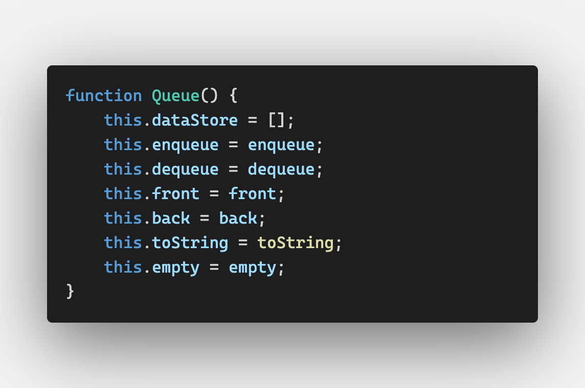

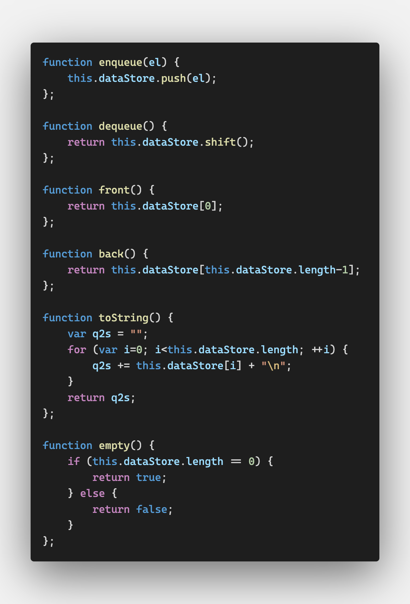

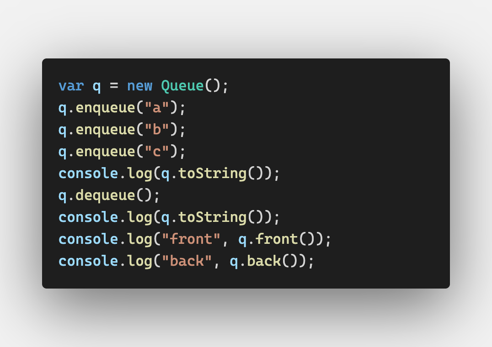

```shell
a
b
c

b
c

front b
back c
```


## Queue Class

큐는 대기 라인 시뮬레이션에 자주 쓰인다

스퀘어 댄스파티에 파트너를 지정해주는 코드를 작성해본다

대기자들은 성별에 따라 다른 줄에서 기다린다

댄스 홀이 비어서 새로운 사람들을 받을 수 있게 되면

남성 줄과 여성 줄의 맨 앞 사람 한 명씩이 들어올 수 있다

남성이나 여성 중 한 명이라도 없다면(짝을 이룰 수 없다면) 그 사실을 알린다

```txt
F Allison McMillan
M Frank Opitz
M Mason McMillan
M Clayton Ruff
F Cheryl Ferenback
M Raymond Williams
F Jennifer Ingram
M Bryan Frazer
M David Durr
M Danny Martin
F Aurora Adney
```

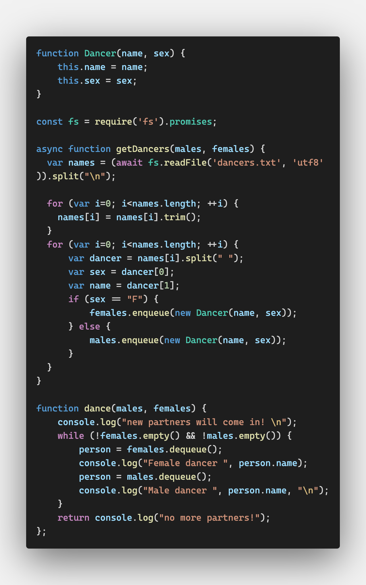

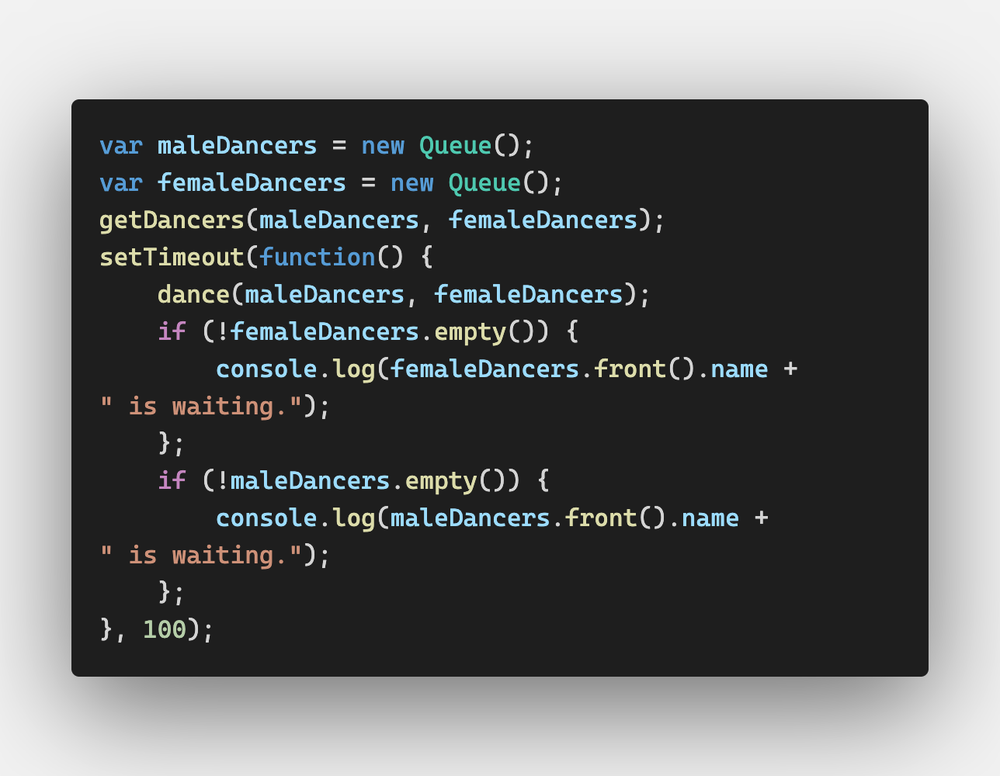

```shell
new partners will come in! 

Female dancer  Allison
Male dancer  Frank 

Female dancer  Cheryl
Male dancer  Mason 

Female dancer  Jennifer
Male dancer  Clayton 

Female dancer  Aurora
Male dancer  Raymond 

no more partners!
Bryan is waiting.
```


여기에서 남은 사람의 수를 알려주는 기능을 추가해본다

```js
// Queue class
{
  this.count = couunt;
}

// function
function count() {
  return this.dataStore.length;
}

// 적용
if (maleDancers.count() > 0) {
  console.log("There are ", maleDancers.count(), " male dancers watiting to dance.");
};
if (femaleDancers.count() > 0) {
  console.log("There are ", femaleDancers.count(), " female dancers watiting to dance.");
};
```


## Sorting Data

큐를 이용해서 데이터를 정렬할 수도 있다

기수 정렬(radix sort)을 큐를 이용해 구현한다

0에서 99까지의 숫자를 처음에는 1의 자리를 기준으로 정렬하고

두 번째에는 10의 자리를 기준으로 정렬한다

[91, 46, 85, 15, 92, 35, 31, 22]

=> [91, 31, 92, 22, 85, 15, 35, 46]

=> [15, 22, 31, 35, 46, 85, 91, 92]

큐를 이용해서 기수 정렬을 구현하려면 숫자 0부터 9까지를 위한 아홉 개의 큐가 필요하다

큐들을 어레이에 저장한다

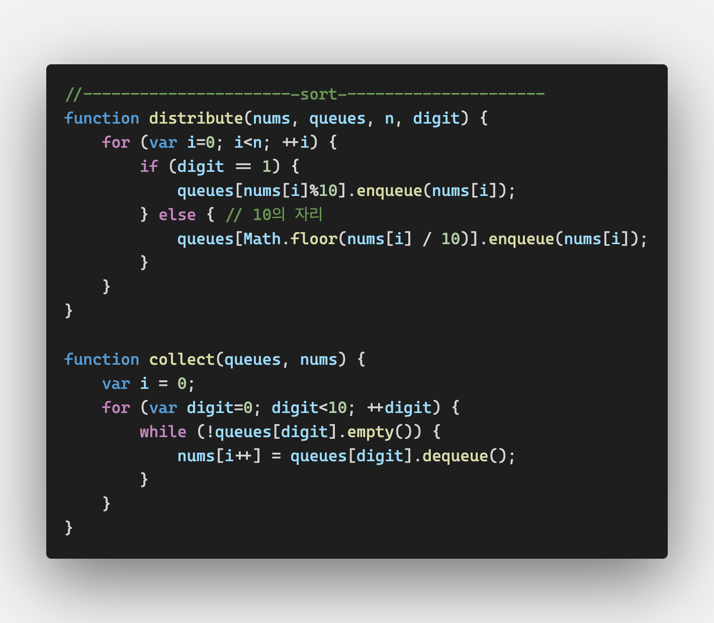

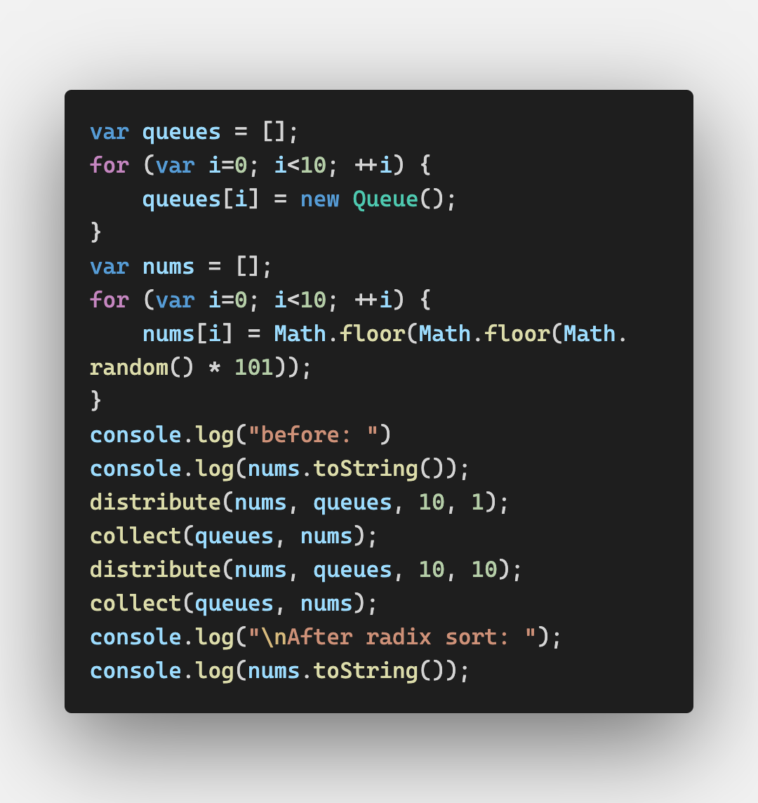

```shell
before: 
8,15,66,46,20,2,66,5,80,12

After radix sort: 
2,5,8,12,15,20,46,66,66,80
```


## Priority Queues

일반 큐가 들어온 순서에 의해 정렬된다면 

우선순위 큐는 임의의 조건에 의해 정렬된다

응급실을 생각하면 된다

여러 환자 중에서 위급한 환자를 먼저 진료하고

비슷하게 위험한(?) 환자라면 그 안에서 먼저 온 환자를 진료한다

이것을 코드로 옮겨보겠다(우선순위가 낮을수록 먼저 진료를 받는 것이다)

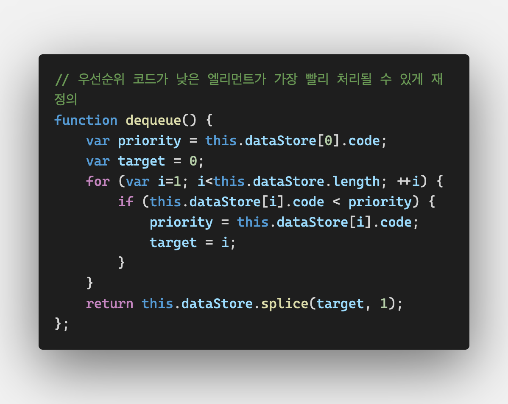

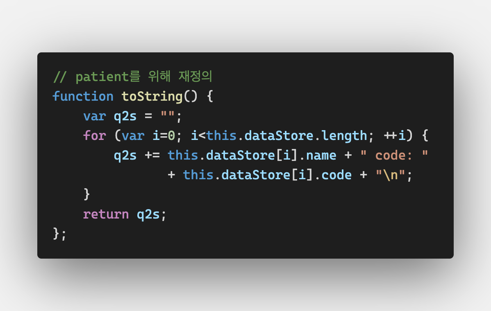

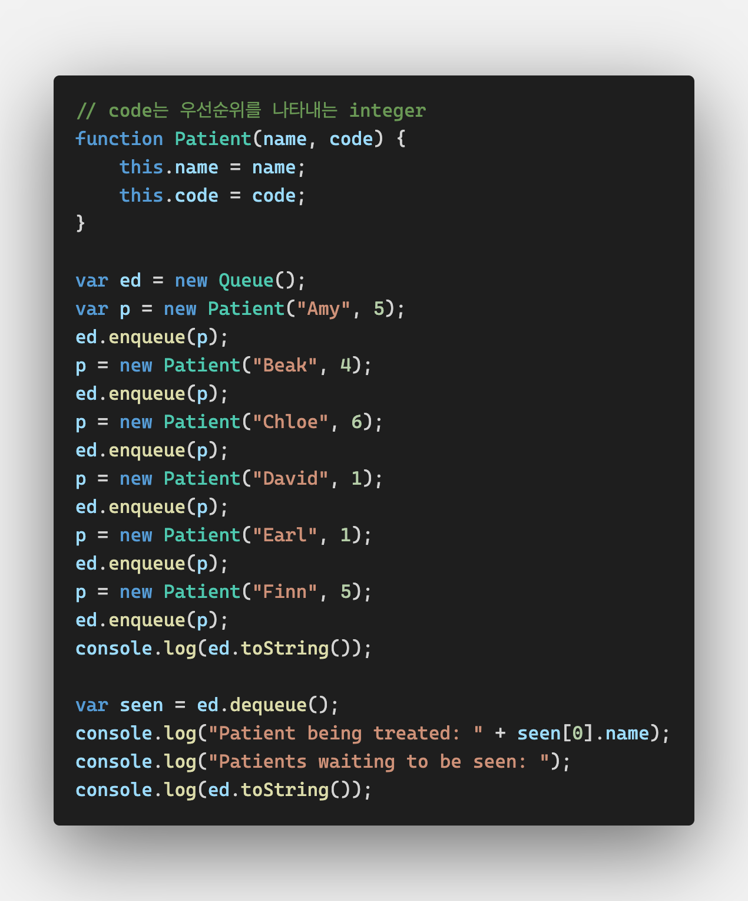

```shell
Amy code: 5
Beak code: 4
Chloe code: 6
David code: 1
Earl code: 1
Finn code: 5

Patient being treated: David
Patients waiting to be seen: 
Amy code: 5
Beak code: 4
Chloe code: 6
Earl code: 1
Finn code: 5
```

 David와 Earl은 같은 우선순위를 가졌기 때문에 먼저 온 David가 먼저 진료를 받는다

📌 책에서는 우선순위 코드가 1인데도 우선순위 4가 먼저 진료를 받는다

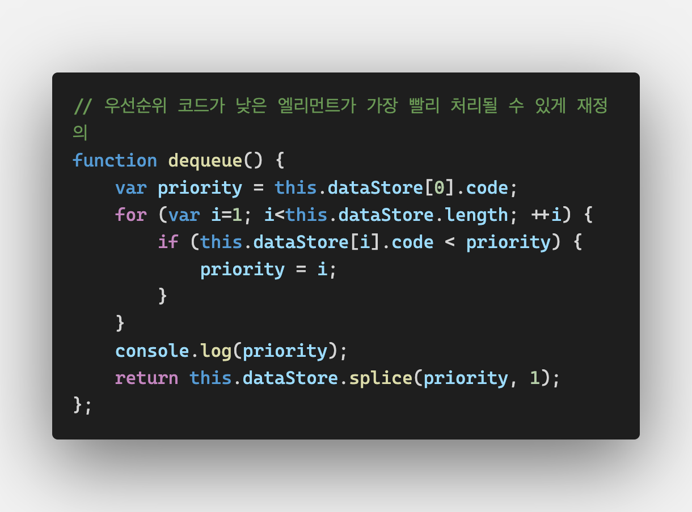

​	여기서 콘솔을 찍으면 1이 나온다

​	5 4 6 1 1 5순으로 우선순위 코드를 넣어줬는데

​	for문의 if문에서 priority를 this.dataStore[i].code가 아니라 i로 할당한 뒤

​	계속 반복문이 돌아가기 때문이다

​	그래서 target이라는 새로운 변수를 만들어서 인덱스를 저장했다.

## Exercises

1. Queue 클래스를 변형해서 Deque 클래스를 만들어라. 덱은 큐와 비슷한 자료 구조이지만  엘리먼트가 앞뒤로 더해지거나 제거될 수 있다.

   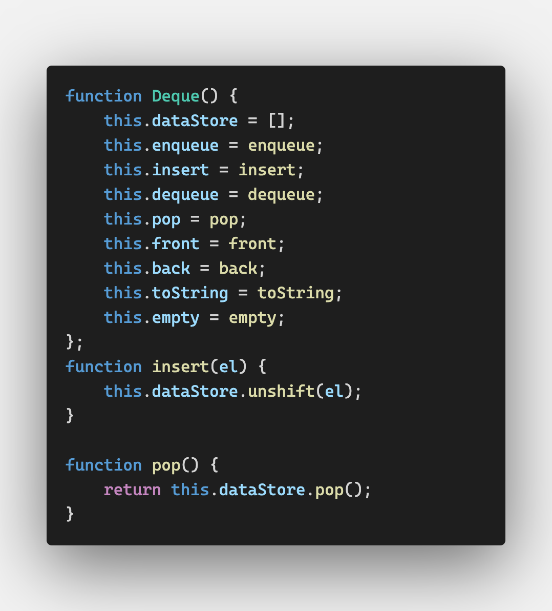

   insert와 pop 메소드를 더했다

   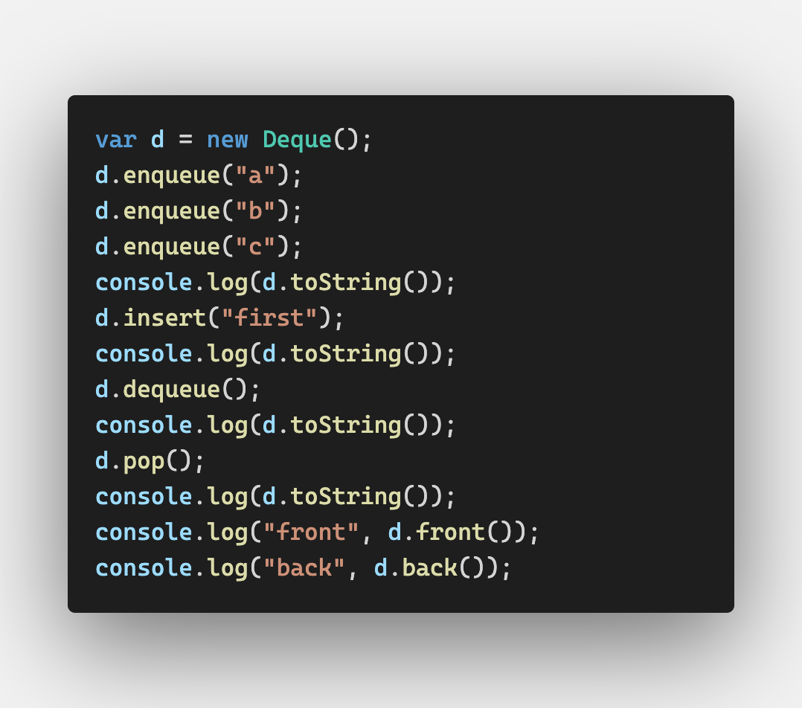

   ```shell
   a b c 
   first a b c 
   a b c 
   a b 
   front a
   back b
   ```

   

2. Deque 클래스를 이용해서 주어진 단어가 회문인지 체크해보자

   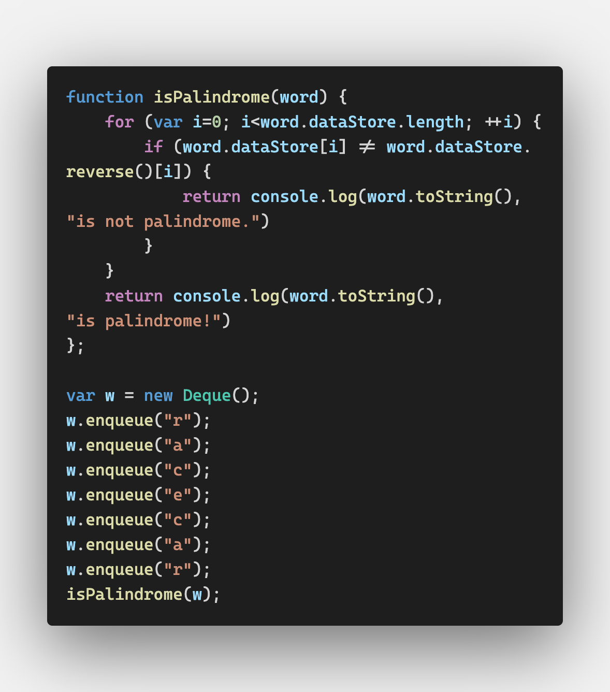

   ```shell
   racecar is palindrome!
   
   raceccar is not palindrome.
   ```

   

3. 우선순위 큐 예시를 변형하여 우선순위 코드가 높은 환자가 먼저 진료를 받을 수 있게 고쳐보자

   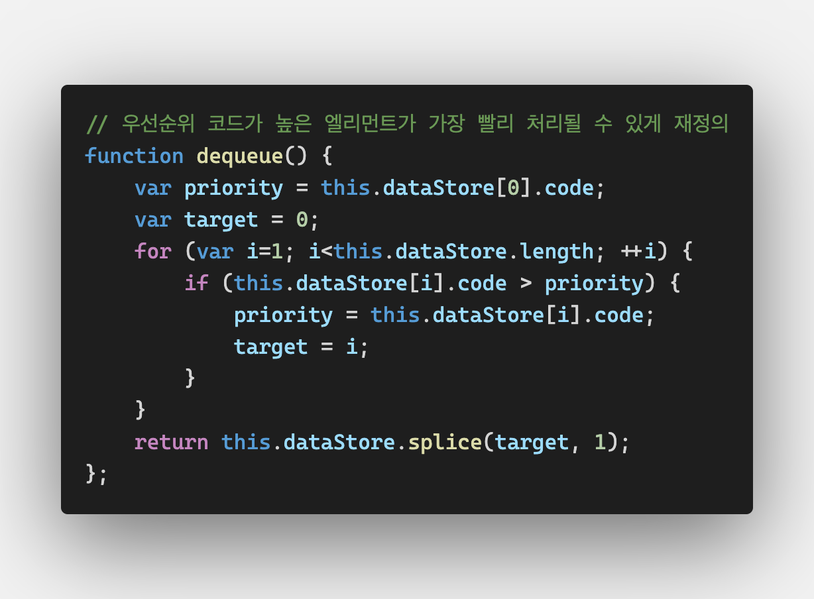

   

4. 우선순위 큐 예시를 변형하여 사용자가 ED 내 작업을 조정할 수 있도록 해 보자. 메뉴 시스템을 만들어서 1) 환자가 ED에 들어옴 2) 환자가 진료를 봤음 3) 대기 환자 띄우기를 선택할 수 있도록 만들자

   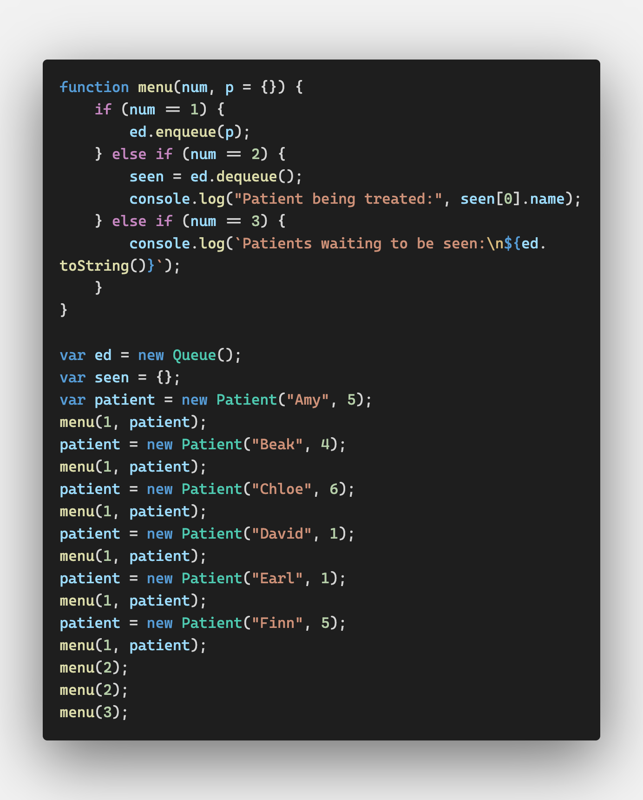

   ```shell
   Patient being treated: Chloe
   Patient being treated: Amy
   Patients waiting to be seen:
   Beak code: 4
   David code: 1
   Earl code: 1
   Finn code: 5
   ```

   