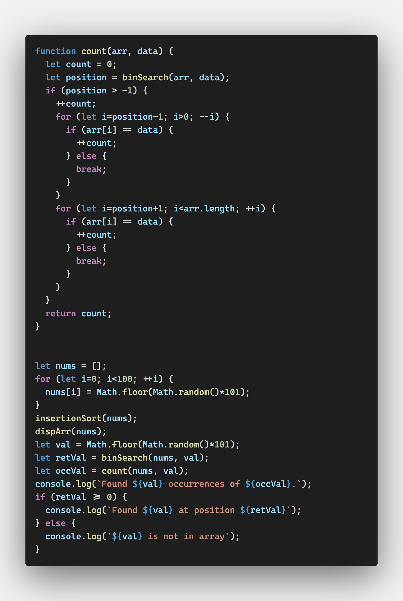

# Searching Algorithms

리스트에서 특정값을 찾는 방법은 순차 탐색과 이진 탐색이 있다

순차 탐색은 목록이 정렬되지 않았을 때 사용하고

이진 탐색은 목록이 정렬되었을 때 사용한다

이진 탐색이 더 효율적인 알고리즘이지만 이진 탐색을 위해 목록을 정렬하는 시간이 필요하다는 것을 염두에 두자


## Sequential Search

linear search라고도 불리는 sequential search, 순차 탐색은 브루트 포스 검색 방법이다

원하는 데이터를 찾기 위해 목록의 처음부터 하나씩 찾아보기 때문이다

(목록의 중간에서 목표 데이터를 찾거나 찾지 못하고 목록의 끝까지 가거나 둘 중 하나다)

처음부터 하나씩 찾는 것이기 때문에 적용도 쉽다


### 최솟값, 최댓값

최솟값 찾는 알고리즘

1. 첫 번째 요소를 최솟값으로 지정한다
2. 반복문을 이용해 두 번째 어레이 요소부터 현재 최솟값과 비교를 한다
3. 현재 최솟값보다 작다면 최솟값 바꾸기
4. 이걸 끝까지 반복한다

```javascript
function findMin(arr) {
  let min = arr[0];
  for (let i=1; i<arr.length; ++i) {
    if (arr[i] < min) min = arr[i];
  }
  return min;
}

let nums = [];
for (let i=0; i<100; ++i) {
  nums[i] = Math.floor(Math.random() * 101);
}
let minValue = findMin(nums);
console.log(minValue);
```

두 번째 요소부터 비교해야 되니까 i를 1로 할당한다


같은 알고리즘으로 최댓값도 찾을 수 있다


### Self-Organizing Data

정렬이 되어 있지 않은 목록을 순차 검색할 때 목표 데이터가 목록의 앞쪽에 위치해있다면 빠르게 검색을 할 수 있다

나중에 똑같은 검색을 할 때 좀 더 빨리 찾을 수 있도록 검색으로 찾아진 데이터를 목록의 처음에 위치시킬 수 있다

이것을 자기조직화 데이터라고 한다

프로그램 실행 전 프로그래머가 저장한 대로 저장되는 데이터가 아닌 

프로그램이 실행되면서 저장 위치가 바뀌는 데이터다


검색되는 데이터의 80%가 전체 데이터의 20%에 불과하기 때문에(80-20규칙) 자기조직화 데이터가 유용하다


```shell
5,1,7,4,2,10,9,3,6,8
5,1,4,7,2,10,9,3,6,8
5,4,1,7,2,10,9,3,6,8
4,5,1,7,2,10,9,3,6,8
```

4가 한 칸씩 앞으로 나오는 것을 확인할 수 있다

어레이의 첫 번째 요소가 되면 더 이상 움직이지 않는다


찾은 데이터를 스왑이 아니라 맨 처음으로 옮겨서 구현할 수도 있다

이미 앞부분에 위치하고 있다면 자리를 바꾸지 않는다

어디까지가 앞부분인지는 정의하는 바에 따라 다르다

80-20 규칙에 입각해서 목록 앞의 20%까지는 앞부분이라고 하기로 하자


만약 찾는 데이터가 앞부분이었다면(20%) 데이터의 위치는 바뀌지 않은 것을 확인할 수 있다


## Binary Search

정렬되어 있는 목록에서 검색을 해야 한다면 순차 검색보다는 이진 검색이 효율적이다

1. 어레이의 첫 번째와 마지막 위치를 할당한다
2. 첫 번째가 마지막보다 작거나 같은 한,
   1. (마지막 + 처음)을 2로 나눈 중간 지점을 설정한다
   2. 중간 지점이 목표 데이터보다 작다면 처음 위치를 중간지점 + 1로 바꾼다
   3. 중간 지점이 목표 데이터보다 크다면 마지막 위치를 중간지점 - 1로 바꾼다
   4. 중간 지점이 목표 데이터라면 그대로 리턴한다


```
0 1 3 3 3 4 5 8 10 10 
10 10 11 12 14 15 15 15 15 17 
17 18 20 21 21 22 23 23 24 25 
25 26 27 27 28 30 31 33 34 34 
34 35 37 37 39 43 43 45 46 48 
48 49 49 51 52 53 53 53 53 54 
58 59 59 61 63 64 65 65 66 67 
67 67 68 70 73 74 75 75 77 78 
79 81 82 83 83 84 86 87 91 93 
94 94 94 95 95 96 98 98 99 99 
current mid point is 49
current mid point is 24
current mid point is 36
current mid point is 30
current mid point is 33
Found 27 at position 33


2 5 7 8 8 9 10 17 17 18 
18 19 19 20 22 23 25 25 25 25 
26 28 28 29 29 29 30 32 32 34 
34 35 35 36 36 36 37 39 40 41 
42 42 44 44 45 47 50 51 52 52 
52 53 54 55 55 56 60 60 61 61 
62 64 64 64 65 66 66 66 66 66 
70 71 72 72 73 73 74 76 77 77 
80 84 85 85 85 88 90 90 92 92 
93 93 94 95 95 96 96 98 99 100 
current mid point is 49
current mid point is 24
current mid point is 11
current mid point is 17
current mid point is 20
current mid point is 22
current mid point is 21
27 is not in array
```


### Counting Occurrences

binSearch()가 목표한 값을 찾았지만 목록에 동일한 값이 있으면

해당 값은 이미 찾은 위치의 부근이 된다(정렬된 목록이므로)

binSearch()의 특성상 세 개의 동일한 값이 있으면 가운데의 위치를 반환한다


목표값이 몇 개나 있는지를 셀 것인지 아닌지를 확실히 해야 한다

두 개의 반복문을 사용해서 등장 횟수를 셀 수 있다



```
0 6 8 8 10 11 13 16 18 19 
19 20 20 21 25 26 26 26 27 27 
28 29 29 30 30 31 31 31 33 34 
34 35 35 36 38 38 39 40 40 44 
45 46 46 47 47 50 51 51 51 52 
52 52 54 54 55 57 59 60 60 64 
64 64 66 66 67 68 68 69 70 73 
74 74 76 76 77 79 81 82 83 83 
83 84 84 84 85 85 85 87 89 90 
90 91 91 92 92 96 96 97 100 100 
Found 40 occurrences of 2.
Found 40 at position 37
```


## Searching Textual Data

```
// words.txt


The nationalism of Hamilton was undemocratic. The democracy of Jefferson was, in the beginning, provincial. The historic mission of uniting nationalism and democracy was in the course of time given to new leaders from a region beyond the mountains, peopled by men and women from all sections and free from those state traditions which ran back to the early days of colonization. The voice of the democratic nationalism nourished in the West was heard when Clay of Kentucky advocated his American system of protection for industries; when Jackson of Tennessee condemned nullification in a ringing proclamation that has taken its place among the great American state papers; and when Lincoln of Illinois, in a fateful hour, called upon a bewildered people to meet the supreme test whether this was a nation destined to survive or to perish. And it will be remembered that Lincoln's party chose for its banner that earlier device--Republican--which Jefferson had made a sign of power. The "rail splitter" from Illinois united the nationalism of Hamilton with the democracy of Jefferson, and his appeal was clothed in the simple language of the people, not in the sonorous rhetoric which Webster learned in the schools.
```

wodrs.txt를 띄어쓰기 기준으로 나눠서 array로 저장한다


데이터 집합이 작을 때는 순차 검색과 이진 검색의 차이가 크지는 않다

데이터 집합 크기가 클수록 이진 검색이 효율적인 게 드러난다

이진 검색은 순차적으로 검색해야 할 데이터 집합을 절반씩 줄여나가기 때문이다


## Exercises

1. 순차 검색 알고리즘은 처음으로 발견되는 목표값을 반환한다. 알고리즘을 수정해서 마지막으로 발견되는 목표값을 반환해보자

   

2. 순차 검색에 걸리는 시간과 정렬 시간 + 이진 검색에 걸리는 시간을 비교해보자

3. 두 번째로 작은 데이터를 찾는 함수를 만들어보자. N번째로 작은 데이터를 찾는 함수로 만들 수도 있는가? 데이터의 집합은 최소 1000개로 해서 테스트해보자. 숫자와 텍스트 모두를 대상으로 테스트해보자

   