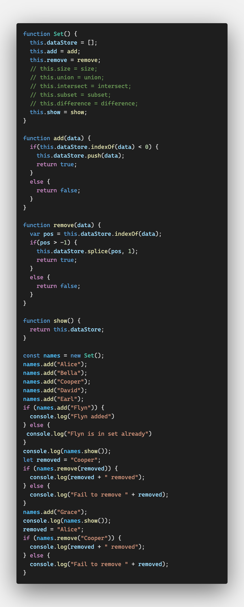
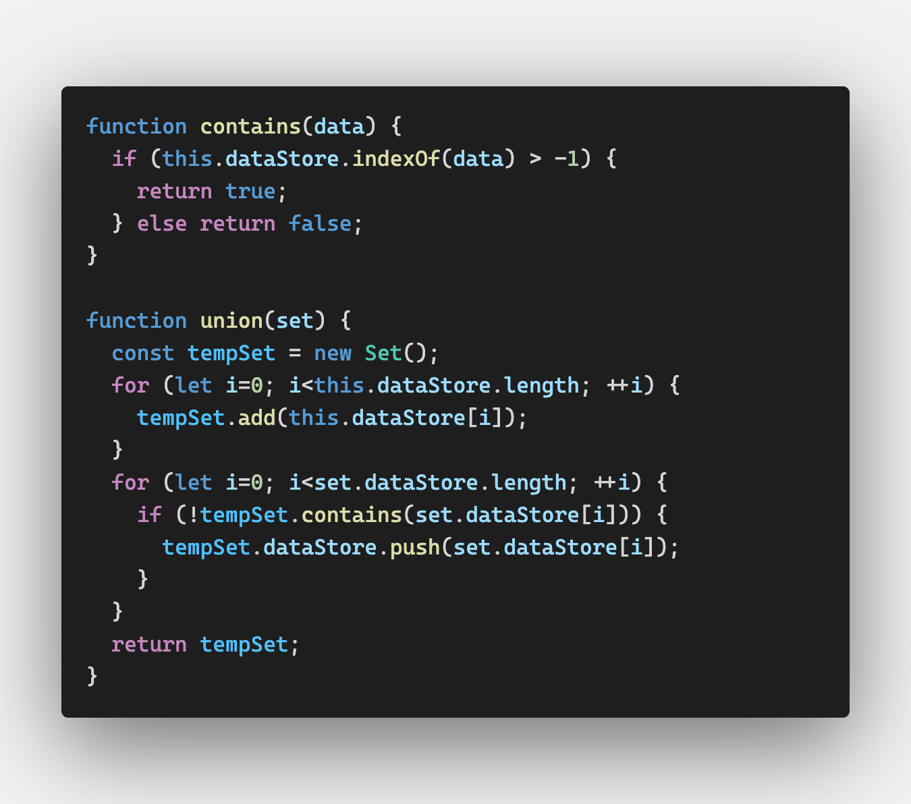
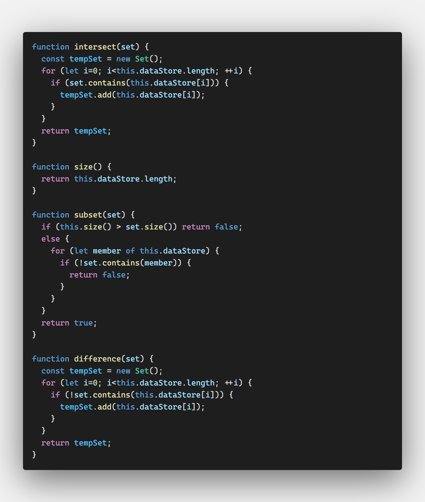
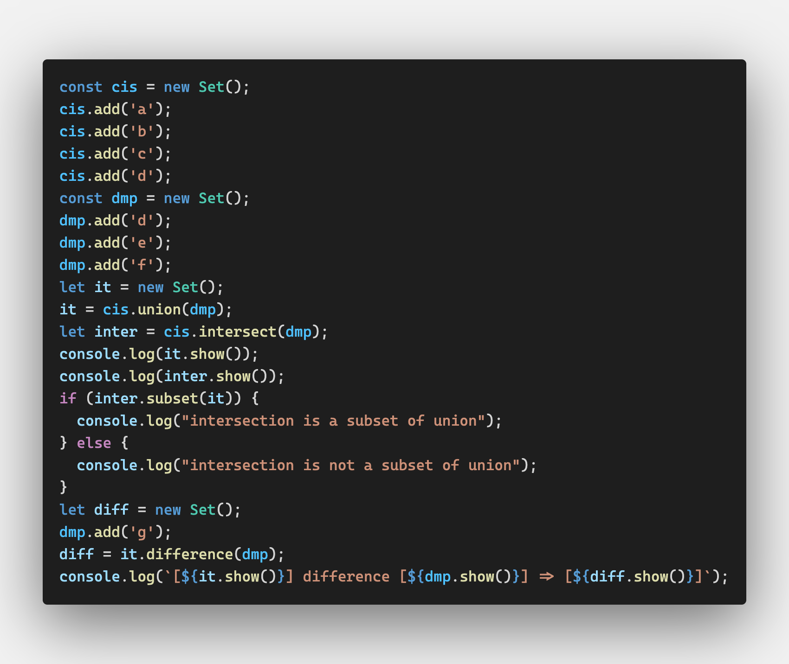

# Sets

세트는 고유한 요소들로 이루어진다

세트의 요소들은 멤버라고 부른다

멤버는 정렬되어 있지 않고, 중복될 수 없다


## Fundamental Set Definitions, Operations, and Properties

`{0, 1, 2, 3, 4, 5, 6, 7, 8, 9}`처럼 {}를 이용해서 세트를 정의한다

말했듯이 정렬되지 않는 자료구조이기 때문에 {9, 3, 2, 8, 0, 1, 7, 5, 6, 4}라고 해도 된다


### Set Definitions

- empty set: 멤버가 없는 세트
- universe: 가능한 멤버가 모두 있는 세트
- 똑같은 멤버를 가지고 있는 서로 다른 세트는 같은 것으로 여겨진다
- 세트 a의 모든 멤버가 세트 b에 속할 때, a는 b의 서브세트가 된다


### Set Operations

- union 합집합
- intersection 교집합
- difference 차집합


## The Set Class Implementation




## More Set Operations



```js
const cis = new Set();
cis.add('a');
cis.add('b');
cis.add('c');
const dmp = new Set();
dmp.add('d');
dmp.add('e');
dmp.add('f');
let it = new Set();
it = cis.union(dmp);
console.log(it.show()); // ['a', 'b', 'c', 'd', 'e', 'f']
```





```shell
[ 'a', 'b', 'c', 'd', 'e', 'f' ]
[ 'd' ]
intersection is a subset of union
[a,b,c,d,e,f] difference [d,e,f,g] => [a,b,c]
```


## Exercise

1. Set 클래스를 수정하여 Set의 요소가 정렬된 순서로 저장되게 만들어라
2. Set 클래스를 수정하여 연결리스트를 사용해서 요소를 저장해라
3. higher 함수를 만들어라 이 함수는 주어진 요소보다 큰 요소 중에서 제일 작은 요소를 리턴한다
4. lower 함수를 만들어라 주어진 요소보다는 작지만 그 중에서 제일 큰 요소를 리턴한다