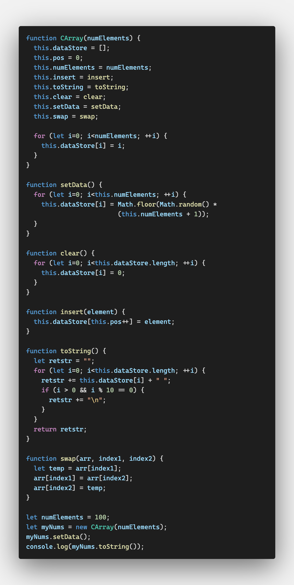
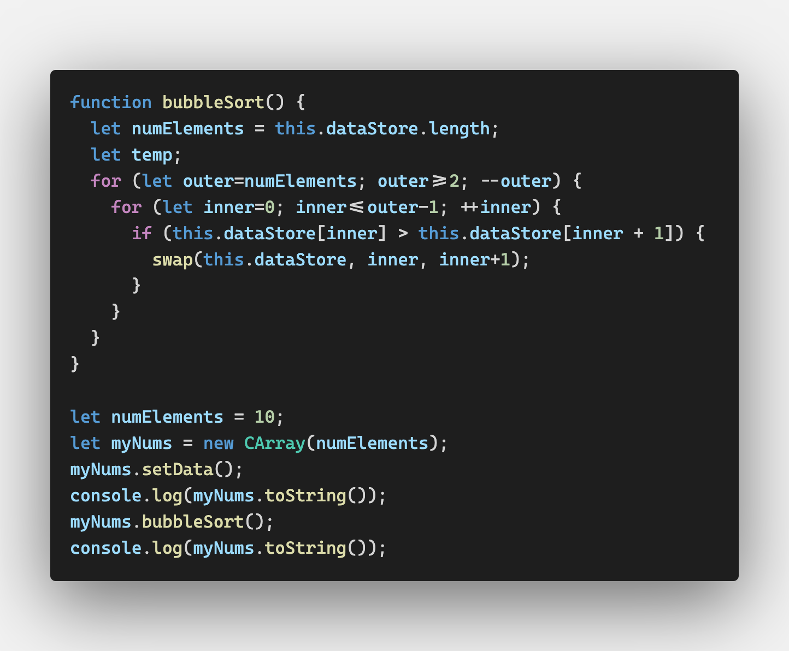

# Sorting Algorithms

컴퓨터에서 많이 하는 데이터 작업 두 가지가 정렬과 검색이다

여기서 소개할 알고리즘은 어레이만 사용하도록 한다


## An Array Test Bed




## Basic Sorting Algorithms

for 반복문을 중첩하여 데이터를 정렬한다

바깥의 for문은 각 아이템을 순회하고

안쪽의 for문은 이전 아이템과 비교를 한다


### Bubble Sort

버블 정렬은 굉장히 느린 정렬 알고리즘이지만 가장 적용이 쉽다

데이터를 정렬할 때 데이터들이 어레이 사이를 떠돌아다니는 거품같다고 붙여진 이름이다

`EADBH`를 오름차순으로 버블정렬하면

- AEDBH
- ADEBH
- ADBEH
- ABDEH

이런 과정을 거쳐서 정렬이 된다




```shell
7 3 5 4 0 1 1 8 8 5 
0 1 1 3 4 5 5 7 8 8 
```

버블 정렬 과정이 보고 싶다면

bubbleSort의 첫번째 for문 마지막에 this.toString()을 찍어보면 된다.

```javascript
function bubbleSort() {
  let numElements = this.dataStore.length;
  let temp;
  for (let outer=numElements; outer>=2; --outer) {
    for (let inner=0; inner<=outer-1; ++inner) {
      if (this.dataStore[inner] > this.dataStore[inner + 1]) {
        swap(this.dataStore, inner, inner+1);
      }
    }
    console.log(this.toString());
  }
}
```

```shell
6 4 7 10 3 4 4 6 10 1 
4 6 7 3 4 4 6 10 1 10 
4 6 3 4 4 6 7 1 10 10 
4 3 4 4 6 6 1 7 10 10 
3 4 4 4 6 1 6 7 10 10 
3 4 4 4 1 6 6 7 10 10 
3 4 4 1 4 6 6 7 10 10 
3 4 1 4 4 6 6 7 10 10 
3 1 4 4 4 6 6 7 10 10 
1 3 4 4 4 6 6 7 10 10 
1 3 4 4 4 6 6 7 10 10 
```


