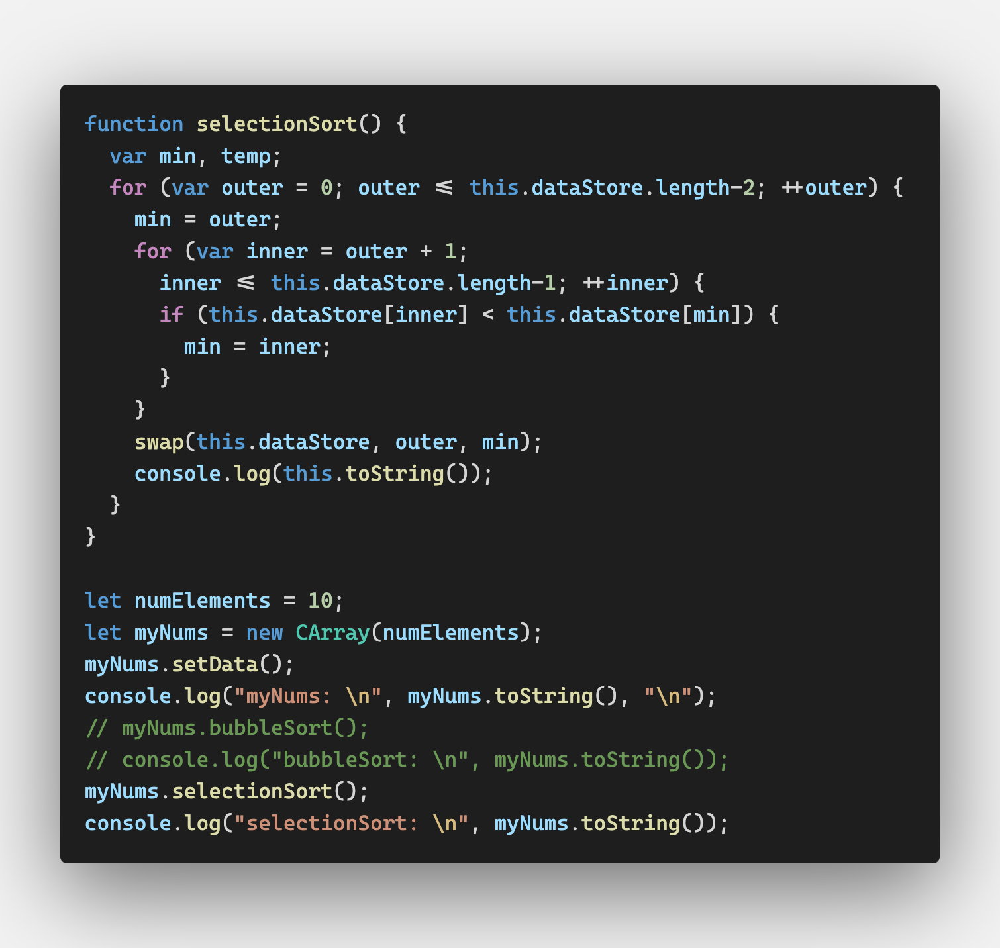
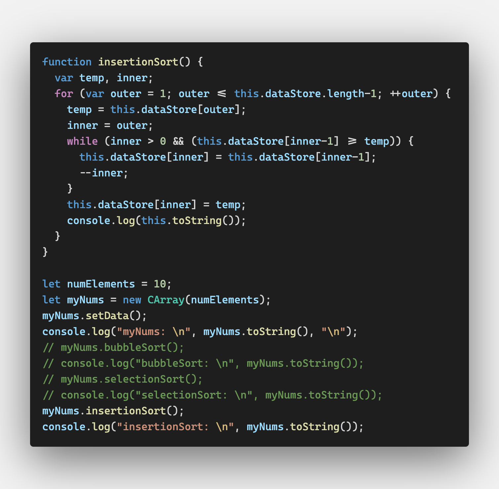
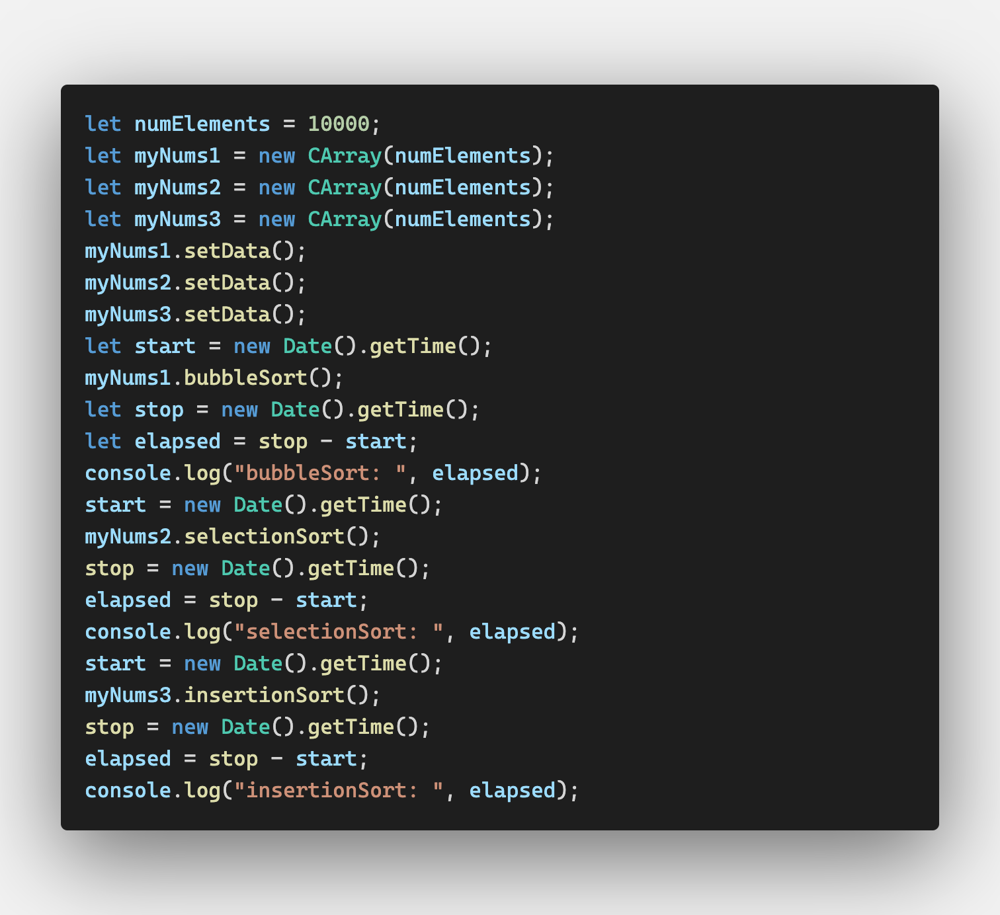
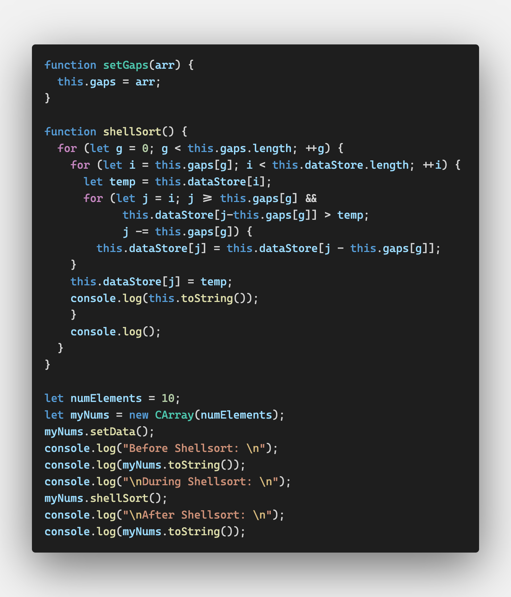
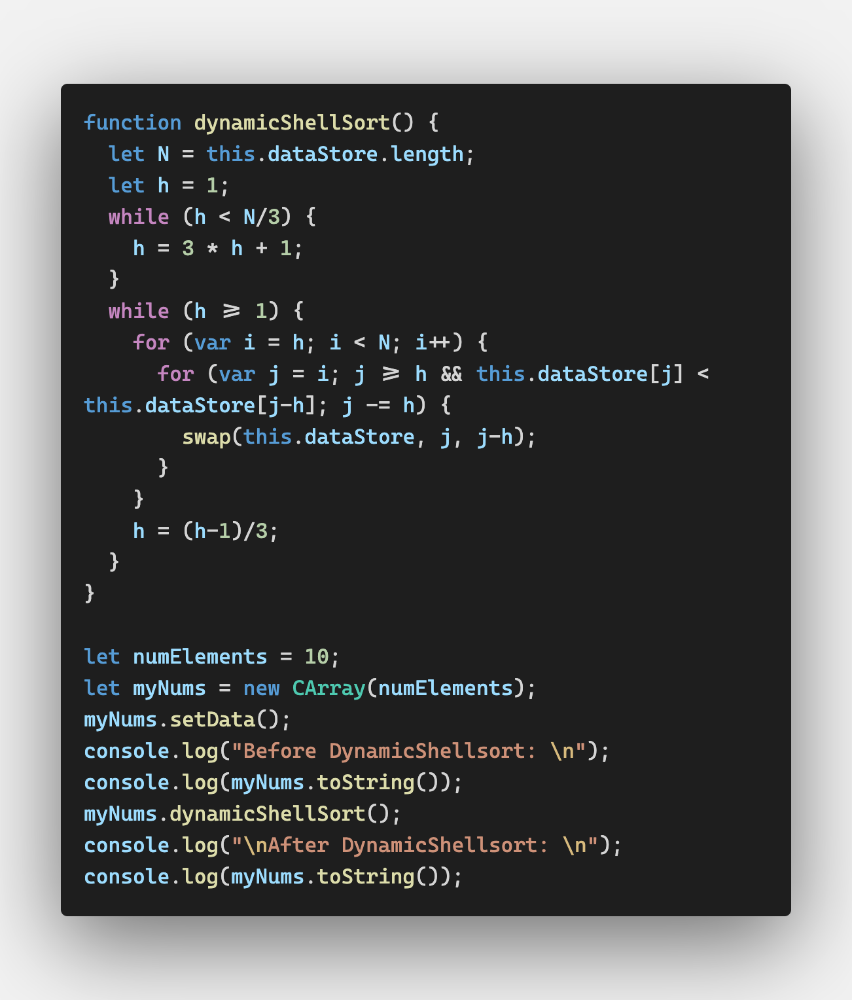
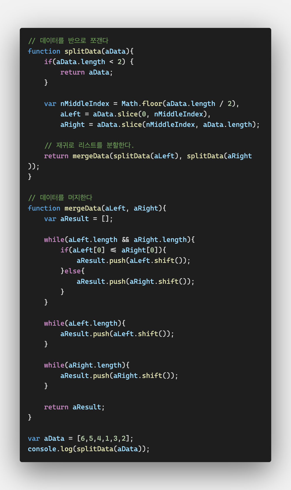
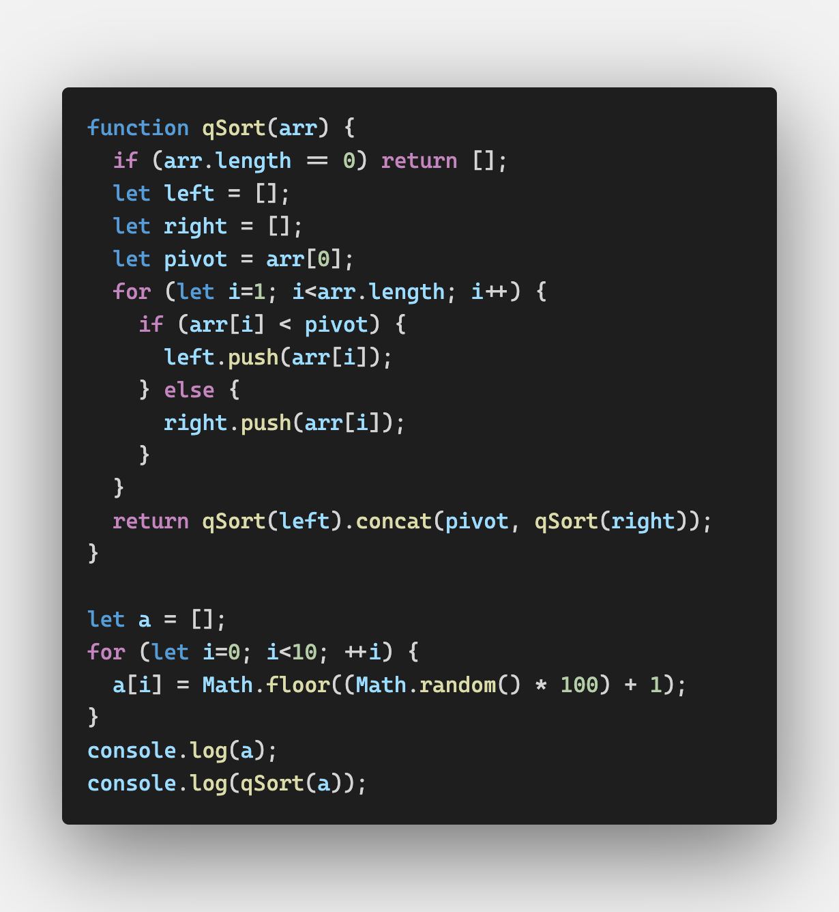

# Sorting Algorithms

컴퓨터에서 많이 하는 데이터 작업 두 가지가 정렬과 검색이다

여기서 소개할 알고리즘은 어레이만 사용하도록 한다


## An Array Test Bed


## Basic Sorting Algorithms

for 반복문을 중첩하여 데이터를 정렬한다

바깥의 for문은 각 아이템을 순회하고

안쪽의 for문은 이전 아이템과 비교를 한다


### Bubble Sort

버블 정렬은 굉장히 느린 정렬 알고리즘이지만 가장 적용이 쉽다

데이터를 정렬할 때 데이터들이 어레이 사이를 떠돌아다니는 거품같다고 붙여진 이름이다

`EADBH`를 오름차순으로 버블정렬하면

- AEDBH
- ADEBH
- ADBEH
- ABDEH

이런 과정을 거쳐서 정렬이 된다


```shell
7 3 5 4 0 1 1 8 8 5 
0 1 1 3 4 5 5 7 8 8 
```

버블 정렬 과정이 보고 싶다면

bubbleSort의 첫번째 for문 마지막에 this.toString()을 찍어보면 된다.

```javascript
function bubbleSort() {
  let numElements = this.dataStore.length;
  let temp;
  for (let outer=numElements; outer>=2; --outer) {
    for (let inner=0; inner<=outer-1; ++inner) {
      if (this.dataStore[inner] > this.dataStore[inner + 1]) {
        swap(this.dataStore, inner, inner+1);
      }
    }
    console.log(this.toString());
  }
}
```

```shell
6 4 7 10 3 4 4 6 10 1 
4 6 7 3 4 4 6 10 1 10 
4 6 3 4 4 6 7 1 10 10 
4 3 4 4 6 6 1 7 10 10 
3 4 4 4 6 1 6 7 10 10 
3 4 4 4 1 6 6 7 10 10 
3 4 4 1 4 6 6 7 10 10 
3 4 1 4 4 6 6 7 10 10 
3 1 4 4 4 6 6 7 10 10 
1 3 4 4 4 6 6 7 10 10 
1 3 4 4 4 6 6 7 10 10 
```


### Selection Sort

선택 정렬은 어레이의 첫 아이템부터 비교하면서 정렬한다

모든 아이템을 검사한 뒤 제일 작은 아이템이 첫번째로 간다

그러면 두 번째 자리를 결정하기 위해 다시 순회가 시작된다

마지막에서 두 번째 자리까지 같은 방법이 반복된다(마지막은 하나밖에 없으니까)


선택 정렬에서도 중첩 반복문이 사용된다

바깥 반복문은 어레이의 첫 요소부터 마지막 요소까지를 순회하고

내부의 반복문은 두 번째 요소부터 마지막 요소까지를 순회한다

바깥 반복문이 가리키는 현재 요소보다 작은 것을 찾아야하기 때문이다

내부의 반복문이 한 번 반복될 때마다 한 자리씩 채워진다

- EADHB
- AEDHB
- ABDHE
- ABDEH



```shell
myNums: 
 9 0 3 9 5 8 10 5 10 3  

0 9 3 9 5 8 10 5 10 3 
0 3 9 9 5 8 10 5 10 3 
0 3 3 9 5 8 10 5 10 9 
0 3 3 5 9 8 10 5 10 9 
0 3 3 5 5 8 10 9 10 9 
0 3 3 5 5 8 10 9 10 9 
0 3 3 5 5 8 9 10 10 9 
0 3 3 5 5 8 9 9 10 10 
0 3 3 5 5 8 9 9 10 10 
selectionSort: 
 0 3 3 5 5 8 9 9 10 10 
```


### Insertion Sort

삽입 정렬은 사람이 데이터를 정렬할 때 사용하는 방법과 같다

바깥의 반복문은 어레이의 각 요소를 순회하고

안쪽의 반복문은 바깥 반복문에서 선택된 요소의 다음 요소와 비교를 한다




```shell
myNums: 
 9 10 9 3 10 10 1 9 3 6  

9 10 9 3 10 10 1 9 3 6 
9 9 10 3 10 10 1 9 3 6 
3 9 9 10 10 10 1 9 3 6 
3 9 9 10 10 10 1 9 3 6 
3 9 9 10 10 10 1 9 3 6 
1 3 9 9 10 10 10 9 3 6 
1 3 9 9 9 10 10 10 3 6 
1 3 3 9 9 9 10 10 10 6 
1 3 3 6 9 9 9 10 10 10 
insertionSort: 
 1 3 3 6 9 9 9 10 10 10 
```

삽입 정렬은 데이터를 교환하는 것이 아니라 큰 요소를 오른쪽으로 보내면서 이루어진다


### 시간 비교하기

버블 정렬, 선택 정렬, 삽입 정렬의 복잡도는 거의 비슷하다

세 알고리즘의 퍼포먼스 차이를 알아보기 위해 시가닝 얼마나 걸리는지 알아보겠다


`new Date().getTime();`으로 시작 시간과 끝 시간을 측정한 뒤

두 시간의 차이를 구하는 방법으로 정렬 시간을 알아본다

100개와 10000개의 데이터를 정렬해 본다



```shell
# 100개
bubbleSort:  1
selectionSort:  0
insertionSort:  1

# 10000개
bubbleSort:  199
selectionSort:  52
insertionSort:  38
```

정렬해야 할 데이터 수가 적을 때는 시간 차이가 크지 않지만

데이터 집합의 크기가 커질수록 버블 정렬이 훨씬 비효율적인 것을 확인할 수 있다

선택 정렬과 삽입 정렬 중에서는 삽입 정렬이 더 빠르다


## Advanced Sorting Algorithms

지금부터 알아볼 정렬 알고리즘은 데이터 집합의 크기가 100만 개처럼 클 때 쓰면 좋다

퀵 정렬, 셸 정렬, 합병 정렬, 힙 정렬이 그것이다


### 셸 정렬

셸 정렬을 만든 도날드 셸의 이름을 딴 정렬 알고리즘이다

삽입 정렬의 개선된 버전이라고 볼 수 있다

삽입 정렬과 달리 멀리 있는 요소를 먼저 비교하는 것이 중요하다


셸 정렬은 정렬을 시작할 때 제일 멀리 있는 요소와의 차이를(gap sequence) 정의하는 것부터 시작한다

갭 시퀀스는 동적으로 정의할 수도 있지만 대부분 미리 정의해 둔다

여러 갭 시퀀스 중에서 Marcin Ciura가 정의한 시퀀스는 다음과 같다

`701, 301, 132, 57, 23, 10, 4, 1`


```javascript
// CArray constructor
  this.gaps = [5,3,1];
  this.setGaps = setGaps;
  this.shellSort = shellSort;
```


바깥의 반복문은 갭 시퀀스 안에서의 동작을 조정한다

처음에는 5개 뒤의 요소를, 다음에는 3개 뒤의 요소를 마지막으로는 삽입 정렬처럼 바로 뒤에 인접한 요소를 정렬한다

마지막 정렬 때는 정렬해야 할 데이터들이 많지 않은데

이 때문에 삽입 정렬보다 좋은 효율을 가질 수 있다




```shell
Before Shellsort: 

9 6 10 10 3 5 1 3 6 10 

During Shellsort: 

5 6 10 10 3 9 1 3 6 10 
5 1 10 10 3 9 6 3 6 10 
5 1 3 10 3 9 6 10 6 10 
5 1 3 6 3 9 6 10 10 10 
5 1 3 6 3 9 6 10 10 10 

5 1 3 6 3 9 6 10 10 10 
5 1 3 6 3 9 6 10 10 10 
5 1 3 6 3 9 6 10 10 10 
5 1 3 6 3 9 6 10 10 10 
5 1 3 6 3 9 6 10 10 10 
5 1 3 6 3 9 6 10 10 10 
5 1 3 6 3 9 6 10 10 10 

1 5 3 6 3 9 6 10 10 10 
1 3 5 6 3 9 6 10 10 10 
1 3 5 6 3 9 6 10 10 10 
1 3 3 5 6 9 6 10 10 10 
1 3 3 5 6 9 6 10 10 10 
1 3 3 5 6 6 9 10 10 10 
1 3 3 5 6 6 9 10 10 10 
1 3 3 5 6 6 9 10 10 10 
1 3 3 5 6 6 9 10 10 10 


After Shellsort: 

1 3 3 5 6 6 9 10 10 10 
```


#### 동적으로 갭 시퀀스 계산하기

Robert Sedgewick은 갭 시퀀스를 동적으로 계산하는 셸 정렬을 정의했다



정적 셸 정렬과 동적 셸 정렬 모두 같은 효율을 가진다(정렬 시간이 같다)

그러므로 어떤 것을 선택해도 좋다


### 병합 정렬

정렬된 하위 리스트들을 합치는 정렬 알고리즘이라서 병합 정렬이라고 한다

하위 리스트들 때문에 공간을(메모리를) 많이 차지한다


#### top-down

필수적인 것은 아니지만 보통 병합 정렬은 반복 알고리즘으로 실행한다

그러나 자바스크립트로 그렇게 만드는 것은 불가능하기 때문에 

여기서는 반복적이지 않은 bottom-up 방식을 쓴다


#### bottom-up

데이터 집합을 쪼개서 하나의 요소를 가진 어레이들로 만든다

이 어레이들은 서서히 좌 우의 하위 어레이로 병합된다

좌 우 어레이 역시 하나의 어레이로 병합하면 정렬이 끝난다

- 6 10 1 9 4 8 2 7 3 5 
- 6, 10
  1, 9
  4, 8
  2, 7
  3, 4
- 6 10, 1 9
  4 8, 2 7
  3, 5
- 1 6 9 10, 2 4 7 8
  3, 5
- 1 2 4 6 7 8 9 10, 3 5
- 1 2 3 4 5 6 7 8 9 10


Divide and Conquer 분할하여 정복한다

문제의 크기를 줄여서 작은 것부터 해결하는 알고리즘 전략으로

병합 정렬도 이 알고리즘을 사용하는 것이다



> http://superjang.com/archives/3050


### 퀵 정렬

큰 데이터 집합을 정렬할 때 가장 빠른 정렬 알고리즘이 퀵 정렬이다

퀵 정렬은 divide-and-conquer 알고리즘을 사용한다

데이터를 하위 리스트로 쪼개는데 피봇(pivot)이라고 하는 한 요소를 선택한다

피봇을 기준으로 작은 것은 왼쪽으로 큰 것은 오른쪽으로 배치하며 정렬한다

- **44** 75 23 43 55 12 64 77 33
- 23 12 43 33 **44** 75 55 64 77
- **23** 12 43 33, **44**, **75** 55 64 77
- **23** 12, **43** 33, **44**, **75** 55, **64** 77
- 12 23, 33 43, 55 75, 64 77
- 12 23 33 43 55 75 64 77


1. 리스트를 두 개로 나눌 피봇을 정한다

2. 피봇보다 작은 것은 왼쪽으로 큰 것은 오른쪽으로 배치한다
3. 1과 2를 좌 우의 리스트에 반복한다




```shell
[
  42, 30, 87,  7, 46,
  88,  3, 35, 78, 93
]
[
   3,  7, 30, 35, 42,
  46, 78, 87, 88, 93
]
```


## Exercises

1. 스트링 데이터를 세 가지 정렬 알고리즘으로 정렬해보자
2. 1000개의 인티저 데이터가 순서대로 이루어진 어레이를 정렬해보자. 각 정렬 알고리즘마다 걸리는 시간을 비교해보자. 랜덤한 데이터로 이루어진 데이터를 정렬할 때와의 시간 차이도 비교해보자
3. 1000개의 인티저 데이터가 역순으로 이루어진 어레이를 정렬하고 시간을 비교해보자
4. 만개가 넘는 랜덤한 숫자로 이루어진 어레이를 만들어 퀵 정렬과 JS 내장 정렬 함수로 정렬하고 시간을 비교해보자

